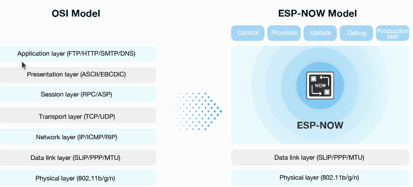
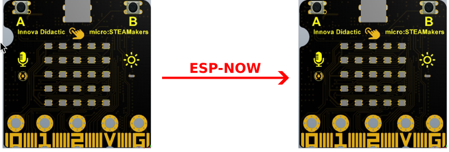
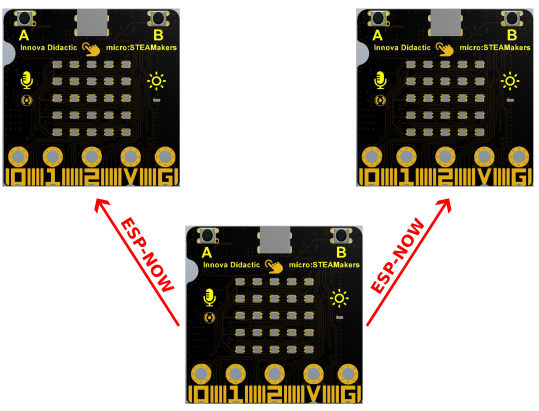
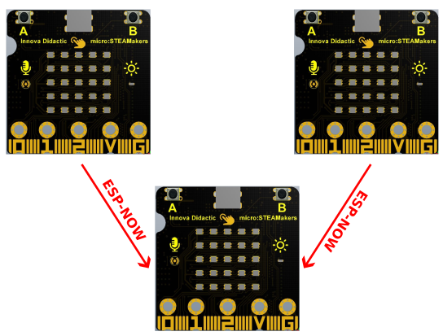
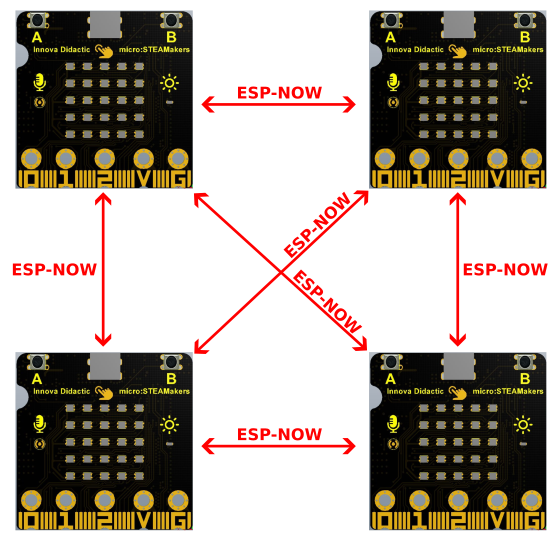

## **Referencias**
Los contenidos de este apartado van a estar basados en:

* Manual [Comunicación ESP-NOW con ESP32 STEAMakers](https://drive.google.com/file/d/1xeSOalJhOgPZF2syGutzAwufxOdv2H1H/view) creado por Juanjo López.
* Apuntes [ESP-NOW](https://pedroruizf.github.io/steamakers_demo/espnow.html) de Pedro Ruiz.
* [Wireless Communication Protocol (ESP-NOW)](https://www.espressif.com/en/solutions/low-power-solutions/esp-now) de Espressif.
* [Getting Started with ESP-NOW (ESP32 with Arduino IDE)](https://randomnerdtutorials.com/esp-now-esp32-arduino-ide/) de Random Nerd Tutorials.

## **Introducción a ESP-NOW**
ESP-NOW es un protocolo de comunicación inalámbrica desarrollado por Espressif para los microcontroladores ESP32, que permte que varios dispositivos se comuniquen entre sí sin utilizar una red Wi-Fi. Trabaja con baja potencia y baja latencia en la banda de 2.4 GHz para transmitir pequeños paquetes de datos directamente entre dispositivos ESP32.

Este funcionamiento permite la comunicación directa entre múltiples dispositivos, formando una red red inalámbrica descentralizada ad-hoc (todos los dispositivos están en igualdad de condiciones), y soporta tanto unicast (dirección destino a un único destino) como multicast (dirección destino a multiples destinos), permitiendo la transmisión de datos a uno o varios dispositivos simultáneamente.

Es necesario el emparejamiento entre dispositivos antes de establecer su comunicación. Una vez realizado el emparejamiento, la conexión es segura y de igual a igual, sin necesidad de mas presentaciones. Esto significa que después de emparejar un dispositivo con otro, la conexión es persistente. En otras palabras, si de repente una de tus placas pierde potencia o se reinicia, al reiniciarse se conectará automáticamente a su par para continuar la comunicación.

  
*Logotipo ESP-NOW*

## **Características de ESP-NOW**

* Comunicación unididireccional encriptada y no encriptada;
* Dispositivos emparejados encriptados y no encriptados;
* Puede transportarse una carga útil de hasta 250 bytes;
* Función de devolución de llamada al envío que puede configurarse para informar a la capa de aplicación del éxito o fracaso de la transmisión.

ESP-NOW es un protocolo de comunicación inalámbrica basado en la capa de enlace de datos, que reduce las cinco capas del [modelo OSI](https://www.cloudflare.com/es-es/learning/ddos/glossary/open-systems-interconnection-model-osi/) a una sola.

  
*Logotipo ESP-NOW*

## **Ventajas e inconvenientes**

### Ventajas

* Coexistencia con WiFi y Bluetooth LE.
* Ocupa menos recursos de memoria flash y de CPU.
* Aplicaciones en tiempo real por la transmisión de datos casi instantánea, con una latencia muy baja.
* Algoritmos [ECDH](https://es.wikipedia.org/wiki/Elliptic-curve_Diffie-Hellman) y [AES](https://es.wikipedia.org/wiki/Advanced_Encryption_Standard) de encriptación de datos mediante claves precompartidas, asegurando la comunicación.
* Gran eficiencia energética.
* Facil de implementar dada su simplicidad.
* Proyectos colaborativos dado que múltiples robots pueden comunicarse entre sí de manera eficiente.
* El no depende de una infraestructura WiFi le dota de una gran portabilidad y flexibilidad.

### Inconvenientes

* Número limitado de pares cifrados.
* Se admiten 10 pares cifrados como máximo.
* Se admiten varios pares no cifrados, pero su número total debe ser inferior a 20, incluidos los pares cifrados.
* La carga útil está limitada a 250 bytes.

!!! Success "Resumiendo:"
    <b>ESP-NOW es un protocolo de comunicación rápida que se puede utilizar para intercambiar mensajes pequeños (hasta 250 bytes) entre placas ESP32.</b>

## **Comunicaciones ESP-NOW**
ESP-NOW es muy versátil y se puede tener una comunicación unidireccional o bidireccional en diferentes configuraciones.

!!! note "Nota"
    En la documentación no hablaremos de "sender/master (emisor/maestro)" y "receiver/slave (receptor/esclavo)". Cada placa puede ser emisora o receptora. Sin embargo, para mantener las cosas claras utilizaremos los términos "emisor" y "receptor" o "maestro" y "esclavo" o "master" y "slave".

### Unidireccionales

#### Un master un slave
Esta configuración es la más fácil de implementar y es ideal para enviar datos de una placa a otra. Se trata de una ESP32 micro:STEAMakers enviando datos a otra ESP32 micro:STEAMakers o cualquier otra placa ESP32.

  
*Comunicación unidireccional*

#### Un master multiples slaves
Una placa ESP32 micro:STEAMakers enviando el mismo o diferentes comandos a diferentes placas ESP32 micro:STEAMakers. Esta configuración es ideal para construir algo parecido a un mando a distancia. Se pueden tener varias placas ESP32 micro:STEAMakers (slaves o esclavas) que son controladas por una placa ESP32 micro:STEAMakers (master o maestra o principal).

  
*Un master multiples slaves*

#### Un slave multiples masters
Esta configuración es ideal si queremos recopilar datos de varios nodos sensorizados en una placa ESP32 micro:STEAMakers. La placa receptora se puede configurarse como servidor web para mostrar los datos de todas las demás placas, por ejemplo.

  
*Un slave multiples masters*

### Comunicación bidireccional
Con ESP-NOW, cada placa puede ser emisora y receptora al mismo tiempo. Así, se puede establecer una comunicación bidireccional entre placas.

  
*Comunicación bidireccional*

## **Dirección MAC**
Para comunicarse a través de ESP-NOW, se necesita conocer la Dirección MAC del receptor ESP32. Así sabrá a qué dispositivo enviará los datos.

Cada ESP32 micro:STEAMakers tiene una dirección MAC única y así es como podemos identificar cada placa para enviarle datos mediante ESP-NOW.

Pero <b>¿Que es una dirección MAC?</b>. MAC son iniciales de <b>Media</b><b>Access</b><b>Control</b> que significa control de acceso al medio y es un identificador único de hardware que identifica cada dispositivo de una red.

Las direcciones MAC están formadas por seis grupos (6 bytes) de dos dígitos hexadecimales, separados por dos puntos o, a veces, un guión, por ejemplo: 34:98:7A:A9:D1:A8.

Las direcciones MAC son asignadas por los fabricantes, aunque se pueden cambiar a una dirección MAC personalizada. Pero hay que tener muy presente que cada vez que la placa se reinicie, volverá a su dirección MAC original.

En el caso de las placas ESP32, la dirección MAC se utiliza tanto para la conexión Wi-Fi como para la comunicación ESP-NOW.
