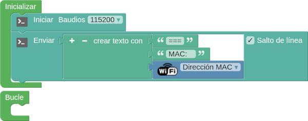
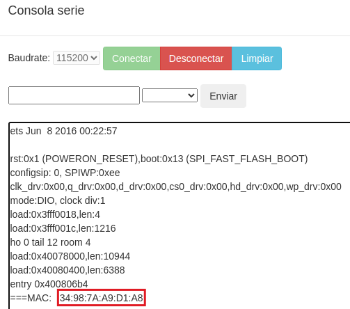
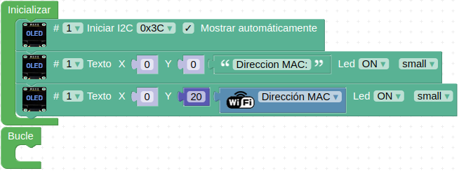
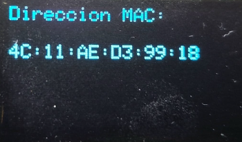
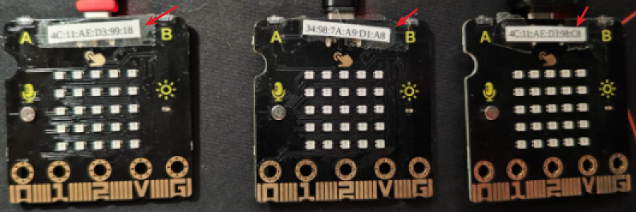
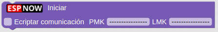
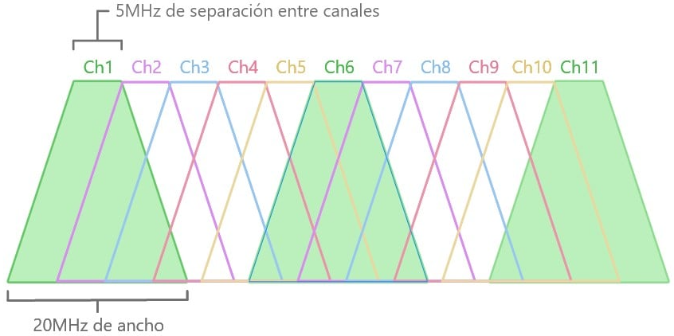
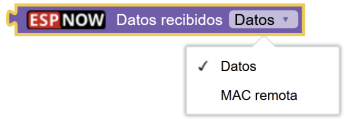

## **Referencias**
Los contenidos de este apartado van a estar basados en:

* Manual [Comunicación ESP-NOW con ESP32 STEAMakers](https://drive.google.com/file/d/1xeSOalJhOgPZF2syGutzAwufxOdv2H1H/view) creado por Juanjo López.
* Apuntes [ESP-NOW](https://pedroruizf.github.io/steamakers_demo/espnow.html) de Pedro Ruiz.

## **Obtener MAC placa micro:STEAMakers**
Para obtener la dirección MAC por consola se puede usar el siguiente programa:

  
*[Programa para obtener MAC placa micro:STEAMakers](../program/ejemplosAB/obt_mac_microSM.abp)*

El resultado en consola es el de la imagen siguiente:

  
*Consola del programa para obtener MAC placa micro:STEAMakers*

!!! info ""
    Si al hacer clic en el botón verde Conectar de la consola no aparece nada en pantalla será necesario pulsar el botón de reset de la placa.

Otra posibilidad es conectar una pantalla a la micro:STEAMakers y sacar la MAC por ella. En este caso el programa para una OLED I2C sería:

  
*Programa para obtener MAC placa micro:STEAMakers*

Que da como resultado:

  
*Resultado en OLED del programa para obtener MAC placa micro:STEAMakers*

!!! Example "Consejo"
    <b>A la hora de trabajar con proyectos ESP-NOW es recomendable etiquetar físicamente cada placa con la dirección MAC obtenida para poder fácilmente identificar cada una de ellas durante la programación.</b>  

    

## **Bloques ESP-NOW**

### Bloque iniciar
Es obligatorio para iniciar el protocolo ESP-NOW y lo pondremos en el bloque de inicialización de nuestros programas.

El bloque permite activar o no la encriptación de las comunicaciones. La encriptación es muy importante para hacer proyectos seguros y evitar que espien nuestras comunicaciones, o que puedan inundarnos (flooding) con paquetes de datos ajenos. Los dos tipos de claves son:

* **PMK** (Private Master Key) o clave maestra: es la usada para encriptar la clave LMK con [cifrado AES128](https://es.wikipedia.org/wiki/Advanced_Encryption_Standard). Es obligatorio definir esta clave, por lo que si no modificamos nada la clave son los 16 guiones (bytes) por defecto ("----------------"). Ya que vamos a añadir seguridad lo suyo es cambiarla.

* **LMK** (Local Master Key) o clave local: es la clave que se utiliza para encriptar action frames (tipo de trama de gestión que se utiliza para desencadenar una acción) con el método de criptografía [CCMP](https://en.wikipedia.org/wiki/CCMP_(cryptography)). Es la encriptación a nivel de dispositivo. Tiene la misma composición que la clave PMK.

!!! info "Importante"
    En los dispositivos emparejados en la red ESP-NOW deberán coincidir las claves para poder establecer comunicación.

El aspecto del bloque es el siguiente:

  
*Bloque iniciar*

### Bloque establecer canal
Bloque para establecer el canal WiFi de nuestra red ESP-NOW.

Sin entrar en detalles diremos como simil que un canal de una red inalámbrica y las diferentes frecuencias que utiliza funciona de manera similar a la radio y sus frecuencias. Las redes WiFi trabajan en frecuencia de GHz, indicando la frecuencia a la que se transmiten los datos. Si cambiamos de canal estamos cambiando la frecuencia de transmisión.

El estándar WiFi 802.11 b/g/n indica que en redes WiFi de 2.4GHz se pueden configurar anchos de canal de 20 y 40 MHz.

En la banda de 2.4 GHz el estándar WiFi establece la separación de canales en 5 MHz. Si representamos cada canal por un cono truncado con su base inferior de 20MHz (para 40MHz se daria la misma situación) y su base superior de 5MHz. Cada canal empieza 5MHz por encima del anterior. Si representamos esto obtenemos, de forma simplificada, una representación de los canales WiFi del espectro de 2.4GHz que vemos a continuación:

  
*Canales Wifi en 2.4GHz*  
***Imagen obtenida de [¿Por qué se utilizan los canales WiFi 1, 6 y 11 en 2.4GHz?](https://www.acrylicwifi.com/blog/por-que-se-utilizan-canales-wifi-1-6-y-11-en-2-4ghz/) de [ACRYLIC](https://www.acrylicwifi.com/)***

Cuando por ejemplo situamos la banda en el canal 6, este se solapa con parte del 4,5,7 y 8; en concreto 15MHz de solapamiento.

En la figura se aprecia el motivo de por qué se dice que los mejores canales son el 1,6,11 o 2,6,10 o 1,5,9 o 3,7,11 ya que para un ancho de banda de 20MHz no se solaparian. Pero la imagen es una representación idealizada y en realidad es mas complejo tal y como se explica en los artículos (ambos en inglés) citados en la imagen siguiente:

.svg.png)  
*Representación gráfica del solapamiento de canales de 22 MHz en la banda de 2,4 GHz*  
***Imagen obtenida del enlace [Electromagnetic interference at 2.4 GHz § Wi-Fi](https://en.wikipedia.org/wiki/Electromagnetic_interference_at_2.4_GHz#Wi-Fi) en el artículo [List of WLAN channels](https://en.wikipedia.org/wiki/List_of_WLAN_channels) de [Wikipedia](https://en.wikipedia.org/wiki/Main_Page)***

!!! info "==Atribución imagen anterior=="
    ***By Michael Gauthier, Wireless Networking in the Developing WorldKelleyCook, image improvementsWhidou, French translation - This file was derived from: 2.4 GHz Wi-Fi channels (802.11b,g WLAN).png by Michael Gauthier, CC BY-SA 3.0, https://commons.wikimedia.org/w/index.php?curid=8353678***

Vemos que en realidad el ancho de banda es 22MHz por lo que se produce un pequeño solapamiento. En la imagen anterior vemos también que aparecen los canales 12 y 13, lo que tiene que ver con la zona geográfica en que nos encontremos. En USA va del 1 al 11, Japón del 1 al 14 y el resto del mundo del 1 al 13.

El aspecto del bloque es el siguiente:

  
*Bloque establecer canal*

### Emparejar nodo remoto
Bloque para añadir un nodo a partir de su dirección MAC. Una vez emparejado ya podemos enviar datos a ese nodo.

El aspecto del bloque es el siguiente:

  
*Bloque Emparejar nodo remoto*

En las [especificaciones de ESP-NOW (limitations)](https://randomnerdtutorials.com/esp-now-esp32-arduino-ide/) indica que el número de pares cifrados máximo es de 10 en modo emisor; 6 en modo receptor y emisor. Se admiten varios (sin indicar número) pares no cifrados, pero el número total debe ser inferior a 20, incluidos los cifrados.

### Enviar a un nodo
Bloque para enviar datos (en forma de trama de texto) a un nodo remoto con una longitud máxima de 250 caracteres.

!!! warning "==Muy importante=="
    **El nodo debe estar previamente emparejado.**

El aspecto del bloque es el siguiente:

  
*Bloque enviar a nodo remoto*

### Enviar a todos
Bloque para enviar datos (en forma de trama de texto) a todos los nodos emparejados con una longitud máxima de 250 caracteres.

!!! warning "==Muy importante=="
    **Todos los nodos deben estar previamente emparejados.**

El aspecto del bloque es el siguiente:

  
*Bloque enviar a todos*

### ¿Último envio correcto?
Bloque para comprobar si el último envio de datos se ha realizado correctamente. Con el podemos detectar si ha habido acuse de recibo del nodo remoto o no.

El aspecto del bloque es el siguiente:

  
*¿Último envio correcto?*

### Evento al recibir datos
Evento que se produce cuando se reciben datos de un nodo remoto.

El aspecto del bloque es el siguiente:

  
*Evento al recibir datos*

Dentro del evento podemos utilizar el bloque de la imagen siguiente para tener los valores válidos tanto de los datos recibidos como la dirección MAC del nodo remitente.

  
*Datos recibidos*

!!! danger "Importante"
    El evento ***“Al recibir datos”*** se puede bloquear internamente si realizamos esperas bloqueantes en nuestro programa. Por tanto evitar usar el bloque **“esperar”**, y en su lugar utilizar el ***“ejecutar cada”*** u otros esquemas de programación similares no bloqueantes.
