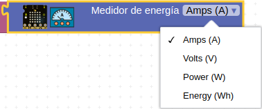

# Inicio a la programación de micro:STEAMakers con arduinoblocks
El tipo de proyecto a escoger lo vemos en la imagen siguiente:

  
*Tipo de proyecto ESP32 microSTEAMakers*

En los bloques vamos a tener disponible la categoria micro:STEAMakers siguiente:

  
*Categoria de bloques microSTEAMakers*

## **Sensores integrados**
En esta categoria aparecen todos los sensores disponibles por defecto en la placa. Vemos la lista en la imagen siguiente:

  
*Sensores integrados*

A continuación se describen brevemente los bloques de la categoria.

* Bloque *Pulsador pulsado* para saber el estado de los pulsadores de manera individual o ambos al mismo tiempo.

* Bloque *Pulsador se ha pulsado* para analizar el evento de si se ha pulsado o se ha soltado el pulsador A o el B.

* Bloque *Pulsador táctil* para comprobar si el pulsador táctil se ha activado.

* Bloque *Nivel de luz* que permite medir la luminosidad ambiente bien en porcentaje o bien en valor numérico entre 0 y 4095.

* Bloque *Temperatura y humedad* para medir los citados parámetros directamente desde la placa ESP32 micro:STEAMakers.

* Bloque *Nivel de sonido* para obtener el nivel de ruido ambiente bien en porcentaje o bien en valor numérico entre 0 y 4095.

* Bloque *Accel+Gyro (MPU6050)* devuelve los datos del giroscopio integrado en el MPU6050 referentes a aceleración y giro en los tres ejes X, Y, Z.

* Bloque *Medidor de energia* para medir el consumo que está teniendo nuestra placa.

* Bloque *Medidor de energia > Reset Wh=0* para resetear el sensor.

## **Actuadores**
Como actuador tenemos el Buzzer o zumbador y los bloques disponibles son los siguientes:

  
*Actuadores*

Los bloques que vemos son los clásico para reproducir tonos o para reproducir melodias.

* El bloque zumbador siguiente nos permite reproducir durante el tiempo que indiquemos (expresado en milisegundos) en Ms la frecuencia especificada en Hz.

  
*Bloque Ms Hz*

* Al bloque anterior le podemos indicar como frecuencia directamente cualquiera de los tonos de la nota "La" central que tiene una frecuencia de 440 Hz.

  
*Bloque Ms Hz con tonos*

## **NeoMatrix**
Los bloques para la matriz de 5x5 LEDs RGB los vemos en la imagen siguiente:

  
*Bloques NeoMatrix*

Los bloques de inicialización general son los tres que vemos en la imagen siguiente:

  
*Bloques de inicialización de la matriz*

El bloque Bitmap nos permite dibujar directamente en la matriz escogiendo pixel a pixel el color de la paleta que se muestra. En la animación siguiente vemos un primer ejemplo de dibujar una carita con los labios rojos, los ojos azules y el pelo rubio.

  
*[Ejemplo carita](../program/ejemplosAB/carita.abp)*

Veamos ahora los bloques de texto. Los disponibles los vemos en la imagen siguiente:

  
*Bloques de texto*

En el tema de texto con scroll debemos saber que ese no bloquea el funcionamiento del programa por lo que hay un bloque denominado *¿texto desplazandose?* para saber si el scroll está en proceso. El parámetro *Ms* se refiere a la velocidad del desplazamiento o scroll medida en milisegundos. Un sencillo ejemplo como el de la imagen siguiente no aclara el uso de esto.

  
*[Ejemplo scroll de texto](../program/ejemplosAB/textos_desplazandose.abp)*

En el ejemplo siguiente vemos el uso básico del resto de bloques de la categoria. Observamos como posicionar una "H" en una coordenada, mostrar un texto, rellenar de un color, poner los pixeles de las esquinas de dos colores en diagonal, sibujar una X con dos líneas cruzadas blancas, crear dos rectángulos, uno con relleno y el otro sin el y dibujar un circulo.

  
*[Ejemplo bloques NeoMatrix](../program/ejemplosAB/uso_bloques_NeoMatrix.abp)*

En la animación siguiente podemos observar el funcionamiento del programa.

  
*Funcionamiento del ejemplo bloques NeoMatrix*

El recuadro blanco es una especie de filtro impreso en 3D para que los LEDs deslumbren menos a la cámara. Aunque su diseño es muy simple aquí dejo el [archivo STL](../3D/Filtro_NeoMatrix/filtro.stl) por si te interesa.

## **Tarjeta microSD**
Los bloques para tarjeta SD disponibles los vemos en la imagen siguiente:

  
*Tarjeta SD*

Son los típicos de iniciar, leer y escribir en tarjetas SD y que se describen en el apartado [Tarjeta SD](https://docs.google.com/document/u/1/d/e/2PACX-1vQSrOKHpbLQHVbGFdAvp7DcndoftoHDI20nvwGMaxu_7bGc1bUCmi4U6DZrJWRSudc2iXBg43QMuzCT/pub#h.wbtuet1e1p4e) del [arduinoblocks FreeBook - ES](https://docs.google.com/document/u/1/d/e/2PACX-1vQSrOKHpbLQHVbGFdAvp7DcndoftoHDI20nvwGMaxu_7bGc1bUCmi4U6DZrJWRSudc2iXBg43QMuzCT/pub).

Para almacenar datos en una tarjeta microSD y posteriormente abrirlos en una hoja de cálculo existe un bloque denominado 'Crear texto CSV', que encontramos en el menú 'Texto', que nos permite unir varios datos en formato CSV utilizando un caracter delimitador.

  
*Bloque crear texto CSV*

