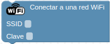
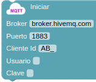
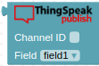
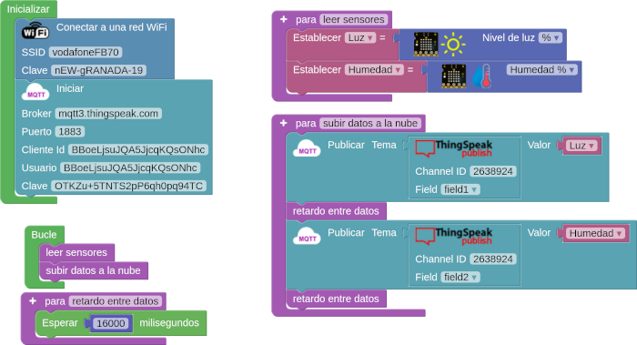
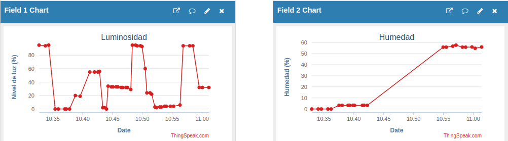

## **Introducción**
Como se puede ver en la sección [Teoría básica de IoT](./thinspeak.md) el broker que vamos a utilizar utiliza un dispositivo MQTT para trabajar, por lo que en arduinoblocks necesitamos bloques MQTT que se comuniquen con el MQTT del broker.

Antes de entrar en los bloques de programación tenemos que saber que el broker MQTT de Thinspeak esta en la dirección mqtt3.thingspeak.com y el puerto que utiliza para comunicarse es el 1883:

!!! info "Servidor MQTT de Thingspeak"
    ==**Dirección:**== **mqtt3.thingspeak.com**  
    ==**Puerto:**== **1883**

## **Bloques MQTT**
Los bloques MQTT están explicados en en el libro online [Arduinoblocks free edition](https://docs.google.com/document/u/1/d/e/2PACX-1vQSrOKHpbLQHVbGFdAvp7DcndoftoHDI) y aquí veremos muy brevemente los que vamos a utilizar:

* **Iniciar WiFi**. Aunque no es un bloque MQTT lo primero que debemos hacer es dar conectividad WiFi a nuestra placa para poder comunicarnos via MQTT con el broker.

  
*Conectar a red WiFi*

* **Iniciar**. La primera tarea a realizar será iniciar el broker con los datos anteriores y las credenciales que nos ha suministrado Thingspeak.

  
*Iniciar broker*

* **Publicar**. Para enviar datos a los campos del canal creado.

  
*Publicar en el broker*

* **Thingspeak publish**. Define la parte "Tema" del bloque anterior. Tenemos que indicarle el ID del canal y el campo en el que lo haremos. Tengase en cuenta que Thingspeak ordenada los campos de *field1 ... field8* de manera invariable por lo que tenemos nosotros que saber que variable hemos puesto en cada campo.

  
*Thingspeak publish*

!!! info "Publicar campo a campo"
	Con los bloques anteriores ya podemos trabajar perfectamente enviando de uno en uno los datos al broker por MQTT.  
    En **cuentas gratuitas** debemos tener presente que debemos **dejar transcurrir** un tiempo de **15 segundos entre envios**.

## **Ejemplo de subida dato a dato**
Vamos a ver un ejemplo de envio de datos al canal. Vamos a enviar el nivel de luz y la humedad que dan los sensores que monta la placa micro:STEAMakers. El programa es el siguiente:

  
[*Ejemplo de subida dato a dato*](./ejemplosAB/Datos_1a1_Thingspeak.abp)

Mas adelante veremos diferentes formas de visualizar los resultados, pero por ahora, en el canal tenemos lo siguiente:

  
*Resultados de ejemplo de subida dato a dato*

## **Mas bloques MQTT**
A veces puede resultar tedioso y lento el subir los datos uno a uno. En arduinoblocks existe la posibilidad de utilizar los bloques "multi publish" que realizan una publicación de todos los datos en una sola subida.

* **Thingspeak multi publish con ID**. Para publicar a partir del ID del canal.

  
*Thingspeak multi publish con ID*

* **Thingspeak multi publish Values**. El bloque concatena los valores a publicar como una cadena y los sube de una sola vez. La parte difuminada del bloque indica claramente que debemos usarlo en conjunto con el siguiente que vamos a ver: **Thingspeak multi publish Field**

  
*Thingspeak multi publish Values*

* **Thingspeak multi publish Field**. Permite definir el valor y el campo en el que se publicará. Debemos usarlo en conjunto con el anterior: **Thingspeak multi publish Values**

  
*Thingspeak multi publish Field*

En la actividad [A04-Temperatura y Humedad con Thingspeak](../actividadesMOD/A04MOD.md) se utilizan estos bloques.
