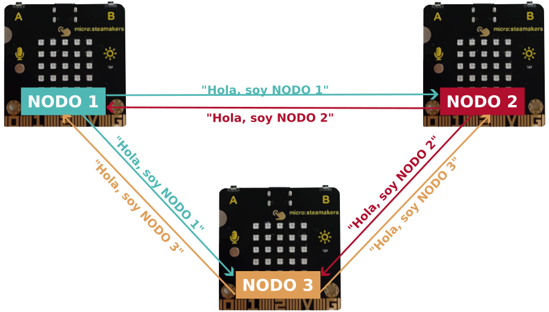
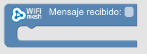
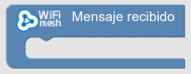
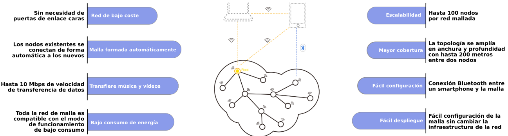

# WiFiMesh
El contenido de esta sección está basado en el apartado WiFiMesh del manual [ESP32 STEAMakers - nuevos bloques - WiFi · IoT · WifiMesh](https://drive.google.com/file/d/1bRxolnQ7ny5jdpUCbmtyT9GTHrseVjFG/view) de arduinoblocks.

!!! failure "¡¡ ADVERTENCIA !!"
	<b>WiFiMesh presente, en algunas ocasiones, un problema, y es se pierden más mensajes de los que deberían, y a veces a unos les llegan y a otros no, o incluso no le llegan a ningún nodo.  
    Es posible que en el momento que leas esto los bloques para WiFiMesh de arduinoblocks estén considerados como obsoletos (deprecated) y por lo tanto estén desabilitados. Pero las mismas o similares actividades se pueden realizar con ESPNOW.</b>

WifiMesh implementa una malla WiFi de dispositivos descentralizada, de manera que todas las placas micro:STEAMakers estarán interconectadas de forma sencilla y sin necesidad de una red WiFi previa o punto de acceso (la crean ellas mismas automáticamente). Cada dispositivo puede enviar mensajes al resto y recibir de cualquiera (¡hablan todas con todas!)

  
*Malla WiFiMesh de tres nodos*

En arduinoblocks el proceso de intercambio de mensajes entre placas ESP32 micro:STEAMakers es muy fácil de utilizar. No necesitamos una red previa donde conectarnos, los propios dispositivos crean un red propia entre ellos para intercambiar información.

Todos los dispositivos (nodos) que vayan a formar parte de la red Mesh (malla) deben compartir la misma configuración de nombre, clave de la red y puerto.

Analizamos en este mismo apartado los bloques de arduinoblocks que tenemos disponibles para WiFiMesh.

|Bloque| Descripción breve|
|:-:|---|
||Crea o une el dispositivo a una red "mesh" |
||Enviar un mensaje a todos los nodos de la red: envía un mensaje a todos los nodos conectados a nuestra red “mesh”  |
||Enviar un mensaje a todos los nodos de la red: envía un mensaje y datos (opcionales) a todos los nodos conectados a nuestra red “mesh” |
||Recibi mensajes de otros nodos (evento de recepción), este bloque recibe todos los mensajes y ya dentro podré determinar el mensaje y los datos recibidos |
||Recibi mensajes de otros nodos (evento de recepción), este bloque recibe todos los mensajes y ya dentro podré determinar el mensaje |
||Bloque asociado al de "Mensaje recibido" para obtener el mensaje recibido |
||Bloque asociado al de "Mensaje recibido" para obtener los datos asociados al mensaje recibido |

En la imagen siguiente se describen los beneficios de ESP-WiFi-Mesh según Espressif, la empresa creadora de los microcontroladores ESP32-WROOM:

  
*Beneficios de ESP-WiFi-Mesh*

