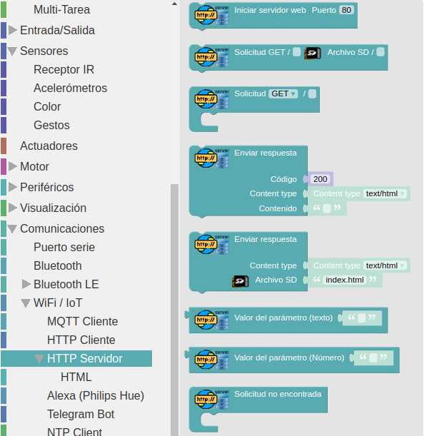
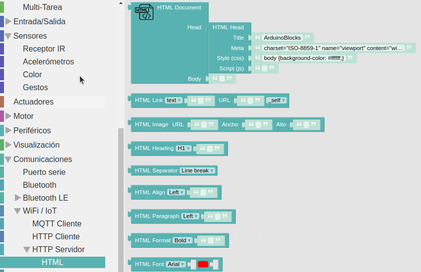
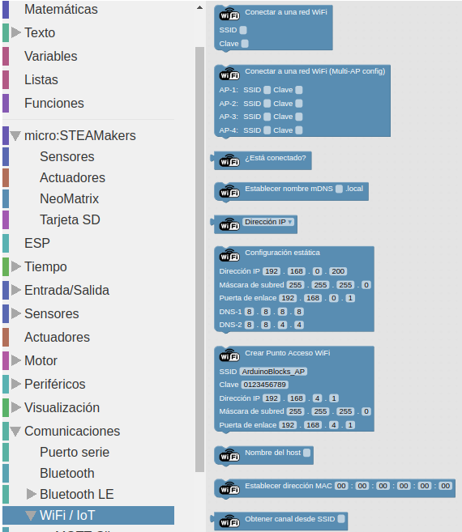

## **Introducción**
Nos basamos en el documento [ESP32 STEAMakers. nuevos bloques. WiFi · IoT · WifiMesh](https://drive.google.com/file/d/1bRxolnQ7ny5jdpUCbmtyT9GTHrseVjFG/view) dado que al portar un procesador ESP32, la micro:STEAMakers tiene capacidades WiFi, lo que nos va a permitir que la placa actue como servidor o como cliente web.

Los bloques disponibles son los siguientes:

  
*Bloques HTTP Server*

En el submenú HTML tenemos disponibles bloques que nos permiten dar un poco de formato HTML a la web:

  
*Bloques HTML*

Para nuestros programas vamos a necesitar bloques WiFi de los que vemos a continuación:

  
*Bloques WiFi*

## **Peticiones HTTP**
Simplemente vamos a extraer del manual online la forma en que se realiza una petición HTTP.

!!! info "Peticiones HTTP"
	Las peticiones HTTP las haremos normalmente desde un navegador, poniendo la IP de nuestro dispositivo en la barra de direcciones con el protocolo http.
    Por ejemplo si nuestro dispositivo tiene la dirección IP 192.168.4.4: [http://192.168.4.4](http://192.168.4.4).

El formato de la URL que podemos solicitar a nuestra ESP32 STEAMakers es:

http://direccionip/accion?parametros

La dirección IP es la que tenga el dispositivo.

La acción (opcional) será la web o comando que queremos pedirle al servidor. En un servidor web real (este es real, me refiero a uno tradicional tipo Apache, etc…) sería el documento del servidor que estamos solicitando (ejemplo: index.html, index.php , guardardatos.jsp, ….)

Los parámetros (en este caso parámetros tipo GET) son datos adicionales que le damos al servidor normalmente como información extra a la acción solicitada. Los parámetros GET son opcionales, siempre van después del símbolo “?” y se forman con pares “clave=valor” separados entre ellos por “&”.