## **Introducción**
Contenidos basados en los documentos de referencia de [Libros & Documentación](http://www.arduinoblocks.com/web/site/doc):

* [ESP32 STEAMakers Telegram Bot.pdf](https://drive.google.com/file/d/15cfrsSBGjL8pgq67x7Syr32BBO714F7M/view?usp=drive_web)
* [ESP32STEAMakers_telegram.pdf](https://drive.google.com/file/d/1Tkn5XbazSuA5-Ms1x1x3FQQEnhiAt76H/view?usp=drive_web)

Telegram es una aplicación de mensajeria instantánea y VOIP (Voz sobre Protocolo de Internet) gratuita, de software libre, desarrollada por los hermanos [Nikolái Dúrov](https://es.wikipedia.org/wiki/Nikol%C3%A1i_D%C3%BArov) y [Pável Dúrov](https://es.wikipedia.org/wiki/P%C3%A1vel_D%C3%BArov). Permite enviar y recibir mensajes, imágenes y vídeos a través de internet de persona a persona o a través de grupos y canales.

Con esta aplicación nos podemos comunicar de forma sencilla con nuestra placa micro:STEAMakers consiguiendo así un nuevo canal de comunicación con ella. Aunque Telegram dispone de una aplicación de escritorio y otra online, lo más habitual es utilizarla desde un teléfono móbil (Android o iPhone) por lo que centraremos aquí las explicaciones con sistema operativo Android.

## **Bot de Telegram**
Un bot es una aplicación que se ejecuta dentro de Telegram. No hay que instalarlos y se usan como si estuviesemos hablando con una persona. Utilizan una interfaz de texto por lo que se controlan enviandoles mensajes que contengan los comandos que soportan. Los comandos son las instrucciones o palabras que tenemos que escribir para comunicarnos con el bot y dependen de cada uno de ellos.

Se buscan como cualquier otro usuario, utilizando @nombre o con el buscador de Telegram. Cuando entablamos una conversación con un bot veremos una descripción de su funcionamiento, debajo de la cual habrá un botón "Start" que sirve para enviar el comando de inicio al bot. Cuando hagamos esto el bot responderá explicando de nuevo su funcionamiento y listando los comandos para empezar a utilizarlo.

Existe un bot, llamado **BotFather**, que es el padre de todos los bots y que sirve para crear otros bots. Una vez encontrado entramos en el chat del mismo y ya podemos comenzar a trabajar.

Inicialmente se muestra un cuadro de opciones, un botón nombrado "Menu" y la entrada de texto del chat. Si hacemos clic sobre "Menu" o escribimos en el chat la barra inclinada (/) sin pulsar la tecla enter se nos mostrarán todas las opciones disponibles u ordenes que el bot puede recibir.

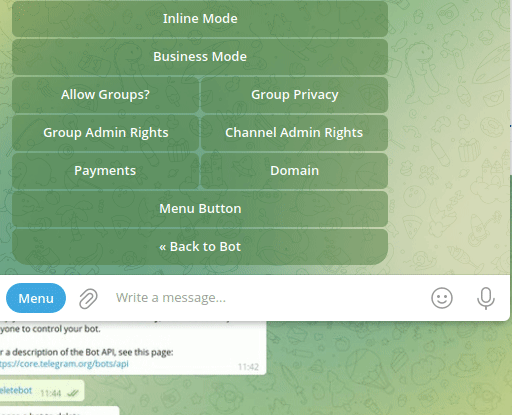  
*Botfather inicial*

A continuación vemos los comandos mas importantes disponibles brevemente explicados:

* /newbot - crea un nuevo bot.
* /mybots - lista los bost existentes y permite administrar su configuración.
* /token - genera un token de autorización. Un token es un código alfanumérico necesario para que el bot utilice la API (interfaz de programación de aplicaciones) de Telegram.
* /revoke - genera un nuevo token quedando revocados todos los derechos del anterior.
* /setname - para cambiar nombre a los bots.
* /setdescription - cambia la descripción del bot.
* /setuserpic - cambia la foto de perfil del bot.
* /setcommands - cambia la lista de comandos del bot.
* /delebot - para borrar un bot.
* /cancel - cancela la operación actual.

Vamos a comenzar creando un bot que vamos a denominar micro:STEAMakers. Hacemos:

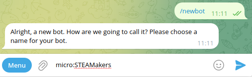  
*/newbot*

Cuando damos Enter tras teclear el nombre se realiza la comprobación de que dicho bot no existe, y si es así, nos invita a teclear un nombre de usuario para nuestro bot. Este nombre debe terminar con la palabra bot o Bot. Hemos probado con "docu_bot", pero está en uso, así que se ha cambiado por "docuuSM_bot". Si tenemos éxito nos devuelve esto:

??? "==¡Clic para mostrar!=="
    Done! Congratulations on your new bot. You will find it at [t.me/docuuSM_bot](https://t.me/docuuSM_bot). You can now add a description, about section and profile picture for your bot, see [/help]() for a list of commands. By the way, when you've finished creating your cool bot, ping our Bot Support if you want a better username for it. Just make sure the bot is fully operational before you do this.
    
    Use this token to access the HTTP API:
    7436809274:AAFloQ8QhUsf2dBnqL3iroTKQq_Ho7zdQtw
    Keep your token secure and store it safely, it can be used by anyone to control your bot.
    
    For a description of the Bot API, see this page: <https://core.telegram.org/bots/api>

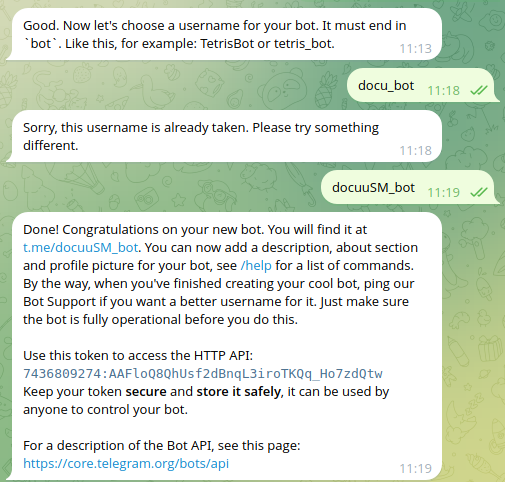  
*/newbot creado*

El API Token es muy importante por lo que debemos guardarlo a buen recaudo y no difundirlo. En este caso se hace para documentar y cuando se finalice la actividad de uso será eliminado.

Una vez tenemos la conversación abierta con BotFather, podemos teclear Start o Empezar o Help o Ayuda para iniciarla y veremos una lista con todos los comandos que entiende BotFather. Con esos comandos, crearemos nuestro propio bot y haremos todo lo necesario para configurarlo y ponerlo en marcha.

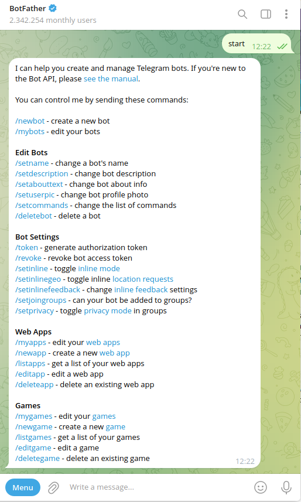  
*Ayuda de BotFather*

Para modificar o completar la información de nuestro bot "docuSM_bot" primero debemos seleccionarlo, lo que podemos hacer con el comando "/mybots" y haciendo clic sobre el mismo:

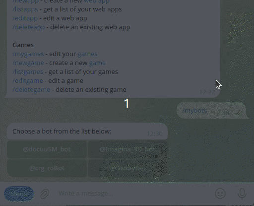  
*mybots*

En la animación siguiente vemos como acceder al usuario del nuevo bot para poder iniciarlo y lo hacemos como si acabasemos de entrar en BotFather que, lógicamente, también debemos iniciar.

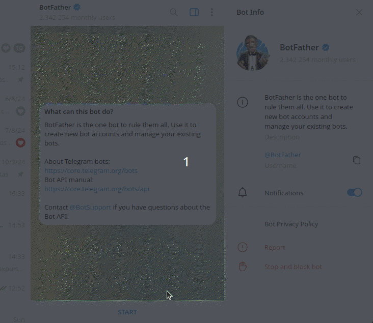  
*Inicio de los bots*

Para el trabajo con el bot también se ha creado un grupo (docu_microSTEAMakers) al que añadimos el usuario de nuestro bot.

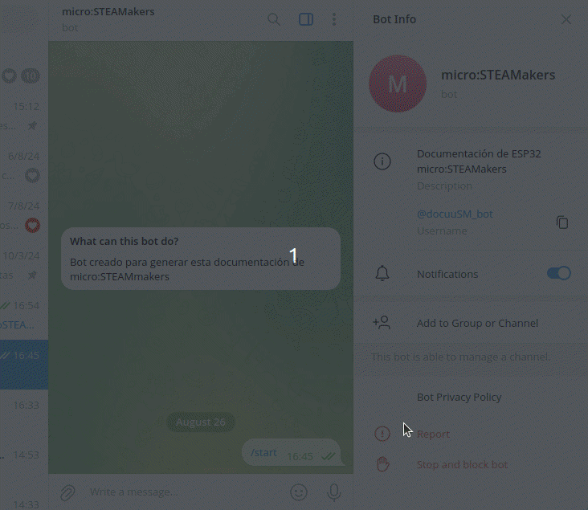  
*Agregar a grupo*

Observamos como en ese grupo ya está @IDBot que ahora vemos el motivo.

Una vez que accedemos al bot podemos escoger las opciones de configuración adecuadas a nuestras necesidades, como consultar (o cambiar) el "API Token", editar el bot, configirar el bot, etc.

Con esto nuestro bot ya puede responder mensajes, pero si queremos enviar mensajes a un chat vamos a necesitar el ID de dicho chat o del grupo. Para obtener el ID vamos a hacer uso de un bot que se llama @myidbot:

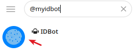  
*@myidbot*

Nos aseguramos que seleccionamos el bot con la imagen señalada.

Entramos en el chat del bot y el menú nos indica las dos opciones que tenemos disponibles:

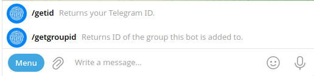  
*Menu @myidbot*

* /getid - devuelve nuestro ID de telegram

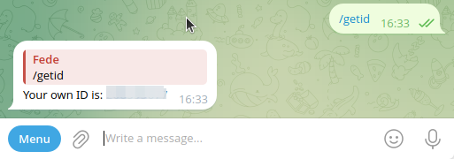  
*/getid*

* /getgroupid - devuelve el ID del grupo al que este bot (myidbot) se ha añadido.

Si hacemos la consulta /getgroupid desde IDBot obtenemos el siguiente mensaje:

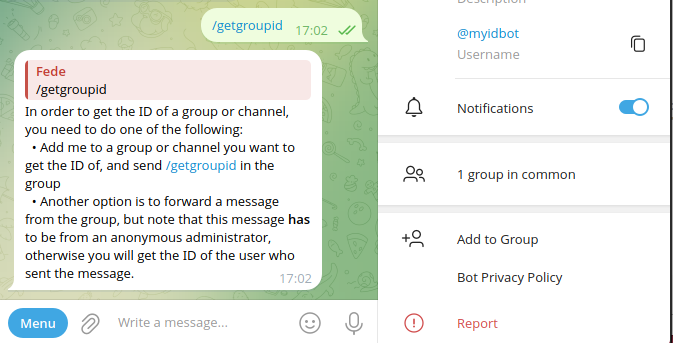  
*/getgroupid desde IDBot*

Para que nos resulte sencillo, a continuación vemos la traducción del mensaje:

???+ "Traducción del mensaje"
    Para obtener el ID de un grupo o canal, tienes que hacer una de las siguientes cosas:  
      - Añadirme a un grupo o canal del que quieras obtener el ID, y enviar /getgroupid en el grupo.  
      - Otra opción es reenviar un mensaje del grupo, pero ten en cuenta que este mensaje tiene que ser de un administrador anónimo, de lo contrario obtendrás el ID del usuario que envió el mensaje.

Si ahora realizamos la consulta desde el grupo obtenemos:

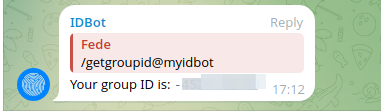  
*/getgroupid desde grupo*

Vamos a establecer los comando que va a reconocer nuestro bot, que van a ser:

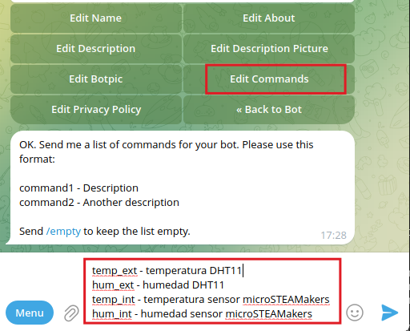  
*Configurar comandos*

Podemos seguir profundizando en las configuraciones de Telegram, pero no es el objetivo aquí y con todo lo realizado vamos a tener suficiente para desarrollar la actividad propuesta.

## **Bloques Telegram-Bot**
Los encontramos en el menú **WiFi / IoT --> Telegram Bot** y son los siguientes:

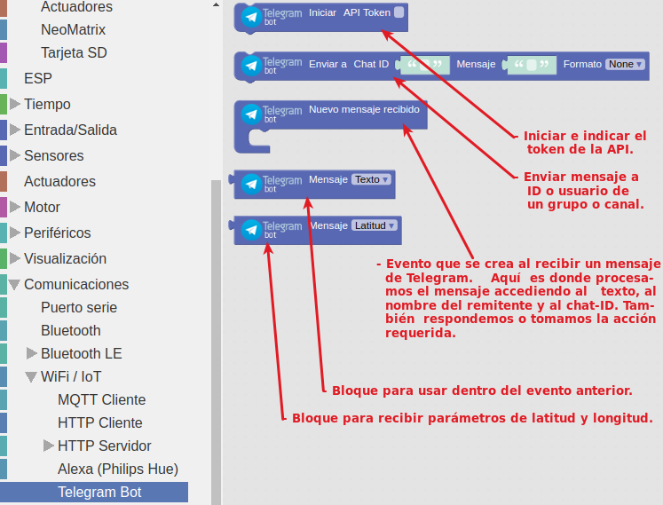  
*Bloques Telegram-Bot*

Trabajar con Telegram requiere estar conectado a una red WiFi, lo que podemos hacer con el bloque:

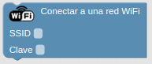  
*Bloques Telegram-Bot*

Lógicamente tenemos que conocer el nombre de la red y la contraseña de acceso a la misma.
