El presente proyecto es una adaptación de la entrada [I2C between micro:bit and Arduino](https://wiki.microblocks.fun/en/communicate_with_arduino_via_i2c) disponible en la [MicroBlocks Wiki](https://wiki.microblocks.fun/en/home) que es un paso a paso para utilizar la comunicación i2c entre una micro:bit y un Arduino (avanzado) creado por [Turgut Guneysu](https://microblocks.fun/about) un defensor de la programación basada en bloques y contribuidor de los entornos MicroBlocks y SNAP.

## <FONT COLOR=#007575>**Introducción**</font>

{align=right}

MicroBlocks soporta tanto comunicaciones I2C como SPI. En este artículo estableceremos un enlace I2C desde una micro:STEAMakers a un Arduino y estableceremos comunicación entre ellos.

I2C utiliza sólo dos cables y es muy fácil de configurar. Un cable SCL proporciona la señalización de reloj entre los sistemas. El otro SDA se utiliza para transferir datos en ambas direcciones.

Los dispositivos se designan como Maestro o Esclavo, siendo el Maestro el que controla todos los intercambios. En nuestro proyecto, micro:STEAMakers será maestro y Arduino será esclavo.

## <FONT COLOR=#007575>**Objetivo**</font>
Seguirás las instrucciones para cablear los dos dispositivos para establecer un enlace entre ellos y para alimentarlos. A continuación, veremos la codificación necesaria para que ambos dispositivos implementen el protocolo I2C. Finalmente, intercambiaremos algunos mensajes entre micro:STEAMakers y Arduino.

## <FONT COLOR=#007575>**Materiales necesarios**</font>
* ESP32 micro:STEAMakers y cable USB-A a USB-C
* Arduino UNO o equivalente y cable USB-A a USB-B
* Alguna placa breakout compatible que nos ofrezca conexión I2C. Nosotros usaremos la placa [Shield:bit](https://shop.innovadidactic.com/ca/micro-bit-placas-shields-y-kits/1675-placa-de-expansion-shield-bit-con-controlador-de-motores.html)
* 3 cables dupont M/F (Macho/Hembra) o 3 cables dupont M/M (Macho/Macho) de 20cm
* Ordenador con dos puertos USB

**Programas listos para descargar:**

* Para micro:STEAMakers, versión 1:  Programa de MicroBlocks [Programa_I2C_a_UNO_V1](../program/actividadesmB/Programa_I2C_a_UNO_V1.ubp).
* Para micro:STEAMakers, versión 2:  Programa de MicroBlocks [Programa_I2C_a_UNO_V2](../program/actividadesmB/Programa_I2C_a_UNO_V2.ubp).
* Para placa tipo UNO: Programa para el IDE 2.3.4 de Arduino [Código en el IDE 2.3.4 de Arduino](../program/comunicacion_i2c/comunicacion_i2c.ino)

!!! info "NOTA:"
    Se presupone que el lector está familiarizado con el uso del IDE 2.3.4 de Arduino y la carga de programas en placas tipo Arduino UNO.

## <FONT COLOR=#007575>**Configuración**</font>
Para establecer la conectividad I2C en las placas Shield:Bit + micro:STEAMakers y UNO tienes que realizar el cableado de la imagen siguiente:

<center>

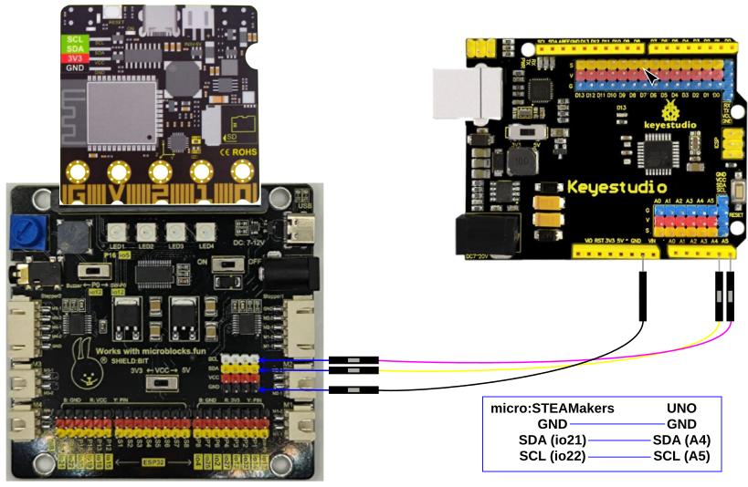  
*Cableado entre Shield:Bit y UNO*

</center>

Además de la conectividad entre las placas mostradas arriba, recuerda usar los respectivos cables USB para conectarlas a tu ordenador para programarlas.

!!! Danger "IMPORTANTE"
    La micro:STEAMaker dispone de conector I2C hembra por lo que cabe pensar que se puede prescindir de la placa breakout.

    Micro:STEAMakers y Arduino UNO o equivalente utilizan diferentes voltajes de alimentación, 3.3V y 5V respectivamente. Por favor, <font color=#FF0000>**NO**</font> conectes directamente estas dos placa una con otra sin una placa breakout que proporcione la conversión de voltaje.

    <center>

    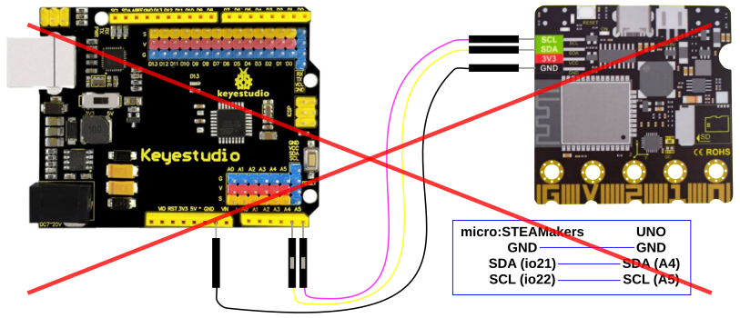  
    *Cableado entre micro:STEAMaker y UNO (NO PERMITIDO)*

    </center>

    !!! Warning "EXCEPCIÓN"
        La placa Keyestudio UNO que se ve en la imagen anterior dispone de un interruptor que permite trabajar con 3.3V. Por lo tanto **estando dicho interruptor en la posición 3.3V si sería posible la conexión anterior**. Pero **CUIDADO** con despistarnos y cambiar el interruptor a 5V con las conexiones realizadas porque romperemos la micro:STEAMakers.

## <FONT COLOR=#007575>**Procedimiento**</font>
Para nuestro proyecto necesitaremos dos conjuntos de programas: uno para la micro:STEAMakers y otro para el Arduino UNO o equivalente. Veremos ambos a continuación.

Pero antes de entrar en examinar el código para estas dos funciones, revisemos los bloques de codificación relacionados con I2C del IDE de microBlocks.

### <FONT COLOR=#AA0000>Bloques I2C de microBlocks</font>
Los siguientes bloques componen las funciones I2C en microBlocks disponibles en el menú "Comm (Comunicaciones)":

* Este bloque lee el valor del Registro del dispositivo I2C seleccionado. El valor devuelto es un entero de un byte en el rango de 0 - 255.

<center>

  
*Bloque i2c get device...*

  
*Bloque lee del dispositivo i2c...*

</center>

* Este bloque escribe un valor en el Registro seleccionado del dispositivo I2C seleccionado. El valor utilizado debe ser un entero de un byte en el rango de 0 - 255.

<center>

  
*Bloque i2c set device...*

  
*Bloque escribe al dispositivo i2c...*

</center>

* Este bloque nos permite leer múltiples bytes de datos del dispositivo I2C. La longitud de la lista determina cuántos bytes se intercambiarán. I2C tiene un límite interno de 32 bytes como máximo. Por lo tanto, sólo se pueden intercambiar entre 1 y 32 bytes a través de este bloque. Los valores de la lista deben ser enteros y estar comprendidos entre 0 y 255. Cualquier otro valor será ignorado.

<center>

  
*Bloque i2c device... read...*  

  
*Bloque lee del dispositivo i2c... a la lista*

</center>

* Este bloque nos permite escribir múltiples bytes de datos en el dispositivo I2C. La longitud de la lista determina cuántos bytes se intercambiarán. I2C tiene un límite interno de 32 bytes como máximo. Los valores de la lista deben ser enteros y estar comprendidos entre 0 y 255. Cualquier otro valor será ignorado.

<center>

  
*loque i2c device... write list...*

  
*Bloque escribe al dispositivo i2c... el contenido de la lista...*

</center>

Para nuestro proyecto, sólo haremos uso de los dos últimos bloques relacionados con listas. Veamos el código del programa con más detalle.

### <FONT COLOR=#AA0000>Programa para la micro:STEAMakers_V1</font>
El programa en un momento de la ejecución lo vemos en la imagen siguiente:

<center>

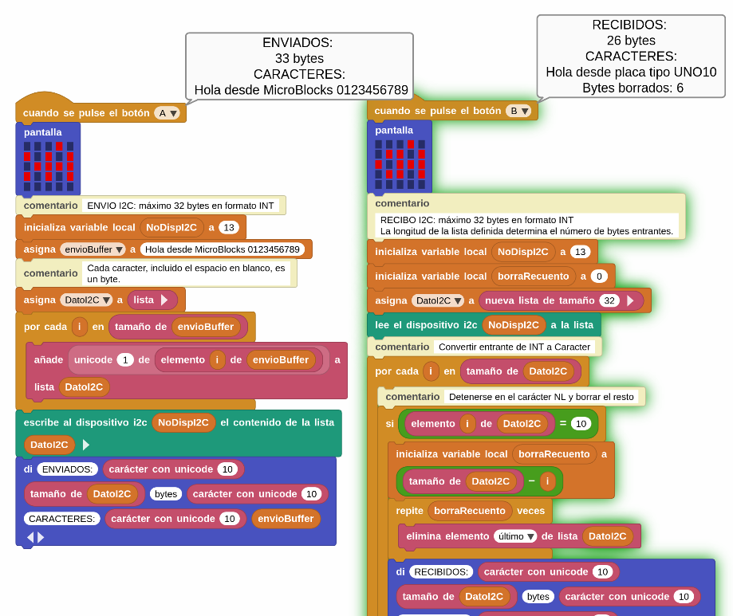  
*Programa*

</center>

Realizamos un análisis de cada script por separado.

==**Botón A. Enviar**==

Lo que queremos que suceda es que cuando pulsamos el Botón-A en la micro:STEAMakers se envíe nuestro mensaje a la placa UNO.

* <font color=#ff00ff>"cuando se pulsa el botón A"</font>

<center>

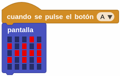

</center>

Empezamos con el bloque "cuando se pulsa el botón A" y mostramos una imágen en la pantalla correspondiente a ">A" para intentar indicar que la función está ENVIANDO datos.

* <font color=#ff00ff>Definición de variables</font>

<center>

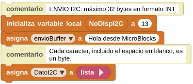

</center>

**NoDispI2C** es el número de dispositivo I2C que hemos decidido utilizar para el dispositivo esclavo, la placa UNO. La selección es totalmente arbitraria pudiendo ser cualquier número entre 8 y 127. Los primeros números (0 - 7 ) están reservados para el propio i2c.

La variable **envioBuffer** se utiliza para almacenar el texto del mensaje que queremos enviar al dispositivo UNO. En este ejemplo, he creado un mensaje de 33 bytes, aunque puede ser cualquier otro con las limitaciones ya expuestas, como veremos en la descripción del botón B.

La variable **DatoI2C** comienza como una lista VACIA. Necesitamos una variable de tipo lista porque el bloque "escribe al dispositivo i2c..." que utilizaremos para enviar nuestro mensaje multibyte así lo requiere.

* <font color=#ff00ff>Rellenamos la lista con los datos suministrados</font>

<center>

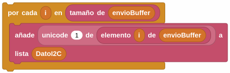

</center>

Como el texto de nuestro mensaje está en la variable de cadena **envioBuffer**, tenemos que convertirlo al formato de lista requerido por el bloque "escribe al dispositivo i2c...".

Recuerda que a I2C sólo le gustan los enteros entre 0 - 255, y no sabe nada de letras de texto o signos de puntuación, etc. Esto significa que tenemos que tomar todas y cada una de las letras de nuestro mensaje y convertirlas a un valor ASCII entre 0 - 255. Luego tenemos que almacenarlas una por una. Por tanto tenemos que almacenarlos uno por uno en ubicaciones consecutivas de la variable de tipo lista **DatoI2C**. Qué mejor manera de conseguirlo que dejar que microBlocks se encargue de la laboriosa tarea. Así que usamos un bloque de tipo bucle FOR para iterar a través de la longitud de la variable **envioBuffer**, y añadir cada letra a la lista **DatoI2C**. Al finalizar las iteraciones del bucle ya está en el formato apropiado, listo para ser enviado.

* <font color=#ff00ff>Aquí es donde ocurre la acción</font>

<center>

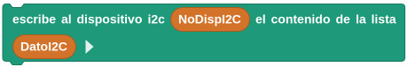

</center>

Le decimos a microBlocks que tome nuestra lista **DatoI2C** y la envíe al dispositivo I2C **NoDispI2C** 13.

Las rutinas de la librería I2C que se ejecutan en segundo plano mirarán la longitud variable de la lista **DatoI2C** y calcularán cuántos caracteres hay que enviar. Entonces la librería indicará a la placa UNO que hay 33 bytes de datos en camino, y los enviará. Hay una gran actividad que está sucediendo en segundo plano sin que se requiera de nuestra intervención o codificación. Tenemos que agradecer a microBlocks que nos lo haya puesto tan fácil. Sin embargo, no podemos decir lo mismo del lado del IDE de Arduino, como veremos más adelante.

* <font color=#ff00ff>Final de la rutina ENVIAR</font>

<center>

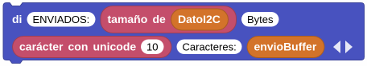

</center>

Para asegurarnos de que todo se ha completado en este punto, mostramos un mensaje indicando el número de bytes que hemos enviado y el contenido del buffer enviado.

Ahora, pasemos a la parte de RECEPCION.

==**Botón B. Recibir**==

Lo que queremos que suceda es que cuando pulsamos el Botón-B en la micro:STEAMakers se reciba un mensaje desde la placa UNO.

* <font color=#ff00ff>"cuando se pulsa el botón B"</font>

<center>

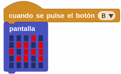

</center>

Empezamos con el bloque "cuando se pulsa el botón B" y mostramos una imágen en la pantalla correspondiente a "< A" para intentar indicar que la función está RECIBIENDO datos.

* <font color=#ff00ff>Definición de variables</font>

<center>

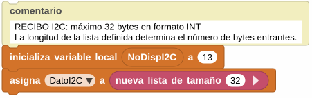

</center>

De nuevo, tenemos que definir nuestras variables.

**NoDispI2C** es el número de dispositivo I2C del que recibiremos.

**DatoI2C** necesita ser configurado como una lista vacía de 32 entradas, lista para recibir el mensaje de la placa UNO.

* <font color=#ff00ff>Bloque de acción</font>

<center>


</center>

Indicamos a microBlocks que lea múltiples bytes del dispositivo 13 y coloque el mensaje entrante en la variable de tipo lista **DatoI2C**. En este caso tampoco hay mucho que hacer por nuestra parte, ya que microBlocks maneja los detalles de I2C en segundo plano. Sin embargo, examinemos lo que sucede en segundo plano: La librería I2C inicializará los detalles del protocolo I2C como la velocidad, y se designará a sí misma como maestra. Entonces mirará el tamaño de la lista **DatoI2C** y enviará un mensaje REQUEST al dispositivo 13 pidiendo 32 bytes de datos. Cuando esos datos lleguen los almacenará en la lista designada y cerrará el enlace I2C.

* <font color=#ff00ff>Conversión de entero a carácter</font>

<center>

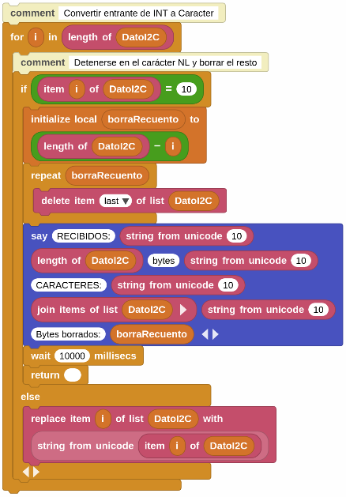

</center>

En este caso se trata de un bloque de código de un bucle "for" con un condicional anidado que analizaremos en detalle.

Como hemos visto estamos limitando la longitud máxima de los datos entre uno y 32 bytes y para el manejo de los datos mas cortos se finalizan con un carácter NEWLINE al final en el programa del IDE de Arduino. De esta forma, buscando el carácter NEWLINE en el mensaje recibido en el lado micro:STEAMakers, podemos saber que es el final del mismo e ignorar el resto de los 32 bytes, si los hubiera. Ten en cuenta que esta es una decisión de diseño del programa y se indica lo anterior para facilitar la compresión del código.

El bucle FOR examina cada byte de la lista **DatoI2C** y busca un valor NEWLINE. El byte NEWLINE tiene un valor ASCII decimal de 10.

<center>


</center>

Así que cuando encontramos esto en los bytes examinados, hacemos dos cosas:

<center>

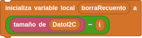{align=left}

</center>

**1.** En primer lugar, calculamos una variable local **borraRecuento** y almacenamos en ella el número de bytes que quedan hasta el final del buffer. Es decir, como hemos llegado al final del mensaje, calculamos cuántos bytes sobran, si es que sobran. Eso es lo que almacena la variable **borraRecuento**. Así que todo lo que haya después de la NEWLINE no nos interesa, y nos desharemos de ello.

<center>

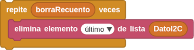{align=left}

</center>

**2.** En segundo lugar usamos un bucle REPETIR con **borraRecuento** como parámetro para borrar los bytes restantes de la lista **DatoI2C**. Usando la opción ELIMINA ELEMENTO ULTIMO de la lista, no tenemos que preocuparnos de dónde estamos en el proceso de borrado.

Esto nos deja con una lista limpia que contiene sólo los bytes válidos del mensaje entrante incluido el carácter NEWLINE que es el decimal 10.

Inmediatamente después, mostramos un mensaje para informar del final del proceso.

<center>

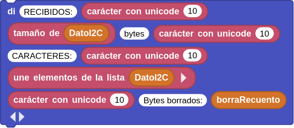

</center>

El bloque "UNE ELEMENTOS DE LA LISTA..." sirve para convertir los valores de la lista **DatoI2C** en una cadena.

El bloque ESPERA debe ser del tiempo suficiente que nos permita ver y leer el mensaje mostrado.

El bloque RETURN simplemente sirve para salir del bucle FOR inmediatamente.

Si el byte examinado NO es el valor NEWLINE, significa que tenemos un contenido anormal de nuestro mensaje y debemos conservarlo.

<center>

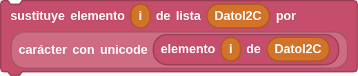

</center>

Como los valores de la lista están en formato entero, tenemos que convertirlos a formato cadena utilizando el bloque CARACTERR CON UNICODE, y sustituir el valor entero de la lista por esta nueva cadena.

Esto nos lleva al final de la lógica del bucle FOR.

Dado que existe la posibilidad de que un mensaje entrante contenga o no un byte NEWLINE, dependiendo de su longitud, el último bloque DI tiene en cuenta la visualización de los detalles, en caso de que NO encontremos el byte NEWLINE.

A continuación se muestra el programa cuando se pulsa el Botón-B y se recibe el mensaje de la placa tipo Arduino UNO o similar:

<center>

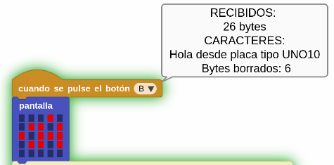  
*Botón B. Recibir en ejecución*
</center>

### <FONT COLOR=#AA0000>Programa para la micro:STEAMakers_V2</font>
El programa completo en un momento de la ejecución lo vemos en la imagen siguiente:

<center>

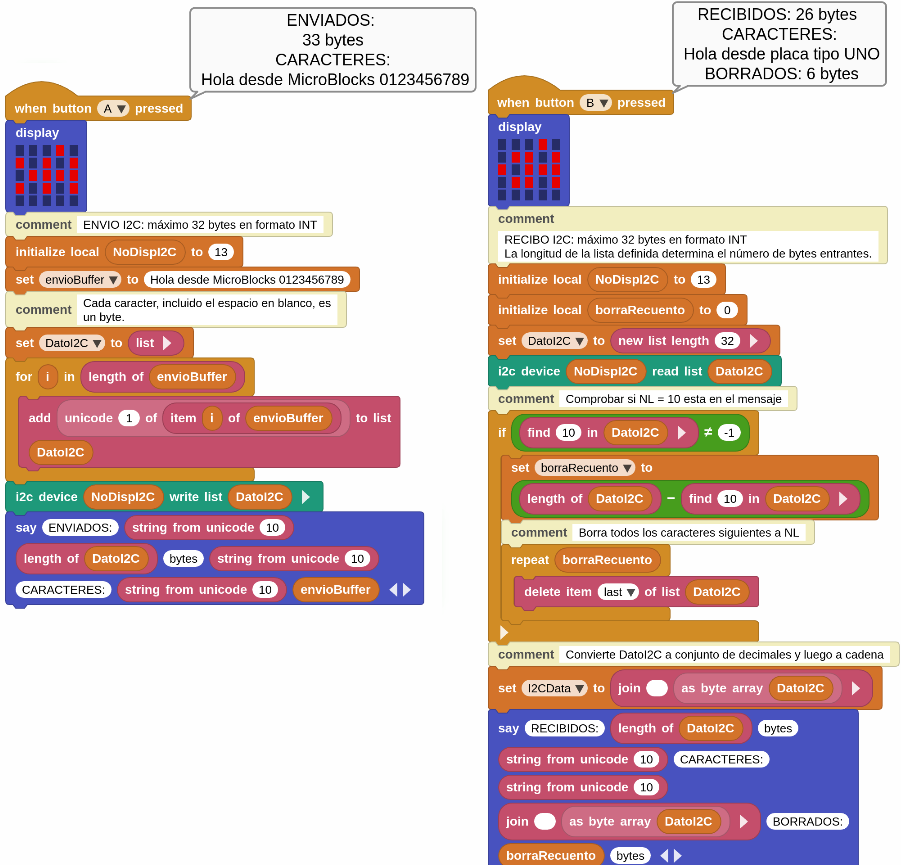  
*Programa*

</center>

==**Botón A. Enviar**==

Lo que queremos que suceda es que cuando pulsamos el Botón-A en la micro:STEAMakers se envíe nuestro mensaje a la placa UNO.

* <font color=#ff00ff>"cuando se pulsa el botón A"</font>

<center>


</center>

Empezamos con el bloque "cuando se pulsa el botón A" y mostramos una imágen en la pantalla correspondiente a ">A" para intentar indicar que la función está ENVIANDO datos.

* <font color=#ff00ff>Definición de variables</font>

<center>


</center>

**NoDispI2C** es el número de dispositivo I2C que hemos decidido utilizar para el dispositivo esclavo, la placa UNO. La selección es totalmente arbitraria pudiendo ser cualquier número entre 8 y 127. Los primeros números (0 - 7 ) están reservados para el propio i2c.

La variable **envioBuffer** se utiliza para almacenar el texto del mensaje que queremos enviar al dispositivo UNO. En este ejemplo, he creado un mensaje de 33 bytes, aunque puede ser cualquier otro con las limitaciones ya expuestas, como veremos en la descripción del botón B.

La variable **DatoI2C** comienza como una lista VACIA. Necesitamos una variable de tipo lista porque el bloque "escribe al dispositivo i2c..." que utilizaremos para enviar nuestro mensaje multibyte así lo requiere.

* <font color=#ff00ff>Rellenamos la lista con los datos suministrados</font>

<center>


</center>

Como el texto de nuestro mensaje está en la variable de cadena **envioBuffer**, tenemos que convertirlo al formato de lista requerido por el bloque "escribe al dispositivo i2c...".

Recuerda que a I2C sólo le gustan los enteros entre 0 - 255, y no sabe nada de letras de texto o signos de puntuación, etc. Esto significa que tenemos que tomar todas y cada una de las letras de nuestro mensaje y convertirlas a un valor ASCII entre 0 - 255. Luego tenemos que almacenarlas una por una. Por tanto tenemos que almacenarlos uno por uno en ubicaciones consecutivas de la variable de tipo lista **DatoI2C**. Qué mejor manera de conseguirlo que dejar que microBlocks se encargue de la laboriosa tarea. Así que usamos un bloque de tipo bucle FOR para iterar a través de la longitud de la variable **envioBuffer**, y añadir cada letra a la lista **DatoI2C**. Al finalizar las iteraciones del bucle ya está en el formato apropiado, listo para ser enviado.

* <font color=#ff00ff>Aquí es donde ocurre la acción</font>

<center>


</center>

Le decimos a microBlocks que tome nuestra lista **DatoI2C** y la envíe al dispositivo I2C **NoDispI2C** 13.

Las rutinas de la librería I2C que se ejecutan en segundo plano mirarán la longitud variable de la lista **DatoI2C** y calcularán cuántos caracteres hay que enviar. Entonces la librería indicará a la placa UNO que hay 33 bytes de datos en camino, y los enviará. Hay una gran actividad que está sucediendo en segundo plano sin que se requiera de nuestra intervención o codificación. Tenemos que agradecer a microBlocks que nos lo haya puesto tan fácil. Sin embargo, no podemos decir lo mismo del lado del IDE de Arduino, como veremos más adelante.

* <font color=#ff00ff>Final de la rutina ENVIAR</font>

<center>


</center>

Para asegurarnos de que todo se ha completado en este punto, mostramos un mensaje indicando el número de bytes que hemos enviado y el contenido del buffer enviado.

Ahora, pasemos a la parte de RECEPCION.

==**Botón B. Recibir**==

Lo que queremos que suceda es que cuando pulsamos el Botón-B en la micro:STEAMakers se reciba un mensaje desde la placa UNO.

* <font color=#ff00ff>"cuando se pulsa el botón B"</font>

<center>


</center>

Empezamos con el bloque "cuando se pulsa el botón B" y mostramos una imágen en la pantalla correspondiente a "< A" para intentar indicar que la función está RECIBIENDO datos.

* <font color=#ff00ff>Definición de variables</font>

<center>

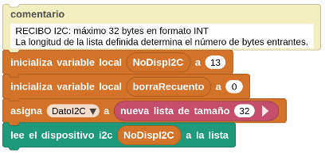

</center>

De nuevo, tenemos que definir nuestras variables.

**NoDispI2C** es el número de dispositivo I2C del que recibiremos.

**borraRecuento** es la variable que va contener los bytes posteriores a NEWLINE que deben ser borrados.

**DatoI2C** necesita ser configurado como una lista vacía de 32 entradas, lista para recibir el mensaje de la placa UNO.

* <font color=#ff00ff>Bloque de acción</font>

<center>


</center>

Indicamos a microBlocks que lea múltiples bytes del dispositivo 13 y coloque el mensaje entrante en la variable de tipo lista **DatoI2C**. En este caso tampoco hay mucho que hacer por nuestra parte, ya que microBlocks maneja los detalles de I2C en segundo plano.

Sin embargo, examinemos lo que sucede en segundo plano: La librería I2C inicializará los detalles del protocolo I2C como la velocidad, y se designará a sí misma como maestra. Entonces mirará el tamaño de la lista **DatoI2C** y enviará un mensaje REQUEST al dispositivo 13 pidiendo 32 bytes de datos. Cuando esos datos lleguen los almacenará en la lista designada y cerrará el enlace I2C.

* <font color=#ff00ff>Proceso de datos entrantes en dos fases</font>

    **Primero** miramos si hay algún caracter NL (valor decimal 10) en el mensaje. Como hemos decidido, podemos enviar y recibir 32 bytes de mensajes. Sin embargo, si queremos enviar y recibir menos que eso, entonces tenemos que añadir un carácter NL después del último byte.

    **Segundo** tomamos los valores de bytes decimales recibidos y los convertimos en una cadena legible.

Veamos cómo hemos escrito el código para hacer estas cosas:

<center>

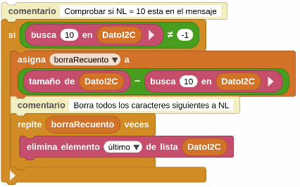

</center>

Como hemos visto estamos limitando la longitud máxima de los datos entre uno y 32 bytes y para el manejo de los datos mas cortos se finalizan con un carácter NEWLINE al final en el programa del IDE de Arduino. De esta forma, buscando el carácter NEWLINE en el mensaje recibido en el lado micro:STEAMakers, podemos saber que es el final del mismo e ignorar el resto de los 32 bytes, si los hubiera. Ten en cuenta que esta es una decisión de diseño del programa y se indica lo anterior para facilitar la compresión del código.

El bloque IF, en combinación con el bloque "busca"", examina cada byte del **DatoI2C** y busca el valor NL. El byte NL tiene un valor decimal ASCII de 10. Así que si lo encuentra en los bytes examinados, devolverá su ubicación. Si no lo encuentra, devolverá -1. Para comprobar si hemos encontrado algo, configuramos el bloque if para que se ejecute si la condición NO ES IGUAL a -1, lo que significa que hay un NL en el mensaje.

<center>


</center>

Así que cuando encontramos esto en los bytes examinados, hacemos dos cosas:

**1.** En primer lugar, calculamos una variable local **borraRecuento** y almacenamos en ella el número de bytes que quedan hasta el final del buffer. Es decir, como hemos llegado al final del mensaje, calculamos cuántos bytes sobran, si es que sobran. Eso es lo que almacena la variable **borraRecuento**. Así que todo lo que haya después de la NEWLINE no nos interesa, y nos desharemos de ello.

<center>

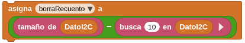

</center>

**2.** En segundo lugar usamos un bucle REPETIR con **borraRecuento** como parámetro para borrar los bytes restantes de la lista **DatoI2C**. Usando la opción ELIMINA ELEMENTO ULTIMO de la lista, no tenemos que preocuparnos de dónde estamos en el proceso de borrado. Esto nos deja con una lista limpia que contiene sólo los bytes válidos del mensaje entrante.

<center>

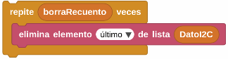

</center>

Ahora que tenemos un búfer limpio con nada más que los caracteres reales del mensaje, tenemos que convertir los valores de bytes decimales a un formato de cadena más legible.

<center>

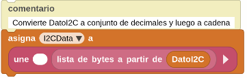

</center>

Esta tarea es muy fácil gracias a la ayuda que proporcionan los bloques de manipulación de datos de Microblocks. Como el bloque "lista de bytes a partir de..." que convierte la variable de tipo lista en un formato byteArray (matriz de valores tipo byte). Ya podemos utilizar el bloque "une micro blocks" con un primer parámetro vacío, lo que fuerza a que todo el byteArray se convierta al formato cadena de texto.

A continuación se muestra el programa cuando se pulsa el Botón-B y se recibe el mensaje de la placa tipo Arduino UNO o similar:

<center>

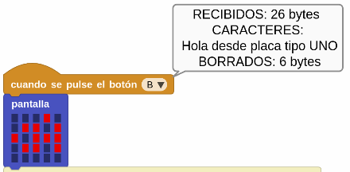  
*Botón B. Recibir en ejecución*

</center>

Con esto hemos llegado con éxito al final de los código de micro:STEAMakers en MicroBlocks.

### <FONT COLOR=#AA0000>Código para el IDE de Arduino</font>

!!! info ""
    El código para la placa Arduino UNO o equivalente trabaja con la libreria "Wire" que se incluye con el IDE de Arduino.

    <center>

    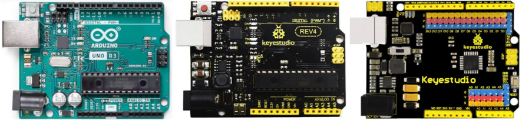

    </center>

Una vez más, tenemos un único programa que servirá como sistema Receptor y Transmisor. 

En la imagen siguiente vemos el código:

<center>

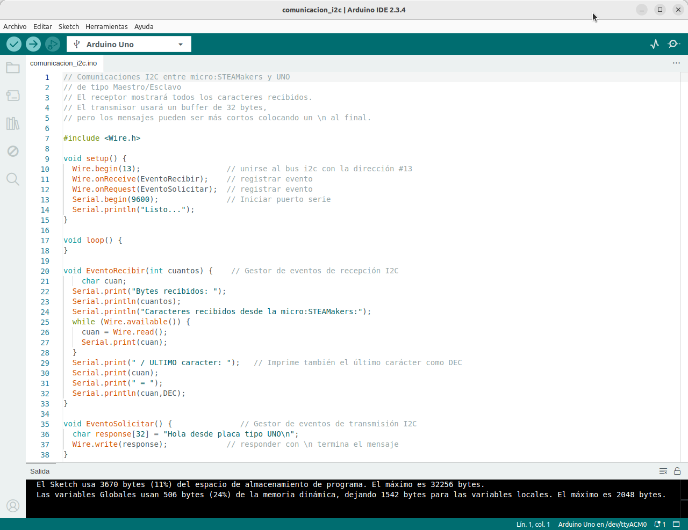  
*[Código en el IDE 2.3.4 de Arduino](../program/comunicacion_i2c/comunicacion_i2c.ino)*

</center>

El programa Arduino incluye la librería "Wire" y cuatro funciones:

~~~C++ linenums="0"
<Wire.h>
~~~

Esta librería proporciona la funcionalidad I2C.

~~~C++ linenums="0"
setup()
~~~

Se inicializa la librería Wire con el dispositivo I2C 13.

Se declaran dos eventos como funciones para manejar los eventos RECEIVE y SEND del I2C.

Luego se inicializa el puerto Serial a 9600 baudios para habilitar la visualización de mensajes del programa.

Y se muestra el mensaje "Listo..." en la consola Serial.

~~~C++ linenums="0"
loop()
~~~

En este caso el bucle principal del programa no se utiliza, ya que los eventos I2C son controlados por interrupciones y manejados por los respectivos manejadores de eventos de Recepción (Receive) y Solicitud (Request).

~~~C++ linenums="0"
EventoRecibir(int cuantos)
~~~

* Este es el manejador que procesa los mensajes I2C recibidos por el Arduino.
* Muestra el número de bytes recibidos en la consola Serial
* Los bytes entrantes son leídos desde I2C usando la función ```Wire.read()``` en la variable '''cuan```
* Imprime cada byte que recibe en la consola Serial
* Adicionalmente, imprime el último byte en formato ASCII DECIMAL para facilitar la diferenciación de cualquier carácter de terminación.

~~~C++ linenums="0"
EventoSolicitar()
~~~

* Este es el manejador que envía el mensaje designado almacenado en el array ```respuesta[ ]```.
* El mensaje puede tener hasta 32 bytes de longitud. Si se desea un mensaje más corto, basta con añadir un byte "\n", que es el carácter NEWLINE para terminar el mensaje.
* La micro:STEAMakers buscará este byte NEWLINE e ignorará el resto de la matriz del búfer.
* El mensaje se envía utilizando la llamada a la función ```Wire.write(respuesta)```.

Con todos los códigos de programa del proyecto analizados, ya podemos ejecutarlos y mirar la salida de la pantalla de la consola serie de Arduino.

<center>

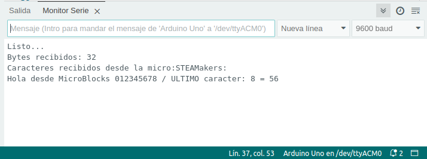  
*Consola serie tras pulsar el botón A*

</center>

Dado que estamos enviando un mensaje de 33 bytes de micro:STEAMakers a la placa UNO teniendo limitada la longitud a 32 bytes, el final del mensaje se termina con el carácter 32 ignorándose el resto. El mensaje nos indica cual es el valor del último caracter recibido tanto en digito como en valor ASCII. Si eliminamos los números en el programa de MicroBlocks el resultado sería el siguiente:

<center>

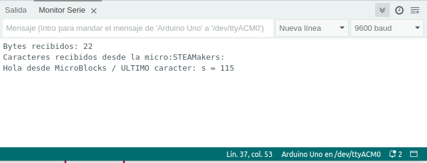  
*Consola serie tras pulsar el botón A*

</center>
