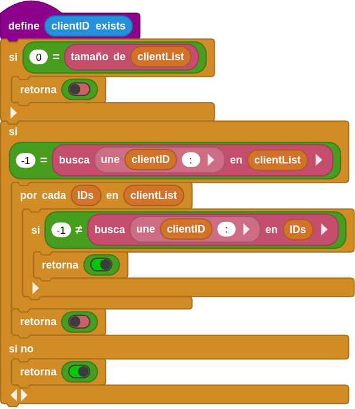

Se trata de la traducción y adaptación a micro:STEAMaker de [MicroBlocks & APP Inventor WEBsocket Integration (For Android Phones)](https://wiki.microblocks.fun/wifi/gamepad) creado por [Turgut Guneysu](https://microblocks.fun/about), un proyecto que se encuentra dentro de los ejemplos de los protocolos UDP y WEBSocket como métodos de control remoto por WiFi.

Se trata de crear un entorno de trabajo (Framework) tipo mando de videojuegos (GamePad) para APP Inventor mediante el protocolo WiFi WEBSocket (para teléfonos con Android).

Se trata de crear un proyecto de cómo controlar una placa microcontrolada micro:STEAMaker con capacidad WiFi programada con MicroBlocks, con una APP de App Inventor, utilizando el protocolo WEBSocket. Se realiza una interfaz de videoconsola muy sencilla como controlador móvil con ocho botones. El programa complementario MicroBlocks se ejecutará en cualquier placa con capacidad WIFI y manejará los comandos entrantes.

Se trata de una descripción en profundidad de la implementación de un controlador GAMEPad en teléfonos Android.

## **Visión general**
El tutorial [WiFi Remote Control with WebSocket (Control remoto utilizando WEBSocket)](https://wiki.microblocks.fun/en/wifi/websocket) describe el uso del protocolo WebSocket entre un microcontrolador programado con MicroBlocks y una aplicación de APP Inventor. Se centra en familiarizarse con la librería Websocket y la programación asociada para hacer que ambas partes se comuniquen.

Este tutorial es sobre la implementación de una **interfaz de tipo GAMEPad** utilizando el mismo protocolo, que también puede ser utilizado para conducir vehículos robótizados, jugar a juegos, o cualquier otra cosa que puedas programar. También se exponen más detalles de programación tanto en MicroBlocks como en APP Inventor.

  
*GamePad minimalista*

Como la aplicación utiliza una interfaz genérica GamePad de 8 botones, programaremos la APP móvil para enviar comandos que representen los 8 botones. Existen ligeras variaciones de esta interfaz con más botones, colores y joystick, etc. Pero los conceptos de programación serán los mismos y aplicables a los otros modelos también. Uno sólo tiene que rehacer la interfaz visual para que coincida con su controlador favorito.

Los microcontroladores que se pueden utilizar en este proyecto deben tener varias características comunes:

* deben soportar WiFi
* de manera opcional deben tener un botón que permita cambiar entre los modos de operación Cliente de Red y Punto de Acceso (PA).

En la imagen siguiente se muestra la micro:STEAMakers, que incorpora el microcontrolador ESP-WROOM-32 con dos botones pulsador y uno táctil. Otras placas pueden disponer de botones BOOT y EN que también pueden ser adecuadas.

  
*Botones en la micro:STEAMakers*

Se proporcionan el programa en MicroBlocks y la APP móvil complementaria para teléfonos Android, para que puedas utilizarlo como dispositivo de control remoto.

## **Partes**
Para completar este tutorial necesitarás:

* una placa micro:STEAMakers que incorpora un microcontrolador con capacidad WiFi ESP32
* un teléfono Android

Estos son los requisitos básicos. Dado que el controlador se puede utilizar para diversos fines, nos hemos abstenido de programarlo para un propósito específico, como conducir un coche robótico.

* Si no tienes un teléfono Android, puedes instalar la extensión **PieSocket WebSocket Tester** para Chrome y trabajar con ella.

  
*PieSocket WebSocket Tester*

## **Conexionado**
Dado que este proyecto hace uso de la capacidad WiFi de los dispositivos en uso, no habrá necesidad de cableado físico. Sin embargo, tu proyecto podría utilizar un sofisticado dispositivo robótico o similar, y dependerá de ti que esa parte se realice.

En cuanto a la disponibilidad de WiFi, puedes empezar utilizando el WiFi proporcionado por tu router de Internet local.

Alternativamente, también puede crear su propio Punto de Acceso WiFi utilizando el ESP32 y proporcionar tu propia señal WiFi. Esto será útil si planeas operar en un área sin conectividad WiFi.

## **Programas**
El proyecto MicroBlocks está codificado en el programa **GAMEPad_Remoto_WiFi.ubp**.

El microcontrolador ESP32, actuando como servidor WebSocket, está programado para:

* Actuar como un cliente WiFi en la red inalámbrica local o convertirse en un HOTSpot proporcionando un Punto de Acceso WiFi
* enviar, recibir y mostrar mensajes
* encender y apagar un LED en el microcontrolador
* poner cada socket en modo loopback
* soportar hasta cinco clientes, todos operativos

En la imagen siguientes tenemos los scripts del proyecto

  
*Programas MicroBlocks del proyecto*

* el bloque **al empezar** conecta a la red WiFi local, inicia el servidor WebSocket, y mostrará la información de la conexión. A continuación, iniciará el proceso WSLoop para comenzar a gestionar la actividad de la red.
* **cuando se pulsa el botón A** se maneja la configuración para el modo **HOTSpot o AP**. Muestra la información de conexión e inicia WSLoop para procesar los mensajes Websocket.
* cuando **último mensaje (lastmessage) = WSLoop** muestra permanentemente todos los mensajes que llegan a través de la conexión WebSocket.
* Definiciones de acciones de 8 botones (izquierda, derecha, arriba, abajo, cuadrado, triángulo, cruz, círculo) son etiquetas indicadoras para las acciones que se programarán para estos botones. Es necesario programarlos de acuerdo con el diseño de la aplicación. Los comandos entrantes serán siempre los mismos, pero lo que hacen puede cambiar dependiendo de tu código. Se han mantenido los nombres originales (left, right, up, down, square, triangle, cross, circle) para la definición de estos bloques.

Cuando estés probando tu proyecto, puede utilizar el bloque **envía ... al cliente WebSocket** para enviar un mensaje a un cliente en un número de socket específico.

  
*Bloque envía ... al cliente WebSocket*

Para ello, debes **anotar el ID de cliente que aparece en la APP** del teléfono cuando se establece una conexión. A continuación, dirije tu mensaje a ese número de cliente específico utilizando este bloque. En la **APP de Android**, el ID de cliente se mostrará en el área de mensajes de la pantalla.

  
*Mensaje recibido en el área de pantalla de la APP*

### Programas personalizados
Hay otros programas en la sección **Mis Bloques** del IDE que se utilizan para ejecutar los detalles de nivel inferior de los mensajes y las acciones de visualización necesarias.

{align=left}

configura las variables del proyecto y luego el script entra en un bucle de recepción de mensajes y los envía a la lógica de eventos del proceso para ser manejados. Los mensajes entrantes se comprueban en busca de nuevas conexiones de cliente, si se encuentran, se añadirán a la variable ***"clientList"*** para mantener un seguimiento de la misma.

El programa o definición para el bloque es:

{align=left}

descifra los mensajes WebSocket de carga útil (payload) connect, disconnect y text message. Estos mensajes de texto se envían al script ***"processText"*** para su gestión.

El programa o definición para el bloque es:

{align=left}

maneja todos los mensajes principales del programa (**LED, LOOP, left, right, up, down, square, triangle, cross, circle**). Dependiendo de la carga útil recibida, se ejecutan diferentes scripts para procesar los mensajes entrantes.

El programa o definición para el bloque es:

{align=left}

Este proyecto soporta **hasta cinco clientes remotos** que se conectan al servidor WebSocket. Este script verifica cada mensaje recibido para **comprobar si el cliente ya existe**. Devolverá true o false dependiendo del estado del cliente.

El programa o definición para el bloque es:

{align=left}

Este script se utiliza para encender y apagar el LED de a bordo. Puede utilizarse para proporcionar una confirmación sencilla de que la conexión está operativa.

El programa o definición para el bloque es:

{align=left}

Cada socket (punto final de un enlace de comunicación bidireccional) del servidor WebSocket se controla de forma independiente y se reproduce en bucle cuando se recibe el comando Loopback. Esto permite al usuario en el extremo del teléfono Android enviar mensajes al servidor y hacer que el servidor los envíe de vuelta. Esta función puede utilizarse para verificar que una conexión de socket de extremo a extremo está operativa.

El programa o definición para el bloque es:

{align=left}

Cuando el servidor se conecta a la red WiFi local, obtiene una dirección IP. Este script devuelve el SSID y la dirección IP obtenida. Si el tipo de conexión es AP, entonces se muestran las nuevas credenciales de red.

   

El programa o definición para el bloque es:

## **Proceso**
Este proyecto requiere una APP que se ejecuta en un teléfono Android o dispositivo similar, y el programa MicroBlocks GAMEPadWIFIRemote que se ejecuta en el microcontrolador ESP32 micro:STEAMakers. **ESP32 micro:STEAMakers actúa como servidor** y el **dispositivo Android es el cliente**.

### Establecer una conexión
Este proyecto te permite operar en dos modos diferentes de conectividad:

* Acceso WiFi local
* Modo HotSpot o AP

### Modo WiFi local
Cuando el programa se inicia, se conectará a la red WiFi local utilizando las credenciales proporcionadas en el script **al empezar**. **Recuerda reemplazar el SSID y la Contraseña en el script con tus credenciales WiFi específicas**.

Cuando se establezca la conexión verás el SSID y la dirección IP adquirida mostrados en el IDE. Anótalos.

Puedes continuar con el proyecto en este estado. Siempre que tu teléfono móvil también esté utilizando la misma conectividad WiFi local, todo funcionará correctamente. Puedes saltarte la siguiente sección si es así como quieres operar.

Si decides trabajar en este modo, tienes que hacer lo siguiente para continuar con el proyecto:

* Debes asegurarte de que el WiFi de tu móvil está utilizando la misma red.
* Inicia tu APP móvil
* Introduce la dirección IP que aparece en el programa MicroBlocks en el área de entrada superior. Esto debería parecerse a 192.168.1.48.

!!! Warning " "
    Dependiendo de los detalles de configuración de tu red WiFi local, la dirección IP proporcionada por tu router puede ser de un rango diferente al que se muestra aquí.
    
    Lo importante es que la IP de tu teléfono y la IP asignada a la ESP32 micro:STEAMakers estén en la misma subred. Eso significa que ambas tienen que tener los mismos tres números iniciales en las direcciones IP asignadas.

  
*Modo WiFi local*

En el momento que se establece la conexión el IDE muestra:

  
*Modo WiFi local*

Si volvemos a tocar el icono WiFi se desconecta la APP y el IDE muestra:

  
*Modo WiFi local*

Ya está todo listo para comenzar a utilizar la aplicación.

### Modo HotSpot o AP
Si estás trabajando en un entorno sin conexión WiFi local, se proporciona la opción de configurar el microcontrolador ESP32 en modo HotSpot o AP, y generar una señal WiFi para facilitar las conexiones WebSocket.

Este modo se activa pulsando el botón BOOT en una ESP32 genérica en la que el botón BOOT se asocia a MicroBlocks como botón-A. En el caso de la micro:STEAMakers no se dispone de botón BOOT sino directamente de un botón A. Como tal, el programa ejecutará el código asociado a **cuando se pulsa el botón A** y cambiará al modo AP. Reconfigurará la placa para configurar una red WiFi con **SSID** igual a **ESP32AP**, y una contras**eña de **12345678**.

Cuando el nuevo modo operativo esté activo, verás el SSID, la dirección IP y la contraseña mostrados en el IDE. Anótalos.

Si activas este modo, tienes que hacer lo siguiente para continuar con el proyecto:

* Debes cambiar la configuración WiFi de tu teléfono móvil para conectarte a la nueva red.
* Inicia un escaneo WiFi en el área de ajustes WiFi de tu teléfono y luego selecciona la red SSID ESP32AP.
* Utiliza la contraseña 12345678 e inicia sesión.
* Inicia tu APP móvil
* Introduce la dirección IP que aparece en el programa MicroBlocks en el área de entrada superior. Debería parecerse a 192.168.4.1.

  
*Modo HotSpot o AP*

Ya está todo listo para comenzar a utilizar la aplicación.

### WebSocket en el proyecto
Ahora, examinaremos, en detalle, todos los scripts que se requieren en el manejo de mensajes WebSocket del proyecto MicroBlocks. Hay tres scripts principales involucrados:

  
*Scripts para manejo de WebSocket*

### WSLoop

!!! info " "
    En el **modo WiFi Local**, la dirección Socket es: 192.168.1.48:81
    En el **modo HotSpot/AP**, la dirección Socket es: 192.168.4.1:81
    
    Las direcciones IP específicas en tu caso pueden ser diferentes dependiendo de la configuración de tu red.
    La implementación de **MicroBlocks del puerto WebSocket será 81**.

Este es el bucle principal que lee el socket y gestiona el envío de mensajes. La presencia de un evento / mensaje Websocket se indica mediante el bloque **lastWebsocketevent o último evento de WebSocket**. Si es **falso**, **no hay mensaje**.

Si hay un mensaje, este bloque devuelve un objeto de evento que se utiliza para analizar los distintos componentes del mensaje. La imagen siguiente muestran los bloques (en inglés y español) para los componentes **event type o tipo de evento**, **client ID o ID de cliente** y **payload o carga útil**.

  
*Bloques event type, client ID y payload*

Siempre que el evento no sea falso (false, sin mensaje), el bucle de procesamiento procede a guardar el clientID y comprueba la presencia del clientID en la clientList activa. MicroBlocks soporta 5 conexiones de cliente por socket. Mantenemos un registro de las solicitudes de conexión entrantes y las manejamos separadamente por cada ID de cliente.

{align=left}

inicia el script de procesamiento de eventos Websocket para manejar los eventos específicos. Observe el formato de **uso especial del bloque de difusión**. En lugar de un nombre de mensaje de difusión, estamos utilizando el nombre de un bloque personalizado que hemos definido. Esto tiene el efecto de iniciar la ejecución de un hilo independiente del script llamado.

### process event
Este script tiene la responsabilidad de analizar **tres tipos específicos** de eventos: **connected** (conectado), **disconnected** (desconectado) y **text message** (mensaje de texto).

En el caso de **connected** (conectado), actualizamos el clientList para indicar la conexión, y enviamos un mensaje a la conexión del cliente identificando el ID.

En el caso de **disconnected** (desconectado), actualizamos la lista de clientes para indicar la desconexión.

En el caso de **text message** (mensaje de texto), enviamos la carga útil (payload) y el ID de cliente al script responsable de procesar los comandos programados.

### process text
Este script maneja todos los comandos programados que hemos diseñado en nuestro proyecto.

Utilizamos una lista de **acciones** que representan todos los comandos que vamos a procesar:

  
*Lista con todos los comandos*

El parámetro de la **carga útil** recibida se busca en la lista de acciones y, si se encuentra, llamamos a una **función de bloque personalizada** que hayamos programado con el mismo nombre que la carga útil. Por ejemplo: si recibimos la carga útil **circle**, buscamos circle en la lista de acciones. Como existe, el resultado de la búsqueda no es igual a -1 (-1, indica que no se ha encontrado). Entonces llamamos al bloque personalizado **circle**.

Tenemos que manejar un comando especial **LOOP** como una característica para ayudarnos a depurar conexiones. Cuando una conexión cliente envía el comando LOOP, esa conexión se pone en modo loopback y todos los mensajes posteriores que lleguen serán devueltos al cliente. Esto permitirá al cliente verificar que la conexión existe y está activa. Mientras que esto es de poca utilidad cuando la APP móvil y el dispositivo controlado están en la misma habitación, puede ser de gran utilidad cuando se encuentran alejados el uno del otro, sólo conectados por el enlace a Internet.

Si el payload no es LOOP, entonces también actualizamos el clientList para mostrar el nombre del comando que hemos recibido.

Esto concluye las explicaciones de la lógica relacionada con WebSocket en el lado MicroBlocks de nuestro proyecto. Ahora pasamos a APP Inventor.

## **Aplicación APP Inventor**
Es una APP Android compañera del programa MicroBlocks GAMEPadWIFIRemote. Implementa una interfaz GAMEPad muy simple con 8 botones, un área de visualización de mensajes, y un campo de entrada de dirección IP WiFi.

La imagen de abajo muestra la GUI (Graphical User Interface) de la APP al inicio del programa:

  
*GUI de la APP*

### Interfaz de usuario de la aplicación
La GUI de la APP consta de tres partes:

* **WIFI IP / Conectar / Desconectar:** se utiliza para introducir la dirección IP de la ESP32 micro:STEAMakers y conectarse y desconectarse de la misma.
* **Área de controles GAMEPad:** 8 botones de control implementados en dos grupos de cuatro.
* **Área de visualización de mensajes:** Todos los **intercambios del programa y cualquier mensaje de error** se muestran en esta área de color naranja.

### Como se usa la aplicación
La GUI de la APP proporciona una interfaz sencilla para todas las funciones del programa. Desglosémosla en varias tareas y probémosla:

#### Conexión con el servidor
Cuando inicies el programa MicroBlocks en la micro:STEAMakers, esta se conectará a la WiFi local y obtendrá una dirección IP; muy probablemente en el formato 192.168.n.n o similar dependiendo de la configuración de tu red.

  
*IP obtenida en el IDE y escrita en la GUI de la APP*

Debes anotar esta dirección IP e introducirla en el área de direcciones IP de la APP del teléfono, en la parte superior de la pantalla. A continuación, pulsa el icono WiFi y observa cómo el teléfono establece una conexión WebSocket con el servidor.

Si la conexión tiene éxito, la pantalla cambiará a este aspecto:

  
*Conexión con WebSocket establecida*

El área de mensajes de la parte inferior de la pantalla indica el número de identificación del cliente asignado:

  
*Número de identificación del cliente y estado de la conexión en la APP*

En el IDE, la conexión tendrá el aspecto que se muestra a continuación:

  
*Número de identificación del cliente y estado de la conexión en el IDE*

Cuando hayas terminado, puedes tocar de nuevo el **icono WiFi** y finalizar la conexión.

#### Uso de los controles
Basta con pulsar los 8 botones de control para enviar los comandos programados al ESP32.

Cualquier mensaje.

### Uso de WebSocket en APP Inventor
Aquí, examinaremos el código de la APP en APP Inventor y veremos los detalles de implementación de WebSocket y comandos del proyecto. Se asume que el usuario está familiarizado con la programación en APP Inventor. El código lo vemos en la imagen:

  
*GAMEPad remoto por WiFi*

Para usar WebSocket en la APP es necesario el uso de una extensión: **WebSocketConnector**.

  
*Extensión WebSocketConnector*

Proporciona una interfaz de programación que admite los siguientes eventos:

* Conexión (Connection)
* Desconexión (Disconnection)
* Envío de mensajes (Message Sending)
* Recepción de mensajes (Message Reception)
* Errores (Errors)

#### Conexión AI2 WebSocket

  
*WebSocketConnector.Connector*

Para la conexión, utilizamos la dirección IP del servidor ESP32 micro:STEAMakers y el puerto Websocket número 81 de MicroBlocks: 192.168.1.48:81. La IP utilizada puede diferir para tu red debido a diferencias en la configuración WiFi.

La dirección IP se extrae del campo de entrada Dirección IP en la parte superior de la GUI de la APP.

  
*Dirección IP en la GUI de la APP*

Cuando se toca el **Icono WIFI**, la APP inicia la conexión a través del script **when WIFI.click**.

  
*Evento when WIFI.click*

El script anterior maneja el evento clic del botón WiFi. Es posible que uno genere inadvertidamente múltiples eventos de clic pulsando el icono una y otra vez. Esto normalmente causaría que se iniciaran múltiples conexiones; y crearía una situación problemática.

Para evitar esto, se ha implementado un interruptor booleano **WIFIclickActive** que controla los clics del botón y sus respectivos manejadores de eventos. Inicialmente, esta variable se establece en false. Tan pronto como un botón es pulsado, establecemos esta variable a true y no la reseteamos hasta que todos los eventos de pulsación relacionados se hayan completado. Los eventos clic sólo se permiten mientras el interruptor está en false.

Cuando se establece una conexión con éxito, se ejecuta el script **when WebSocketConnector1 connected**.

  
*Evento when WebSocketConnector1 connected*

#### Desconexión AI2 WebSocket

  
*Llamada a WebSocketConnector1.Disconnect*

**Una vez establecida la conexión**, si se pulsa el **icono WiFi** por segunda vez, el enlace se desconecta. Véase más arriba el código del script **when WIFI.click**. El botón del icono WiFi actúa como un conmutador: si no hay una conexión WebSocket activa, entonces la conexión se realiza. Si la conexión está activa, entonces el enlace se desconecta.

El bloque siguiente proporciona el estado de la conexión.

  
*Llamada a WebSocketConnector1.IsConnected*

La desconexión del enlace WebSocket hará que se ejecute el script **when WebSocketConnector1 disconnected**.

  
*Evento when WebSocketConnector1 disconnected*

#### Envío de mensajes AI2 WebSocket

  
*Llamada WebSocketConnector1.Message Send*

Enviar un mensaje WebSocket es muy sencillo; sólo requiere un texto de mensaje.

Dado que tenemos ocho mensajes diferentes que necesitamos enviar, hemos recurrido a una técnica para reducir el número de bloques que necesitamos codificar. En lugar de utilizar un enfoque estándar de **escribir código para cada uno de los ocho botones de control**, usaremos la **técnica de código genérico**.

  
*Evento when any Button.clik*

Ya que todos nuestros comandos son activados por clicks de botones, usamos el evento genérico **when any Button.Click**. El código escrito en este script se aplica a cualquier botón pulsado. Y como todos nuestros botones de comandos hacen lo mismo, nos facilita la tarea.

Para diferenciar las distintas acciones de los botones, hemos utilizado otra técnica, la de etiquetar los botones con sus nombres de acción: **left, right, up, down, square, triangle, cross, circle (izquierda, derecha, arriba, abajo, cuadrado, triángulo, cruz, círculo)**. Esto nos da la posibilidad de utilizar los nombres de los textos de los botones como el mensaje WebSocket que necesitamos enviar.

#### Recepción de mensajes WebSocket en AI2

  
*Evento when WebSocketConnector1.MessageReceived*

En este proyecto, no recibimos ningún mensaje en condiciones normales de funcionamiento. Sin embargo, es posible recibir mensajes de prueba durante el testeo del proyecto. Para acomodar ese caso, proporcionamos un manejador de eventos para mostrar cualquier mensaje entrante en el área de mensajes de la APP, en la parte inferior de la pantalla.

#### Errores WebSocket AI2

  
*Evento when WebSocketConnector1.ErrorOccurred*

En caso de que se produzca algún error durante la conexión o el funcionamiento normal de la APP, proporcionamos un controlador de eventos para mostrar cualquier mensaje de error en el área de mensajes de la APP, en la parte inferior de la pantalla.

## **Crear HotSpot propio**
Hemos mencionado anteriormente que pueden presentarse casos en los que el entorno en el que desea ejercer el control sobre dispositivos puede no tener una señal WiFi disponible. Especialmente, si estás en la naturaleza o en un lugar alejado de la civilización. No te preocupes, todavía serás capaz de experimentar con este tutorial siguiendo las instrucciones siguiente.

### Mi propia señal WiFi
Veamos cómo podemos activar nuestra propia señal WiFi.

Para crear nuestra propia señal WiFi, tendremos que pulsar el **Botón A** una vez iniciado el programa, o en cualquier momento que queramos **activar la opción Hotspot**.

### Cómo funciona
Para visualizar mejor la configuración de HOTSpot, echemos un vistazo a la siguiente imagen.

  
*Configuración de HOTSpot*

La **ESP32 micro:STEAMakers** está ahora **actuando como el proveedor del Hotspot WiFi**. Está ejecutando el mismo programa MicroBlocks pero con la **opción de inicio cuando se pulse el Botón A**. El programa MicroBlocks por defecto tiene un **hotspotName = ESP32AP** y un **hsPassword = 12345678**. Siéntete libre de cambiar esto a los valores que quieras.

  
*Script cuando se pulsa el botón A*

En el teléfono, sigues usando la misma APP.

### Activación de la nueva Red
Cuando ESP32 micro:STEAMakers empiece a funcionar y pulses el botón A, se creará una **red WiFi llamada ESP32AP**. Puedes ver esto en el escaneo de redes WiFi de tu ordenador, así como en el escaneo WiFi de tu teléfono Android. Esto es lo que debes buscar:

  
*Escaneo y conexión red WiFi*

En el teléfono Android, en la configuración de WiFi, es necesario **identificarse en la nueva red: ESP32AP / 12345678**.

Ahora puedes empezar a utilizar la APP de la misma manera que antes. La dirección IP en la APP debe establecerse en la dirección IP del HotSpot: 192.168.4.1 . Es posible que tu hardware te asigne una IP diferente. Sea cual sea la que aparezca, utiliza esa.

  
*Dirección IP al pulsar el botón A*

!!! Warning " "
    **No hay acceso a internet mientras estás en el modo HOTSpot.**

    

      

    

    Si has creado un WiFi HotSpot y has probado todo con él, **recuerda apagarlo e iniciar sesión con tus dispositivos y teléfono en tu red WiFi normal**. De lo contrario, no estarás operando como antes de los ejercicios y te preguntarás por qué nada funciona como de costumbre.

## **Sin teléfono Android - Usemos PieSocket Websocket Tester**
**PieSocket es una extensión del navegador Chromium o Chrome**. Puedes instalarla desde el gestor de extensiones.

Cuando lo ejecutes en el navegador, se verá como en la imagen de la izquierda, a excepción de los datos de localización:

  
*PieSocket*

Debes introducir la dirección IP del servidor en el formato del protocolo WebSocket en el campo Ubicación: **ws://192.168.1.48:81**

Cuando hagas clic en Conectar, aparecerá la imagen de la derecha. Observa el mensaje de respuesta de conexión enviado por el servidor: RECIBIDO : Cliente# 0 conectado.

El número de identificación del cliente que se muestra es su número de identificación (0-4). Cuando observes las pantallas de actividad en el servidor, tus acciones se reflejarán en la línea con este número de Cliente.

El **proceso de prueba con el PieSocket** es un poco diferente que usando el programa compañero APP Inventor. Ya que todas las funciones del Servidor son controladas a través de mensajes de texto directos (comandos), simplemente ingresa los comandos deseados de la lista de abajo en el área de Ubicación y haz clic en Enviar Mensaje ( Send Message).

Aquí tienes una lista de todos los comandos que puedes escribir y lo que harán:

* **left, right, up, down, square, triangle, cross, circle (izquierda, derecha, arriba, abajo, cuadrado, triángulo, cruz, círculo)** - Utiliza uno de estos cada vez. Ejecutarán las respectivas funciones programadas en el servidor.
* **LED** - encenderá/apagará el LED de usuario en el servidor.
* **LOOP** - pondrá tu puerto cliente en el servidor en modo Loopback. Para salir de él, envíalo de nuevo
* **cualquier mensaje de texto** - cualquier cosa que no sean los comandos listados anteriormente se tratará como un mensaje normal y se mostrará en el IDE. Si la conexión está en modo Loopback, serán devueltos.

## **Debate**
Este entorno de trabajo o framework se proporciona como ejemplo de implementación de un controlador estilo GAMEPad en teléfonos Android.

* ¿Qué tipo de proyectos crees que pueden utilizar esta interfaz de control?
* ¿Qué pasa si el proyecto que queremos controlar tiene más de 8 comandos?
* Entendiendo cómo funciona la implementación WEBSocket en MicroBlocks, ¿pueden varias personas coordinar y utilizar los controles?

La APP para Android está escrita en MIT App Inventor. Si estás familiarizado con MIT AI2, prueba los siguientes retos.

* Algunos mandos tienen un conjunto de cuatro botones de colores en lugar de los de forma geométrica. Modifica la interfaz para utilizar botones de colores.
* Amplía la interfaz del GAMEPad para que tenga dos botones adicionales.

Los dos retos son de complejidad media y requieren un poco de conocimientos técnicos. Si consigues hacerlos funcionar, lo habrás hecho muy bien.

## **Consejos / Solución de problemas**
En el primer modo del tutorial, donde estás en tu red doméstica, normalmente verás direcciones de red doméstica en el rango de 192.168.1.nnn. Si por alguna razón has modificado el router de Internet de tu casa para asignar un rango diferente de direcciones IP, entonces puede que tengas direcciones con un aspecto diferente.

Si está probando la versión HotSpot del tutorial, tendrá que ser consciente de las diferencias en las direcciones IP creadas y utilizadas.

En el modo HotSpot del tutorial, el ESP32 creará una nueva red y repartirá un conjunto diferente de direcciones. Normalmente serán 192.168.4.1 para el router, y 192.168.4.2 y siguientes para los otros clientes, incluyendo tu teléfono Android.

En el modo HotSpot del tutorial, recuerda activar primero la nueva red, en el ESP32 en nuestro ejemplo. Esto configurará el entorno listo para asignar direcciones a los dispositivos que se unan. Sólo debes conectar el WiFi de tu teléfono a la nueva red después de activarla. De lo contrario, el escáner WiFi de su teléfono no verá la red con el SSID = ESP32AP.

Ten en cuenta que durante ambos modos de funcionamiento del tutorial, nunca estás accediendo a Internet. De hecho, en el modo Hotspot, ni siquiera hay conectividad a Internet disponible, como podrás comprobar en las pantallas de estado de las redes WiFi. Todo el intercambio de tráfico ocurre dentro del dominio privado de tu red doméstica y de la nueva red que creas con la opción HotSpot.

Hay formas de acceder a Internet en ambos modos de funcionamiento. Sin embargo, ese es un tema muy complicado para entrar en los propósitos de este tutorial. Cualquiera que esté interesado puede investigar NAT (Network Address Translation), servicios Proxy, direcciones de Internet privadas y públicas y tratar de darle sentido a todo esto.

Una buena manera de deshacerte de las entradas de red no deseadas en tu PC y en tu teléfono es seleccionar la opción WiFi para OLVIDAR esa red. Encontrarás esta opción en la sección de configuración de conectividad WiFi de tus dispositivos.

### Qué puede fallar
El protocolo WebSocket tiene TIEMPOS DE ESPERA incorporados. Si no se produce ninguna actividad en el protocolo durante el tiempo de espera, la conexión se cerrará y los clientes se desconectarán. No hay manera de ajustar el tiempo de espera en el ámbito de este tutorial. Así que ten esto en cuenta y si empiezas a ver clientes desconectándose, simplemente establece la conexión de nuevo. El tiempo estimado para el tiempo de espera por defecto es de aproximadamente un minuto.

El modo Loopback es un modo de operación muy interesante. Sin embargo, puede causar confusión al usuario si no se entienden exactamente los detalles de su funcionamiento. Piensa en él como un interruptor que se pone en ON o en OFF. Cuando está en ON, todo se envía a la parte solicitante. Hasta que lo apagues seleccionándolo de nuevo, permanecerá en modo Loopback.

Y recuerda, en caso de problemas, la mejor manera de reiniciar todo es RESETAR todo.

¡Que lo disfrutes!

## **Descarga del proyecto**

* [Programa MicroBlocks GAMEPadWiFiRemote.ubp DESCARGADO en enero de 2025 para este Tutorial](../program/actividadesmB/GAMEPadWiFiRemote.ubp) - Instalar en la micro:STEAMakers. Versión disponible en la fecha indicada con ligeras modificaciones respecto al original.
* [Programa MicroBlocks GAMEPadWiFiRemote.ubp ORIGINAL para este Tutorial](https://wiki.microblocks.fun/wifigamepad/gamepadwifiremote.ubp) - Instalar en la micro:STEAMakers.

[Archivo fuente de la aplicación MIT AI2 para Android](../program/AppInventor/GAMEPad_Remoto_WiFi.aia) - Personaliza la APP usando MIT AI2.

{ align=left }  [Aplicación APK MIT AI2 para Android](../program/AppInventor/GAMEPad_Remoto_WiFi.apk) - Carga este archivo en su teléfono. Puede requerir permiso para instalar aplicaciones desconocidas. 
