Partimos para esta sección de conocimientos ya vistos en el apartado [crear un canal en Thingspeak](https://fgcoca.github.io/ESP32-micro-STEAMakers/program/thinspeak/#crear-un-canal-en-thingspeak) de la sección [Teoria básica de IoT](https://fgcoca.github.io/ESP32-micro-STEAMakers/program/thinspeak/). No obstante lo dicho, repasaremos alguno conceptos y profundizaremos en el tema.

En este proyecto trabajaremos por facilidad con los sensores integrados en la micro:STEAMakers, pero es perfectamente ampliable a sensores conectados a la placa con, por ejemplo, la Shielbit. Lo que vamos a hacer es recopilar información y enviarlos al broker a través de WiFi donde serán mostrados como gráficos.

Los datos se pueden visualizar en tiempo real y se pueden configurar para acceso privado o público, teniendo así la posibilidad de compartir información. Se pueden configurar hasta ocho gráficos simultáneamente y los datos se pueden descargar para trabajhar en un análisis más detallado.

Thingspeak dispone de una opción gratuita para uso individual que presenta algunas limitaciones como la cantidad de datos que se pueden compartir y la rapidez con la que se pueden actualizar los mismos. También existe una versión de pago con funciones avanzadas.

En la versión gratuita, el número de consultas está limitado a ocho mil (8000) por día, con un intervalo obligatorio de 15 segundos entre ellas. Esto va a ser más que suficiente para nuestro proyecto y para muchos proyectos personales.

## <FONT COLOR=#007575>**Introducción**</font>
Los materiales para este proyecto son simples, vas a necesitar:

* Un ordenador con conexión a internet.
* Una micro:STEAMakers con cable USB.
* Una cuenta de Thingspeak configurada.

Una vez registrado en Thingspeak, crea tu propio canal para publicar los datos del proyecto. En el menú principal selecciona en el orden que se ve en la imagen:

<center>

  
*Crear canal en Thingspeak*

</center>

Una vez creado el canal debes completar la información. A continuación se resume la información que es posible configurar:

{ align=left }

* **Nombre del canal**: escribe un nombre único para el canal ThingSpeak.
* **Descripción**: escribe una descripción del canal ThingSpeak.
* **Campo n°**: al marcar la casilla se habilita el campo para escribir un nombre para el mismo. Cada canal de ThingSpeak puede tener hasta 8 campos.
* **Metadatos**: permite escribir información sobre los datos del canal, incluidos datos JSON, XML o CSV.
* **Etiquetas**: campo para introducir palabras clave que sirvan para identificar el canal. Las etiquetas van separadas por comas.

{ align=right }

* **Enlace externo**: si tienes una página web que contiene información sobre el canal ThingSpeak, este es el lugar para introducir su URL.
* **Enlace a Github**: si tienes un repositorio en Github introduce su URL aquí.
* **Elevación**: para especificar la altitud geográfica del lugar en metros.
* **Mostrar ubicación del canal**: Se deben indicar la **latitud** y la **longitud** en grados decimales.
* **Mostrar video**: si tienes un video de YouTube™ o Vimeo® con información del canal, especifica la ruta completa de la URL del video.

No olvides hacer clic en “Guardar canal” en la parte inferior para crearlo correctamente.

Para hacer que el canal sea público recuerda compartirlo.

En este proyecto comprobaremos el entorno local y parámetros energéticos de la placa para los siguiente valores de sensores integrados:

<center>

  
*Campos del canal en Thingspeak*

</center>

Los datos se muestran en un panel de Thingspeak en la nube y se podrán ver desde cualquier lugar siempre que se tenga conexión a Internet.

## <FONT COLOR=#007575>**Utilización de las API Keys de Thingspeak**</font>
En la pestaña Api Keys tenemos las claves que permiten escribir o leer el canal. Si conocemos las claves es porque somos propietarios o usuarios autorizados del canal. La clave para enviar datos es Write Api Key y para leer datos del canal es Read Api Key. También tenemos un campo Note que se utiliza para introducir información sobre las claves de lectura del canal. Por ejemplo, se pueden añadir notas para realizar un seguimiento de los usuarios con acceso al canal. Ambos tipos de claves disponen de un botón de regeneración por si en algún momento estas claves han quedado comprometidas.

<center>

  
*API Keys de Thingspeak*

</center>

A la derecha de las claves tenemos la información fundamental de como acceder al canal para enviar o recibir datos mediante el método GET.

Para poder escribir el programa debemos saber los datos de la clave API de escritura del sitio web de Thingspeak. Como hemos visto esta es la clave que le indicará a Thingspeak que estamos transmitiendo datos a nuestro canal.

<center>

  
*API Keys de escritura del canal de Thingspeak*

</center>

## <FONT COLOR=#007575>**Métodos GET y POST**</font>
El protocolo HTTP tiene dos métodos para realizar una solicitud de datos a una URL. Para enviar información dentro de la solicitud los dos métodos de HTTP son GET y POST.

Ambos métodos tienen el mismo propósito aunque con diferentes características y permiten enviar información desde el cliente al servidor dentro de la solicitud.

Vamos a describir brevemente ambos aunque para Thingspeak, que es el caso que nos ocupa, utiliza solamente el método GET.

* **GET**: En este método la información se incluye junto a la dirección URL después de un símbolo ? Si tenemos que incluir varios datos en una petición hay que separarlos con el símbolo &.
* **POST**: Este método no incluye los datos en la dirección sino que los envía aparte de manera no visible. Si tenemos necesidad de enviar datos sensibles este es el formato a utilizar.

El método GET es sencillo de implementar pero presenta como principal desventaja la falta de seguridad en el envio, porque los datos están a la vista de cualquiera. Otras limitaciones son que los datos solamente pueden contener letras y números y que la longitud máxima de la URL no puede superar los 2000 caracteres.

## <FONT COLOR=#007575>**Escribir en el canal**</font>
En las Solicitudes API (API Requests) a la derecha de las APIs vemos que para escribir en el canal la solicitud GET es:

~~~http

https://api.thingspeak.com/update?api_key=ML4876CMR2Y8ZGEY&field1=0

~~~

Como podemos ver es una solicitud HTTP, en su versión segura, a una URL de thingspeak en la que se envía una actualización (update) y tras el símbolo de ? Va la clave de escritura (Write API Key) y a continuación el símbolo & seguido por el valor del primer campo (Field 1) que tiene como nombre field1 (no se puede cambiar) y como valor por defecto cero.

Esta petición puede funcionar incluso sin estar trabajando con un dispositivo IoT, es decir, a modo de prueba podemos enviar valores desde nuestro navegador (uno cada 15 segundos como máximo). A modo de prueba vamos a enviar el valor del campo 1 un par de veces. En ambos casos Thingspeak debe responder enviando un número para indicar el número de datos recibidos y que el dato se ha recibido correctamente.

<center>

  
*Escritura en un canal de Thingspeak*

</center>

## <FONT COLOR=#007575>**Leer el canal**</font>
Para la lectura del canal tenemos tres opciones:

* **Primera**: para leer datos de un canal. El formato de la respuesta lo vemos al final de la URL, antes del parámetro de cadena de consulta que se añade después de un signo de interrogación ?. Se puede utilizar el parámetro de resultados para controlar el número de entradas devueltas, que es hasta 8000. Si se pone un 1 se devuelve la última entrada recibida.

~~~http

https://api.thingspeak.com/channels/2826165/feeds.json?results=3

~~~

Una línea como la anterior puesta en la barra de navegación da como resultado, para la pestaña de datos en formato JSON, lo siguiente:

<center>

  
*Leer un canal de Thingspeak*

</center>

Si nos cambiamos a la pestaña “Datos sin procesar” nos devuelve en texto plano lo siguiente:

<center>

  
*Leer un canal de Thingspeak*

</center>

En “Cabeceras” nos indica datos de la de respuesta y la de la petición que no son objeto a tratar en nuestro caso.
También podemos especificar que la lectura de los datos se realice en formato CSV:

<center>

~~~http
https://api.thingspeak.com/channels/2826165/feeds.csv?results=3
~~~

</center>

Esto hará que se descargue un archivo en feeds.csv con todos los datos subidos al canal con indicación de la fecha y hora en formato UTC y el valor separados por comas. En nuestro caso el archivo leído en el editor de texto gedit se ve así:

<center>

  
*Leer un canal de Thingspeak*

</center>

Si hacemos doble clic sobre el archivo se abrirá la hoja de cálculo (Libreoffice Calc) con la ventana de configuración de importación:

<center>

  
*Leer un canal de Thingspeak*

</center>

Que una vez configurada y aceptada nos abrirá el archivo en el programa Calc, en este caso.

La última forma de especificar el formato de los datos es en XML haciendo:

~~~http
https://api.thingspeak.com/channels/2826165/feeds.xml?results=3
~~~

* **Segunda**: es otra forma de obtener los mismos resultados pero ahora nos permite especificar por que campo iniciar la consulta. Admite los mismos formatos que en el caso anterior:

~~~http
https://api.thingspeak.com/channels/2826165/fields/1.json?results=2
~~~

* **Tercera**: que es para consultar el estado del canal:

Si lo que pretendemos es consultar datos de un canal privado la consulta GET requiere especificar como parámetro al API Key de lectura y tendrá la siguiente forma:

~~~http
https://api.thingspeak.com/channels/2826165/feeds.json?api_key=NMI7H2ROGQ66YD3Q&results=2
~~~

La solicitud GET anterior también funciona para canales públicos y admite las mismas formas que las vistas anteriormente.

!!! Warning "**AVISO**"
    <b>Microblocks no soporta, a fecha de creación de esta web, HTTPS.</b>

## <FONT COLOR=#007575>**Programa**</font>
Lo primero que vamos a hacer es crear una variable "api_key" y ponerle como valor el número de clave de escritura del canal. Arrastramos desde "Control" un bloque "al empezar" y desde "Variables" el bloque "asigna api_key a..." donde escribimos la clave.

El siguiente paso es agregar un bloque "conectate a la wifi..." agregando la libreria WiFi si resulta necesario. En este bloque establecemos el nombre de la red 2G y la contraseña de acceso.

Desde el menú "control" arrastramos un bloque "espera..." que ajustamos a dos segundos para que de tiempo suficiente a establecer la conexión. El estado del programa en este momento será:

<center>

  
*Inicio del programa*

</center>

A continuación de la espera vamos a poner un bloque "por siempre" y es donde van a producirse todas las escrituras de datos en el canal. Vamos a ver como realizar el envio paraa uno de los sensores y para el resto lo único que tendremos que modificar es el propio sensor y el número de campo.

El primer paso es añadir la libreria que necesitamos. Hacemos clic en "Añadir libreria" y entramos en el grupo "Red" donde seleccionamos "Cliente HTTP". Ahí nos encontramos un bloque "petición ... con contenido..." que arrastramos a nuestra zona de programa. Si retomamos la línea de escritura en el canal vemos que consta de una dirección seguida de la opción "update" (actualizar), un signo de interrogación "?" seguido de "api_key" y un signo igual tras el cual va la clave obtenida en Thingspeak. A continuación tenemos un "&" seguido de field1 y su valor:

<center>api.thingspeak.com/update?api_key=ODAHF7CBV56VEN55&field1=0</center>

!!! Success "**OBSERVA BIEN LA LÍNEA ANTERIOR"
    Se ha suprimido la parte https://

Para una mayor comodidad y claridad vamos a dividir la línea en partes y crearla a partir de un bloque "une..." que podemos encontrar en "Datos". La configuración de este bloque se verá así:

<center>

  
*Bloque "une..."*

</center>

Se han recuadrado las dos cosas que debemos cambiar para cada variable.

A continuación vemos el programa completo con las peticiones POST para el sensor de luz y el de sonido.

<center>

  
*Programa para dos sensores*

</center>

Para hacer mas corto el programa vamos a crear funciones para cada sensor con los bloques vistos incluyendo el retardo necesario por cuenta gratuita. A continuación vemos la definición para el sensor de temperatura:

<center>

  
*Definición de la función temperatura*

</center>

Creamos de forma similar el resto de funciones y ocultamos la definición de los bloques creados. El programa final con todos los sensores es el siguiente:

<center>

  
*[Programa](../program/uB/Thingspeak%20y%20Microblocks.ubp)*

</center>

En la imagen siguiente vemos un momento del funcionamiento del programa con la definición de un bloque visible.

<center>

  
*Programa*

</center>

El bloque más importante es el bloque con la solicitud POST o GET. Es durante esta solicitud cuando transmitimos toda la información importante al sitio. En la imagen, para el bloque que vemos la definición, se realiza la actualización (escritura) del campo 3 con el valor leido del sensor de temperatura.

A continuación vemos las gráficas de algunos de los sensores:

<center>

  
*Resultados subidos*

</center>

Podemos decir que hemos convertido la micro:STEAMakers en un dispositivo IoT inteligente.

## <FONT COLOR=#007575>**MQTT en Thingspeak**</font>
### <FONT COLOR=#AA0000>Conceptos básicos de MQTT</font>
ThingSpeak™ tiene un broker MQTT en la URL **mqtt3.thingspeak.com** y el **puerto 1883**. El broker ThingSpeak admite tanto la publicación MQTT como la suscripción MQTT, como se muestra en los siguientes diagramas.

Para publicaciones MQTT la estructura es que el broker reconoce una solicitud de conexión enviando una respuesta de confirmación de conexión.

<center>

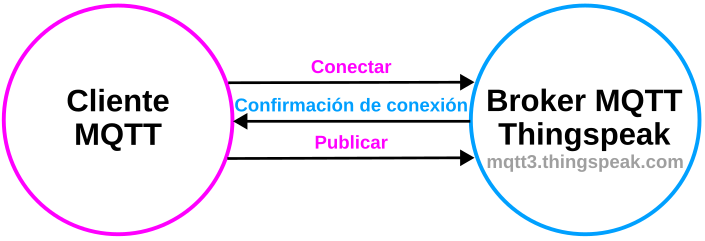  
*Publicar MQTT*

</center>

Es posible publicar:

* Añadiendo contenido a un canal: ```channels/<channelID>/publish```
* Publicar en un campo de un canal: ```channels/<channelID>/publish/fields/field<number>```

Al suscribirse MQTT el broker reconoce una solicitud de suscripción devolviendo la aceptación de la misma.

<center>

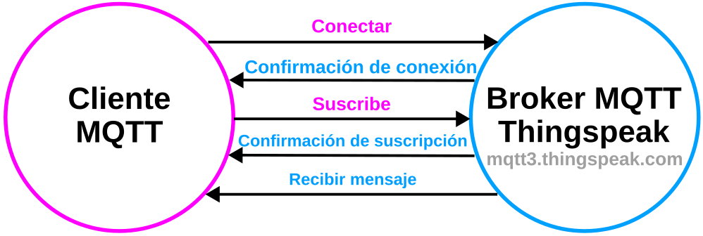  
*Suscribir MQTT*

</center>

Es posible suscribir:

* Al contenido de un canal: ```channels/<channelID>/subscribe```
* A un campo de un canal privado: ```channels/<channelID>/subscribe/fields/field<number>```
* A todos los campos de un canal: ```channels/<channelID>/subscribe/fields/+```

Para comunicarse con el broker MQTT hay que configurar con las siguientes opciones:

<center>

| Puerto | Tipo de conexión | Cifrado |
| ------ | ---------------- | ------- |
| 1883   | TCP              | Ninguno |
| 8883   | TCP              | TLS/SSL |
| 80     | WebSocket        | Ninguno |
| 443    | WebSocket        | TLS/SSL |

</center>

Resumiendo, la información a recabar para poder trabajar con MQTT en Thingspeak publicando en un canal es:

* ID del cliente: Anotamos el **Client ID** del dispositivo MQTT
* Host: mqtt://mqtt3.thingspeak.com (se puede omitir mqtt://)
* Puerto: 1883 que ya estará configurado en los bloques.
* Nombre de usuario: Anotamos el **Username** del dispositivo MQTT
* Contraseña: Anotamos el **Password** del dispositivo MQTT
* Donde enviar (Topic): Vamos a necesitar el **Channel ID** pues tiene la forma: ```channels/<Channel ID>/publish```
* Que enviar (payload): Es de la forma ```field1=<value>&field2=<value>``` para dos campos

### <FONT COLOR=#AA0000>Dispositivos MQTT</font>

El acceso MQTT a tus canales, incluyendo las credenciales, es manejado por un dispositivo MQTT ThingSpeak. El dispositivo está configurado con las credenciales necesarias para que un cliente MQTT se comunique con ThingSpeak, y para autorizar canales específicos. Para crear un dispositivo MQTT nos dirigimos al menú de ThingSpeak de la parte superios y hacemos clic en Devices → MQTT.

<center>

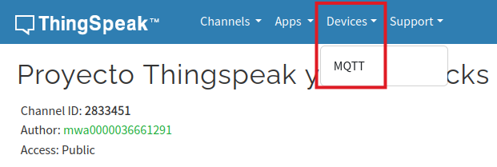  
*Dispositivos MQTT*

</center>

Al hacer clic en MQTT se abre la ventana de dispositivos MQTT siguiente:

<center>

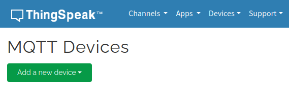  
*Añadir dispositivo MQTT*

</center>

Rellenamos la ventana de diálogo para añadir un nuevo dispositivo comenzando por ponerle un nombre y de manera opcional una descripción:

<center>

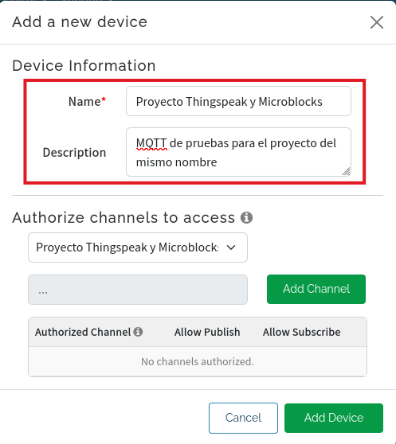  
*Añadir dispositivo MQTT: nombre y descripción*

</center>

A continuación en “Authorize channels to access” desplegamos y podemos o introducir el ID del canal o buscar entre los existentes, a lo que nos ayuda mostrando los canales recientemente creados.

<center>

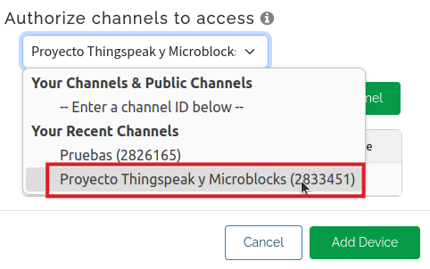  
*Añadir dispositivo MQTT: acceso a canales autorizados*

</center>

Si hacemos clic en “Enter a channel ID below” tendremos que conocer dicho ID y tenerlo anotado para teclearlo. Cuando lo hagamos se activará el botón “Add channel”.

<center>

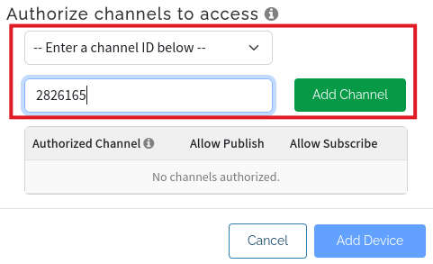  
*Añadir dispositivo MQTT: acceso a canales autorizados*

</center>

En cualquiera de los casos hacemos clic en el botón añadir canal y se mostrará la autorización dando opción de decidir si está permitido publicar y suscribirse al canal que estamos autorizando.

<center>

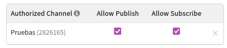  
*Añadir dispositivo MQTT: autorizaciones*

</center>

Ya podemos hacer clic en el botón “Add Device” para que se añada el dispositivo y nos muestre las credenciales del mismo:

<center>

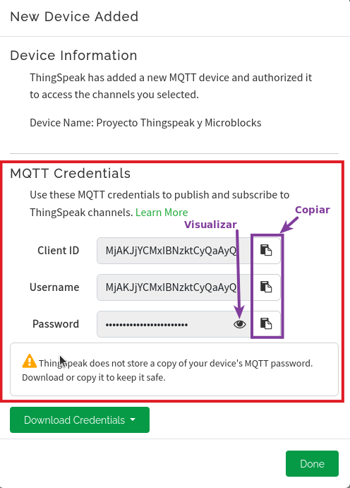  
*Añadir dispositivo MQTT: credenciales*

</center>

En la ventana de diálogo anterior nos da opciones para copiar los campos Client ID y Username y mostrar o copiar la contraseña. Respecto a esto último nos advierte que Thingspeak no almacena dicha contraseña por lo que nos aconseja que descarguemos las credenciales y las guardemos en lugar seguro.

Una vez anotadas o descargadas las credenciales ya podemos hacer clic en el botón “Done” para que se cree el dispositivo MQTT. La ventana de dispositivos MQTT (con dos dispositivos) será ahora:

<center>

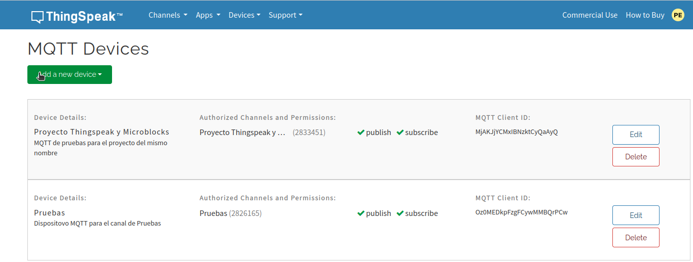  
*Dispositivos MQTT*

</center>

El botón “Delete” nos permite borrar completamente el dispositivo creado. El botón “Edit” nos abre una ventana en la que se permiten editar los datos introducidos cuando se creó el dispositivo y regenerar la contraseña si la hemos perdido.

<center>

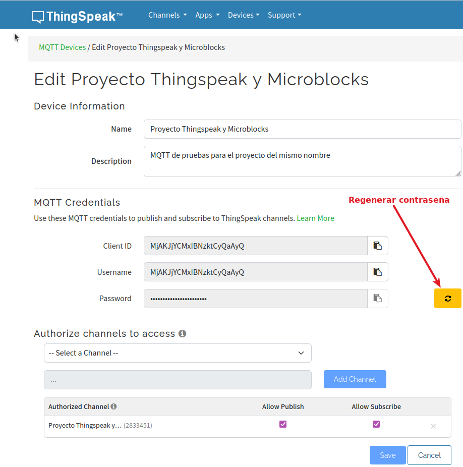  
*Editar Dispositivo MQTT*

</center>

Como vemos el botón copiar de la contraseña no está activo y no podemos visualizarla, así que si la hemos perdido no tenemos mas opción que cambiarla por una nueva.

Con esto ya tenemos todo listo para crear un ejemplo que nos muestre el funcionamiento de todo lo explicado. Crearemos el mismo pograma que utilizando las API keys pero ahora utilizaremos MQTT.

## <FONT COLOR=#007575>**Ejemplo MQTT**</font>
Lo primero que vamos a hacer es agregar un bloque "conectate a la wifi..." agregando la libreria WiFi si resulta necesario. En este bloque establecemos el nombre de la red 2G y la contraseña de acceso.

Desde el menú "control" arrastramos un bloque "espera..." que ajustamos a dos segundos para que de tiempo suficiente a establecer la conexión. El estado del programa en este momento será:

<center>

  
*Inicio del programa*

</center>

A continuación de la espera vamos a poner un bloque "por siempre" que es donde va a realizarse la conexión con el broker, y si esta tiene éxito, la publicación de los datos con una espera mínima de 16 segundos entre cada envio.

Hacemos clic en "Añadir libreria" y entramos en el grupo "Red" donde seleccionamos "MQTT". En esta libreria nos encontramos un bloque "conectate al broker MQTT..." que arrastramos a nuestra zona de programa y expandimos totalmente hasta que tenga el siguiente aspecto:

<center>

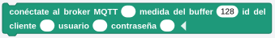  
*Bloque conectate al broker MQTT...*

</center>

Cumplimentamos los campos del bloque con los datos de nuestro dispositivo MQTT y damos una espera de un segundo para que se establezca la conexión. Ahora añadimos desde "Control" una sentencia condicional "si..." en la que que colocamos el bloque "MQTT conectado" para saber si se ha establecido la conexión. En caso afirmativo mostramos un mensaje, realizamos la publicación del tema y tras una espera de 16 segundos desconectamos MQTT. Si la conexión no ha tenido éxito mostramos un mensaje al respecto y también damos una espera de 16 segundos para garantizar que no se intenta publicar antes del tiempo mínimo establecido.

En la imagen siguiente vemos el bloque "publica al tema de MQTT..." y el significado de sus partes:

<center>

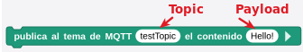  
*Bloque publica al tema de MQTT...*

</center>

Para componer la parte de payload usaremos un bloque une expandiendolo para configurar los ocho campos a enviar. El bloque "une..." quedará así:

<center>

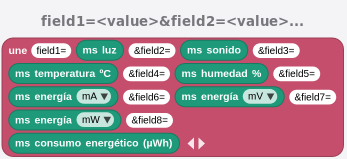  
*Bloque une...*

</center>

A continuación vemos una imagen del programa completo y en su título está el enlace para su descarga.

<center>

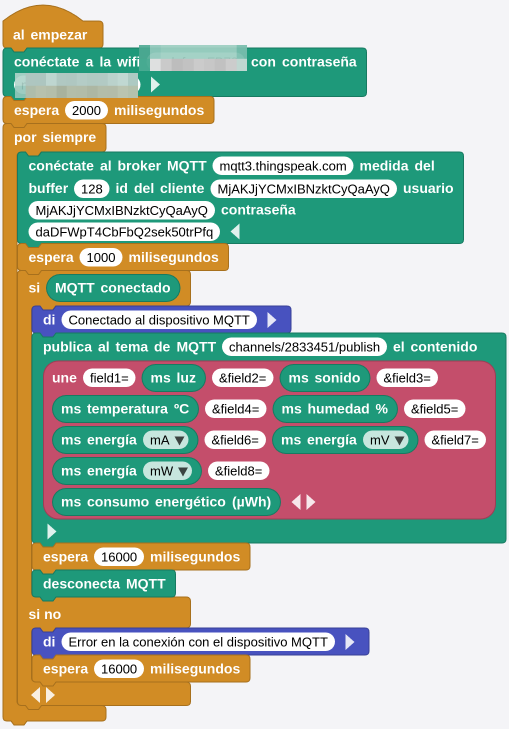  
*[Programa MQTT_Thingspeak_Microblocks](../program/uB/MQTT_Thingspeak_Microblocks.ubp)*

</center>

En la imagen siguiente tenemos una captura de las gráficas de los cuatro primeros campos con unas cuantas publicaciones:

<center>

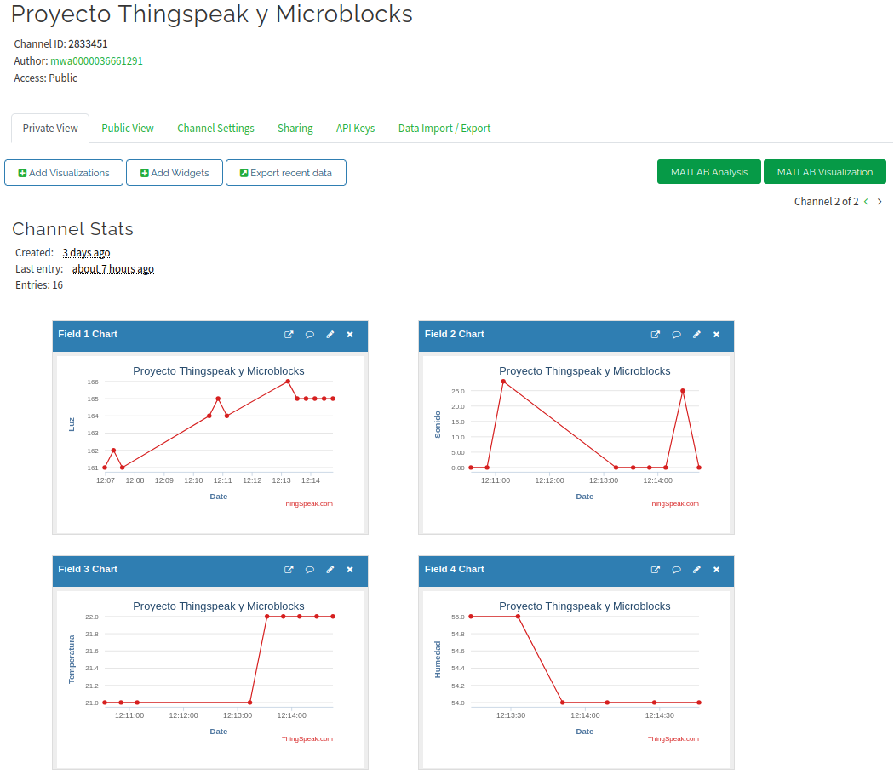  
*Programa MQTT_Thingspeak_Microblocks*

</center>
