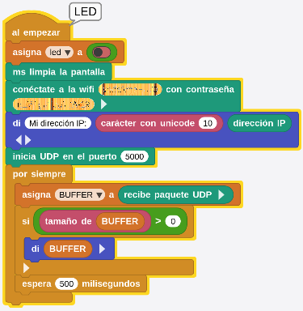

Este proyecto es una adaptación de la entrada [Remote control using UDP](https://wiki.microblocks.fun/en/wifi) disponible en la [MicroBlocks Wiki](https://wiki.microblocks.fun/en/wifi/udp) como una demostración del uso de UDP en MicroBlocks.

El control remoto es una técnica muy utilizada en proyectos de control, como por ejemplo para controlar un coche robotizado, un sistema de gestión de la energía doméstica o una estación meteorológica.

El control remoto puede implementarse utilizando cualquiera de las capacidades de comunicación disponibles en los microcontroladores. Bluetooth, Comunicación serie, GSM (red 2G), radiofrecuencia, WiFi, etc. En este tutorial, nos centraremos específicamente en el uso del control remoto basado en WiFi, específicamente el que hace uso del [Protocolo de Datagramas de Usuario](https://es.wikipedia.org/wiki/Protocolo_de_datagramas_de_usuario) ([User Datagram Protocol o UDP](https://en.wikipedia.org/wiki/User_Datagram_Protocol)).

Aprenderemos a transmitir y recibir mensajes UDP y a actuar sobre el contenido del mensaje encendiendo y apagando un LED de la placa. Una vez que domines este ejercicio, podrás implementar otros sistemas de control más complejos por tu cuenta.

En el tutorial original se hace uso de cinco microcontroladores con el fin de mostrar una de las características importantes de MicroBlocks, la PORTABILIDAD. Puedes experimentar esto con lo que tengas a mano. En nuestro caso vamos a utilizar solamente placas micro:STEAMakers para hacerlo, que tienen las características necesarias para hacerlo:

* Soportan WiFi
* Disponen de botones

## **Material y montaje**

* una o más micro:STEAMakers
* un teléfono móvil con Android (opcional).

Si sólo tienes una micro:STEAMakers, entonces puedes usarla en combinación con la APP del teléfono móvil con Android. En el peor de los casos, si no tienes placas disponibles, pero posees un teléfono móvil con Android todavía puedes experimentar con este tutorial usando tu teléfono.

Dado que este ejercicio hace uso de la capacidad WiFi de los dispositivos en uso, no habrá necesidad de cableado físico.

En cuanto a la disponibilidad de WiFi, puedes empezar utilizando el proporcionado por el router de tu casa.

También describiremos una forma en la que puedes crear tu propio HotSpot WiFi, que será  muy útil si planeas trabajar en un área sin servicio WiFi.

!!! info "HotSpot WiFi"
    Un HotSpot WiFi es un lugar físico donde los usuarios pueden conectar a internet de forma inalámbrica dispositivos como teléfonos móviles o tablets.

## **Proceso**
Para iniciar el proyecto:

* **Identificarse** en la red WiFi local y obtener una dirección IP. En la libreria WiFi tenemos un bloque para ello:

  
*Bloque conéctate a la wifi...*

Si cogemos el bloque y lo configuramos y al mismo le adosamos un bloque di..., podemos construir un pequeño script que nos devuelva la dirección IP de cada placa:

  
*Obtener la IP*

El bloque "direccion IP" también está en la libreria WiFi.

* Después debemos esperar a recibir **mensajes UDP "ON" u "OFF" y conmutar el estado del LED (3,3)** de la pantalla.
* **Si se pulsa el botón A, enviar un mensaje de difusión "ON"** a todos los dispositivos participantes y **si se pulsa el botón B, enviar un mensaje de difusión "OFF"** a todos los dispositivos participantes.

**Recuerda reemplazar el SSID y la Contraseña en el programa con tu información específica.**

Puede ser útil revisar brevemente las operaciones del Protocolo de Datagramas de Usuario (UDP) para tener una mejor idea de toda la acción en el tutorial. Puedes consultar el artículo sobre UDP en Wikipedia o en cualquier otro sitio para un tratamiento más detallado del tema.

### Conceptos básicos de UDP
(obtenidos de Wikipedia)

En redes informáticas, el Protocolo de Datagramas de Usuario (UDP) es uno de los protocolos de comunicación centrales del conjunto de protocolos de Internet utilizado para enviar mensajes (transportados como datagramas en paquetes) a otros hosts en una red de Protocolo de Internet (IP). Dentro de una red IP, UDP no requiere comunicación previa para establecer canales de comunicación o rutas de datos.

UDP utiliza un modelo sencillo de comunicación sin conexión con un mínimo de mecanismos de protocolo. UDP proporciona números de puerto para direccionar diferentes funciones en el origen y el destino del datagrama. No tiene diálogos de toma de contacto y, por tanto, no hay garantía de entrega, orden o protección contra duplicados.

UDP es adecuado para fines en los que la comprobación y corrección de errores no son necesarias o se realizan en la aplicación. Las aplicaciones sensibles al tiempo suelen utilizar UDP porque es preferible soltar paquetes que esperar a que se retrasen debido a la retransmisión, que puede no ser una opción en un sistema en tiempo real.

Las características principales de este protocolo son:

1. Trabaja sin conexión, es decir, que no emplea ninguna sincronización entre el origen y el destino.
2. Trabaja con paquetes o datagramas enteros, no con bytes individuales como TCP. Una aplicación que emplea el protocolo UDP intercambia información en forma de bloques de bytes, de forma que por cada bloque de bytes enviado de la capa de aplicación a la capa de transporte, se envía un paquete UDP.
3. No es fiable. No emplea control del flujo ni ordena los paquetes.
4. Su gran ventaja es que provoca poca carga adicional en la red, ya que es sencillo y emplea cabeceras muy simples.

### Puertos UDP
Las aplicaciones pueden utilizar sockets (conectores) de datagramas para establecer comunicaciones de host (equipo) a host (equipo). Una aplicación vincula un socket a su punto final de transmisión de datos, que es una combinación de una dirección IP y un puerto. De esta forma, UDP proporciona multiplexación de aplicaciones. Un puerto es una estructura de software que se identifica por el número de puerto, un valor entero de 16 bits, que permite números de puerto entre 0 y 65535.

* El puerto 0 está reservado, pero es un valor de puerto de origen admisible si el proceso de envío no espera mensajes como respuesta.
* Los puertos 1 a 1023 se llaman puertos "bien conocidos (well-known)" y en sistemas operativos tipo Unix enlazar con uno de estos puertos requiere acceso como superusuario.
* Los puertos 1024 a 49.151 son puertos registrados usados por [IANA-registered services](https://www.iana.org/assignments/service-names-port-numbers/service-names-port-numbers.txt). IANA son las siglas de Internet Assigned Numbers Authority que es el Registro de nombres de servicio y números de puerto de protocolo de transporte.
* Los puertos 49.152 a 65.535 son puertos dinámicos y son utilizados como puertos temporales, sobre todo por los clientes al comunicarse con los servidores.

### UDP en el proyecto
La implementación de MicroBlocks del protocolo UDP se manifiesta en la libreria UDP. No hay ningún requisito especial antes de usar el protocolo, aparte de que los dispositivos implicados tienen que estar presentes en una red IP compartida, en nuestro caso nuestro WiFi local.

Veamos una descripción de los bloques que compnen esta libreria:

* **inicia UDP en el puerto...**

  

Este bloque configura el script para que **escuche los mensajes UDP en el puerto designado**. La dirección IP propia del dispositivo y el número de puerto especificado forman un socket e identifican de forma única el dispositivo y cualquier servicio de software que proporcione. Según lo anterior:

* si se envía un mensaje de difusión UDP dirigido al puerto 5000,
* o se envía un mensaje UDP dirigido a la IP del dispositivo y al puerto 5000...

nuestro script lo verá y lo recibirá.

* **envia paquete UDP...a la IP...y puerto...**

  

Este bloque se utiliza para **enviar mensajes UDP a la dirección IP y puerto designados**. La **dirección IP 255.255.255.255** es una dirección de **difusión especial**, y se utilizará para acceder a todos los dispositivos IP en la subred local. Esto facilita el envío de mensajes sin molestarse con la dirección IP específica de cada dispositivo.

Ten en cuenta que **en MicroBlocks, los mensajes de difusión no son vistos por el dispositivo emisor**. Sin embargo, **en la MIT AI2 APP, las difusiones son vistas por el teléfono emisor**.

Los mensajes también pueden ser enviados utilizando la dirección IP específica y el número de puerto UDP del dispositivo de destino, incluso a la propia dirección IP.

!!! Abstract "Direcciones IPv4 reservadas para usos específicos"
    127.0.0.0 -> Dirección de loopback o bucle de retorno (la propia interfaz del host)

    224.0.0.0 -> IP multicast o entrega de datos simultanea a un grupo de nodos receptores.

    255.255.255.255 -> Difusión (broadcast); se envía a todas las interfaces en la red

* **recibe paquete UDP**

  

**Siempre que se reciba un mensaje UDP, este bloque contendrá su contenido**. Comprobando si su longitud es mayor que cero, podemos consultar el resultado de las transacciones UDP.

Este bloque también proporciona una opción booleana de **datos binarios** que permite recibir cualquier tipo de dato.

Hay otros bloques en la biblioteca que no se utilizan en este proyecto aunque se explican por sí mismos.

* **detén UDP**. Detiene el procesado de UDP

  

* **dirección IP remota de UDP**. El mensaje UDP envía la dirección IP remota.

  

* **puerto remoto de UDP**. El mensaje UDP envía el puerto remoto.

  

## **Programación MicroBlocks**
La idea inicial del proyecto original es que todas las placas ejecuten exactamente el mismo programa y hagan exactamente lo mismo: encender y apagar el LED de la placa al recibir mensajes UDP y enviar mensajes al pulsar el botón. En nuestro caso hemos introducido pequeñas variaciones para adaptarlo a la placa micro:STEAMakers que es la que nos ocupa. En concreto asumiremos que el LED integrado es el LED de coordenas (3,1) de la pantalla y aprovecharemos la circunstancia de que los LEDs son RGB para usar diferentes colores que distingan un scrip de otro. Veamos el programa por partes:

**$\blacktriangleright$ Bloque al empezar:** gestiona el inicio de sesión WiFi, muestra la dirección IP obtenida del router local e inicia el puerto UDP. A continuación, el script entra en un bucle de recepción de mensajes y los muestra en el IDE.

  
*Bloque al empezar*

**$\blacktriangleright$ cuando botón A:** el bloque envía un mensaje de difusión UDP con "LED" como contenido. Si la IP es 255.255.255.255 el mensaje se envia a todas las placas que estén en la red y si es una IP concreta el mensaje se envia a la placa con esa IP. El mensaje es enviado al soltar el botón.

  
*Bloque cuando botón A*

**$\blacktriangleright$ Bloque BUFFER = LED:** actúa sobre el mensaje LED recibido y conmuta el estado del LED especificado. Si estamos trabajando con al menos dos placas podemos observar como al pulsar el botón A en una placa el mensaje en el IDE de este bloque en la otra placa cambia de estado, correpondiendo el valor "true" de la variable a LED apagado y "false" a LED encendido.

   
*Bloque cuando BUFFER = LED*

El LED integrado o LED (3,1) actúa justo al contrario que el (3,3) y podemos prescindir de uno u otro sin ningún problema, como se ha indicado simplemente se hace por variar el proyecto original.

**$\blacktriangleright$ Bloque envia paquete UDP...:** El programa incluy un bloque de envío UDP separado que puedes utilizar para ejercer la opción de enviar un mensaje UDP a ti mismo o a otro dispositivo específico.

  
*Bloque cuando envia paquete UDP...*

Para ello, **es necesario tomar nota de la dirección IP** mostrada al inicio del programa y luego dirigir el mensaje a esa dirección específica para las respectivas placas de prueba.

Si estás utilizando la **APP de Android**, tendrá su **IP mostrada en la parte superior de la pantalla**.

El programa completo lo tienes en la imagen siguiente y en el enlace lo puedes descargar. No olvides configurar tus datos WiFi para que funcione correctamente.

  
*[Programa comunicaciones UDP](../program/actividadesmB/comunicacionUDP.ubp)*

## **Aplicación con APP Inventor**
En el ejemplo original se proporciona una APP compatible con Android para el programa realizado en MicroBlocks. Asi se proporciona una flexibilidad extra si sólo tienes un microcontrolador o no tienes ninguno. Puedes enviar mensajes entre el microcontrolador y la APP del teléfono móvil; o simplemente enviar mensajes del teléfono a sí mismo.

Las dos imágenes siguientes muestran la GUI (Graphical User Interface) de la APP al inicio del programa y al recibir y enviar mensajes de broadcast UDP, cambiando el estado del LED simulado.

   
*GUIs de la APP*

En la APP se han realizado cambios mínimos para traducir los mensajes e incluir un botón que limpie la zona de mensajes.

### Interfaz de usuario de la APP
La GUI de la APP consta de cuatro partes:

**$\blacktriangleright$ Botón superior / combinación de imágenes:** se utiliza para **generar mensajes de difusión UDP** para alternar los LED de los dispositivos receptores y también **mostrar las acciones del LED** para los mensajes recibidos.

**$\blacktriangleright$ Área de emisor UDP:** Proporciona un control detallado para la dirección IP de destino, los números de Puerto de destino y local y el contenido del texto del Mensaje de los mensajes UDP. Esta área se utiliza principalmente para probar varias opciones de mensajes UDP y experimentar con otros dispositivos con respecto a las combinaciones de numeración de IP y Puerto.

**$\blacktriangleright$ Área de Receptor UDP:** Permite modificar el puerto UDP que está escuchando el dispositivo.

**$\blacktriangleright$ Área de Visualización de Mensajes:** En esta área se muestran todos los intercambios del programa y cualquier mensaje de error.

### Cómo utilizar la APP
Aunque la GUI de la APP ofrece muchos detalles, el uso real es muy sencillo. Desglosémosla en varias tareas y probémosla:

#### **Recibir mensajes UDP**
No tienes que hacer nada ya que el programa comenzará a recibir mensajes inmediatamente después de ponerlo en ejecución. La dirección IP se obtiene automáticamente y cualquier mensaje UDP destinado al puerto 5000 será recibido y mostrado.

El número de puerto puede cambiarse a través del campo de entrada **Puerto local** en el Área de Receptor UDP. Tras el cambio, la APP comenzará a procesar los mensajes dirigidos al nuevo Puerto.

!!! Warning " "
    Para que se reciba un mensaje, debe enviarse a la dirección de difusión 255.255.255.255 o a la dirección IP específica del teléfono. En ambos casos, el número de puerto debe coincidir con el puerto local seleccionado.

#### **Enviar difusiones UDP para controlar LEDs**
De nuevo, no hay nada especial que hacer, pero si tocas la **imagen del LED en la parte superior de la pantalla**, se enviará un mensaje de difusión UDP a destino IP = 255.255.255.255 y Puerto = 5000. Cualquier dispositivo en la subred local que escuche el puerto UDP 5000 debería recibir estos mensajes y conmutar sus LEDs en consecuencia. Esto incluye el teléfono Android. **Verás tu propio LED conmutar**, cada vez que toques la imagen del LED.

!!! Warning " "
    Esta opción está configurada para enviar siempre a la dirección de difusión y el puerto = 5000. Es una forma segura de probar los cambios en la APP.
    Si deseas modificar cualquier opción de IP o Puerto, un poco mas adelante em **Enviar Mensajes UDP Personalizados** está explicado.

### Cambiar puerto UDP local
La APP escucha por defecto en el puerto UDP 5000. Sin embargo, esto puede cambiarse introduciendo un número de puerto diferente en el campo **Local Port (Puerto local)** del área UDP Receiver (Receptor UDP) de la APP. Tras pulsar **APLICAR Cambio**, el nuevo puerto estará operativo inmediatamente.

#### **Enviar Mensajes UDP Personalizados**
Esta es el área donde puedes obtener el control total de los mensajes y parámetros UDP.

Puede designar direcciones IP y Puertos de destino, cambiar tu propio número de Puerto para los mensajes a enviar, y personalizar el contenido del texto del mensaje.

Debes tener un buen conocimiento de todos los campos mencionados antes de jugar con esta opción. No hay posibilidad de que puedas hacer a nada por lo que puedes experimentar. Sin embargo, configurando los parámetros de forma anapropiada, puedes acabar haciendo lo que no pretendías y andar buscando mensajes que no fueron recibidos en los destinos y puertos correctos.

**Si quieres probar un ejercicio a prueba de fallos, intenta enviarte un mensaje a ti mismo:**

**$\blacktriangleright$** Establece como IP de destino tu propia dirección IP

**$\blacktriangleright$** Establece el Puerto de destino en 5000 o el mismo número de puerto seleccionado en Puerto local.

**$\blacktriangleright$** Deja el Puerto de Origen en 5000 (este valor no importará en este ejercicio)

**$\blacktriangleright$** Establece el Mensaje a LED

A continuación, pulsa el botón **ENVIAR mensaje UDP**.

Deberías **ver una notificación de mensaje enviado en el Área de Mensajes** en la parte inferior de la pantalla. Y la **imagen LED en la parte superior de la pantalla se encenderá o apagará** dependiendo de como estuviese antes. Puedes enviar el mensaje repetidamente y observar cómo cambia el LED. En la animación vemos lo descrito en funcionamiento:

  
*Autoenvio de mensajes*

Intenta también enviar un mensaje con un contenido de texto diferente. En este caso, como el texto del mensaje no es "LED", el LED no se encenderá. Sin embargo, recibirás las notificaciones del mensaje en el Área de Mensajes en la parte inferior de la pantalla.

## Crear HotSpot propio
Pueden presentarse casos en los que el entorno en el que desea ejercer el control sobre dispositivos puede no tener una señal WiFi disponible. Especialmente, si estás en la naturaleza o en un lugar alejado de la civilización. No te preocupes, todavía serás capaz de experimentar con este tutorial siguiendo las instrucciones siguiente.

### Mi propia señal WiFi
Veamos cómo podemos activar nuestra propia señal WiFi.

Necesitarás al menos un microcontrolador con capacidad WiFi y un teléfono con Android.

Para crear nuestra propia señal WiFi, utilizaremos una **versión modificada del programa de MicroBlocks** anterior (comunicacionUDP_HS.ubp). Además, mientras que en la versión anterior del ejercicio utilizábamos un único programa para todos los dispositivos, esta vez necesitaremos dos versiones diferentes:

**$\blacktriangleright$** **La versión WiFi HotSpot del programa** - esta se ejecutará en un único dispositivo y actuará como Router, proporcionando señal WiFi y servicios DHCP para la asignación de direcciones.

**$\blacktriangleright$** **y la versión original utilizada anteriormente.**

**$\blacktriangleright$** Por supuesto, si estás utilizando tu teléfono Android, seguirás necesitando la APP para esto.

### Cómo funciona
La configuración del proyecto se ve en la imagen siguiente:

  
*Cómo funciona*

Se utiliza una micro:STEAMakers como proveedor de un punto de acceso (HotSpot) WiFi. La placa está ejecutando el programa comunicacionUDP_HS.ubp creado en MicroBlocks. Este tiene que ser el ÚNICO dispositivo que ejecute esta versión del programa. En el programa MicroBlocks, debes especificar un **nombre de red** y una **contraseña** que se utilizará para definir y controlar el acceso al HotSpot.

El bloque siguiente (usado en el ejemplo) muestra el **nombre de la red como PRUEBA_UDP** y la **contraseña como 01223456789**. Siéntete libre de cambiarlos por lo que quieras.

  
*Bloque para crear punto de acceso*

El programa comunicacionUDP_HS.ubp difiere del anterior sólo en el hecho de que crea un HotSpot WiFi. Dado que sólo debe haber una única red WiFi operativa, sólo se permite que un dispositivo ejecute este programa. Aquí está la sección de inicio del programa con la creación del Hotspot:

  
*Bloque al empezas de comunicacionUDP_HS.ubp*

Si utilizamos mas de una placa, todas deben estar ejecutando el programa comunicacionUDP.ubp. Para estos dispositivos, es necesario modificar el SSID y la contraseña en el programa MicroBlocks a lo que hemos configurado en el punto de acceso WiFi creado.

Para simplificar, sólo hemos puesto un smartphone con Android que ejecuta la APP AI2 del MIT y una placa. Al igual que antes, la imagen LED de la parte superior de la pantalla se encenderá cada vez que reciba un mensaje UDP. También puedes tocar la imagen tú mismo y hacer que conmute el estado del LED.

Recuerda que la versión Android de la implementación UDP permite que las transmisiones enviadas desde el teléfono sean recibidas y ejecutadas por el propio teléfono. Por lo tanto, puedes controlar el LED en tu teléfono desde el mismo teléfono.

Si tienes otros dispositivos microcontroladores con WiFi, puedes añadirlos al entorno. Todos ellos deben estar ejecutando la versión del programa comunicacionUDP.ubp hecho en MicroBlocks.

### Activación de la nueva Red
Cuando la ESP32 micro:STEAMakers empiece a funcionar, creará una red WiFi llamada PRUEBA_UDP. Puedes ver esta red si haces un escaneo de red WiFi en tu PC, así como en el escaneo WiFi de tu teléfono Android. Esto es lo que debes buscar:

  
*Activación de la red PRUEBA_UDP*

Para cada una de las placas (excepto la que está actuando como HotSpot WiFi) que vas a utilizar en tu propia prueba, es necesario modificar el programa MicroBlocks para utilizar las nuevas credenciales de red WiFi: PRUEBA_UDP / 0123456789.

Si estás utilizando un teléfono Android, entonces su WiFi también tiene que ser la nueva red: PRUEBA_UDP / 0123456789.

Una vez que hayas completado estos pasos todo debería funcionar sin problemas.

Cosas que puedes probar:

**$\twoheadrightarrow$** Pulsa el botón en la micro:STEAMakers y debes ver el LED en la APP encenderse. Si pulsas otra vez debería apagarse.

**$\twoheadrightarrow$** Del mismo modo, si pulsas la imagen del LED en la APP de tu teléfono, el LED la micro:STEAMakers se encenderá. El LED del teléfono cambiará al estado opuesto al que tenía antes.

**$\twoheadrightarrow$** Sigue repitiendo hasta que le cojas el truco.

**$\twoheadrightarrow$** Y si te sientes aventurero, intenta enviar mensajes de dispositivo a dispositivo utilizando sus respectivas direcciones IP y números de puerto.

!!! Warning "La red PRUEBA_UDP no tiene acceso a internet"
    Si has creado un punto de acceso WiFi y ya has probado todo con él, recuerda eliminarlo e iniciar sesión en tus dispositivos y teléfono en tu red WiFi normal. De lo contrario, no estarás trabajando como antes de los ejercicios y te preguntarás por qué nada funciona como de costumbre.

## **Debate**
No se garantiza la entrega de los mensajes UDP. Debido a las condiciones de la red, es posible que observes casos en los que no todos los dispositivos conmutan el LED cada vez que se pulsa el botón. Esto dejaría algunas de tus tarjetas con los LEDs encendidos y otras con los LEDs apagados. ¿Cómo puede hacer que todas las tarjetas vuelvan a la condición inicial de todos los LEDs apagados?

Este proyecto envía mensajes cada vez que se pulsa un botón. Esto requiere que tengas al menos una placa con botones. ¿Cómo puedes modificar el proyecto para eliminar este requisito?

¿Cuál crees que es el mensaje más largo que se puede enviar?

La APP para Android está escrita en App Inventor del MIT. Se comporta de forma muy similar a las placas utilizadas en el proyecto. Si estás familiarizado con MIT AI2, ¿puedes modificar la APP para controlar los LEDs RGB desde el teléfono?

## **Consejos / Solución de problemas**
Si tiene varias placas con capacidad WiFi con los que vas a trabajar, te resultará más fácil cargar los programas en ellas de una en una.

Sin embargo, si te sientes cómodo con ello, puedes ejecutar múltiples sesiones de MicroBlocks en el navegador y conectar uns placa a cada una.

Para ello necesitarás una forma de conectar varios dispositivos USB a tu PC. Este método también te resultará útil más adelante, en caso de que quiera probar el envío de mensajes individuales entre dispositivos específicos. Para ello necesitarás conocer sus direcciones IP adquiridas. Cuando el programa MicroBlocks se ejecuta, siempre mostrará la dirección IP adquirida.

Si gestionas varios dispositivos a la vez, recuerda anotar qué dispositivo está conectado a qué puerto USB por su nombre e información del controlador. Las cosas pueden volverse confusas muy rápidamente.

En el primer modo del tutorial, donde estás en tu red doméstica, normalmente verás direcciones de red doméstica en el rango de 192.168.1.nnn. Si por alguna razón has modificado el router de Internet de tu casa para asignar un rango diferente de direcciones IP, entonces puede que tengas direcciones diferentes.

Si estás probando la versión HotSpot del tutorial, tendrás que ser consciente de las diferencias en las direcciones IP creadas y utilizadas.

En el modo HotSpot del tutorial, la placa designada creará una red y distribuirá un conjunto diferente de direcciones. Normalmente serán 192.168.4.1 para el router, y 192.168.4.2 y siguientes para los demás dispositivos, incluido tu teléfono Android (si utilizas uno para el tutorial).

En el modo HotSpot del tutorial, recuerda activar primero la nueva red. Esto configurará el entorno para asignar direcciones a los dispositivos que se unan. Sólo debes conectar el WiFi de tu teléfono a la nueva red después de activarla. De lo contrario, el escaneo WiFi de tu teléfono no verá la red con el SSID = PRUEBA_UDP.

Ten en cuenta que durante ambas versiones del tutorial, nunca estás accediendo a Internet. De hecho, en la versión Hotspot, ni siquiera hay conectividad a Internet disponible, como verás en las pantallas de estado de las redes WiFi. Todo el intercambio de tráfico ocurre dentro del dominio privado de tu red doméstica y de la nueva red que creas con la opción HotSpot.

Hay formas de acceder a Internet en ambos modos de funcionamiento. Sin embargo, ese es un tema muy complicado para entrar en los propósitos de este tutorial. Cualquiera que esté interesado puede investigar NAT (Network Address Translation o traducción de direcciones de red), servicios Proxy, direcciones de Internet privadas y públicas y tratar de darle sentido a todo esto.

Una buena manera de deshacerte de las entradas de red no deseadas en tu PC y en tu teléfono es seleccionar la opción de OLVIDAR esa red. Encontrarás esta opción en la sección de configuración de conectividad WiFi de tus dispositivos.

### Qué puede fallar
Dado que UDP es un modelo de conectividad sin conexión y no hay garantías de entrega de datagramas, algo que viene a la mente son los "mensajes perdidos". Los mensajes UDP NO se ponen en cola ni se reintentan, simplemente se descartan.

No te sorprendas si con cada pulsación de los botones de tu placa (o teléfono), no todos los dispositivos acaban encendiendo sus LEDs; o lo hacen de forma intermitente. Así son las cosas.

Es un poco confuso, pero MicroBlocks WiFi y Androd WiFi manejan los mensajes de difusión de forma diferente. Esto en sí mismo no es un problema, pero ayuda a mantener este punto en nuestras mentes, mientras trabajamos en los ejercicios. Las difusiones enviadas desde los microcontroladores no aparecen en el dispositivo que originó la difusión. Por otro lado, los teléfonos Android emitirán un mensaje y también lo verán y actuarán en consecuencia. Por lo tanto, si utilizas un teléfono con este tutorial, verás que cada vez que toques la imagen del LED en el teléfono, cambiará su estado. Mientras que los microcontroladores nunca encenderán sus propios LEDs con sus propios mensajes.

Los programas del proyecto están escritos para conmutar los LEDs. Esto significa que no hay forma forzada de poner un LED en un estado deseado: ON u OFF. Al principio de los programas, todos los LEDs están en OFF. Pero a medida que los ejercicios continúan, pueden desincronizarse debido a la pérdida de mensajes, etc., como se explicó anteriormente. Así que el comportamiento posterior de cualquier LED depende totalmente del estado en el que se encontraba justo antes de que llegara el último mensaje.

A medida que experimentes con la mensajería UDP, la radiodifusión y la configuración de IP y Puerto, cambiarás invariablemente algunos de estos parámetros. Ayuda tener en mente que los mensajes UDP necesitan tener una dirección de destino que coincida y un número de Puerto. Una vez que configures un dispositivo para escuchar un número de puerto en particular, NO verás mensajes destinados a otros números de puerto. Así que, si empiezas a no recibir los mensajes deseados, comprueba que tus dispositivos emisores y receptores están utilizando las direcciones y puertos correctos.

Y recuerda, la mejor manera de reiniciar todo es RESETAR todo.

¡Que te diviertas!

## **Descarga del proyecto**

* [Programa MicroBlocks comunicacionUDP para este tutorial](../program/actividadesmB/comunicacionUDP.ubp) - Instalar en cada placa con capacidad WiFi con la que quieras hacer pruebas.
* [Programa MicroBlocks comunicacionUDP_HS para la creación de tu propia red WiFi](../program/actividadesmB/comunicacionUDP_HS.ubp) - Instalar sólo en una única placa con capacidad WiFi que quieres que actúe como tu nuevo router de red.
* [Código fuente de la APP MIT AI2 para Android](../program/AppInventor/comunicaciones_UDP.aia) - Personaliza la APP usando MIT AI2.

{ align=left }  [Aplicación APK MIT AI2 para Android](../program/AppInventor/comunicaciones_UDP.apk) - Carga este archivo en su teléfono. Puede requerir permiso para instalar aplicaciones desconocidas. 
