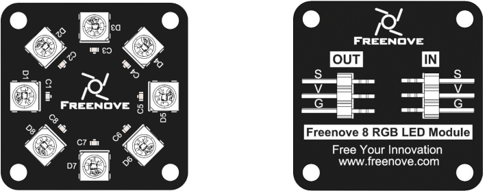
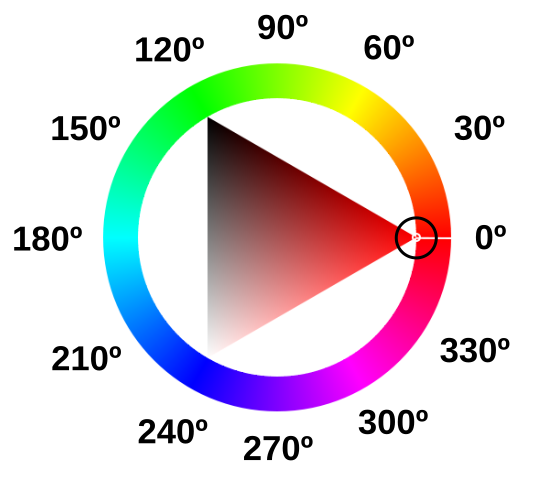
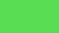
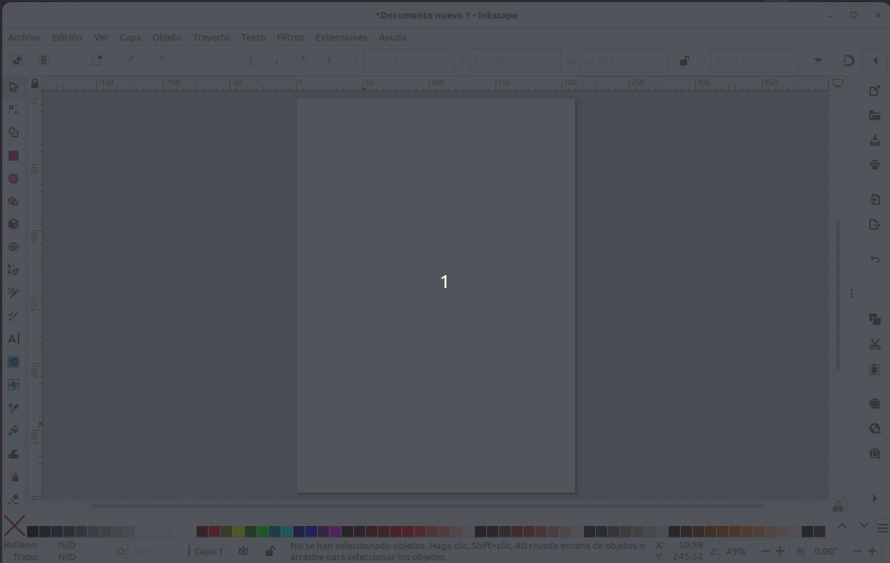

## **Introducción**
Explicamos los fundamentos desde un diodo LED hasta los LEDs RGB direccionables y los modelos de color RGB y HSV por la utilidad que van a tener en nuestro caso.

## **Diodo LED**
El diodo LED (Light Emitting Diode) es un diodo semiconductor capaz de emitir luz, lo mas usuales dentro del espectro visible aunque también pueden ser de infrarrojos, laser, etc. Su uso mas habitual es como indicador y, últimamente cada vez mas frecuentes en iluminación. Sus principales ventajas frente a luces incandescentes son:

* Menor consumo de energía
* Mayor vida útil
* Menor tamaño
* Gran durabilidad y fiabilidad

En la imagen siguiente vemos el aspecto físico que tiene y su símbolo electrónico.

  
*Aspecto y símbolo del LED*

El color de la cápsula es simplemente orientativo, es la longitud de onda quien define realmente el color de la luz emitida. Por ello el LED con la cápsula transparente puede emitir en cualquiera de los colores del espectro visible.

La forma de la capsula mas habitual es cilíndrica de 3 o 5 mm de diámetro, aunque existen otras formas menos usuales como las que vemos en la imagen siguiente:

  
*Tipos de encapsulados para LEDs*

El LED es un dispositivo que tiene polaridad siendo su comportamiento el siguiente: En polarización directa (ánodo a positivo y cátodo a negativo) el LED emite luz y en polarización inversa (ánodo negativo y cátodo positivo) se comporta prácticamente como un interruptor abierto.

Para su correcto funcionamiento el diodo LED se polariza poniéndole en serie una resistencia que limita la corriente que pasa a través del mismo y, por tanto, determina el nivel de brillo de la luz emitida.

Sin entrar en detalles en la tabla siguiente se dan los valores de tensión directa (VF) y corriente directa (IF) para los colores mas habituales de LEDs. A partir de estos valores y el valor de tensión de alimentación de nuestro LED podemos calcular el valor de la resistencia serie sin mas que aplicar la formula indicada.

  
*Tensión y corriente para distintos colores*

La formula corresponde a un circuito típico de polarización de un diodo LED como el siguiente:

  
*Circuito de polarización de un LED*

Si tenemos necesidad podemos utilizar la [calculadora de resistencia serie LED](¡¡) de Digikey.

## **LED RGB**
Un LED RGB es en realidad un encapsulado que incorpora tres diodos LED, uno por cada color fundamental y una patilla común que puede ser el ánodo o el cátodo de los tres diodos.

Los colores primarios en óptica son el rojo, el verde y el azul y la correcta combinación, en términos de intensidad, de ellos originará cualquiera de los colores secundarios. Las siglas RGB son el acrónimo de Red, Green y Blue. En la imagen siguiente vemos el modelo aditivo de los colores rojo, verde y azul.

  
*RGB*  
*Imagen obtenida de [Wikipedia](https://es.wikipedia.org/wiki/RGB)*

Existen dos tipos de LEDs RGB según están conectados internamente y pueden ser de cátodo común o de ánodo común. El símbolo y la representación de este componente lo vemos en la imagen siguiente, correspondiendo la pareja de la izquierda a los de cátodo común y la pareja de la derecha a los de ánodo común:

  
*Símbolo y representación LED RGB*

El pin mas largo es el común, el de su izquierda es el rojo (R), el de su derecha es el verde (G) y el último por la derecha el azul (B).

Teóricamente, cada uno de los LEDs podría adoptar 256 (valores entre 0 y 255) colores diferentes, es decir, un total de 16.777.216 (256x3) posibles colores diferentes con un LED RGB. En realidad el ojo humano solamente puede ver unos 10 millones de colores definidos por lo que se conoce como **espacio de color**, que tiene como referencia estándar habitual el denominado **CIELAB** o **CIEXYZ**, diseñados especificamente para abarcar lo que el ojo humano ve.

## **LED RGB direccionable**
Comúnmente se les conoce como Neopixel, que es una marca registrada por [Adafruit Industries](https://www.adafruit.com/). Cada LED que componen la tira o matriz tiene los siguientes cuatro pines:

* Alimentación VDD: 5V
* Tierra: GND
* DI (Date Input): pin para recibir información
* DO (Date Output): pin para enviar inforamción

Cada uno de los LEDs es direccionable de manera individual gracias al circuito electrónico que incluyen que es un circuito lógico con una memoria de un byte por color. Los tipos mas comunes son el SK6812, WS2811 o, el mas habitual de todos, el WS2812 cuyo [datasheet](https://cdn-shop.adafruit.com/datasheets/WS2812.pdf) tenemos en el enlace.

El WS2812B incluye un oscilador interno de precisión y un circuito de control de corriente constante programable de 12 V, lo que garantiza de manera efectiva que la intensidad del color sea consistente. El protocolo de transferencia de datos utiliza un único modo de comunicación de multiplexado NZR.

En la figura siguiente vemos el aspecto de un diodo LED RGB individual en formato inserción y SMD.

  
*Aspecto de un diodo LED RGB direccionable*

### **Funcionamiento y tipos**
#### Aspectos previos
Para transmitir información digital esta se debe sincronizar mediante una convención especial, la codificación. Dos dispositivos llevan una comunicación por cable convirtiendo la información a transmitir en un flujo de bits (0 y 1) o "Dates" que se suele nombrar con la letra D y que va acompañada de una señal de reloj para sincronizar las transmisiones. La forma convencional de transmisión digital se componen de una línea de datos mas una línea de reloj. Ahora bien, cualquier ligera desviación en la longitud de estas líneas hará que el receptor no cumpla con el tiempo de establecimiento del muestreo de datos, originando errores en los datos. La forma de asegurar que esas líneas son idénticas es que sean la misma línea, lo que hace que aparezcan códigos que fusionan los datos y el reloj, entre los que están los código RZ, NRZ y NRZI que vamos a ver someramente a continuación.

* **Codificación RZ**. El acrónimo de de "Return Zero" o retorno cero y su característica es que se transmiten bits de datos dentro de cada periodo de la señal. En la figura siguiente los datos se representan en rojo y vemos que ocupan una parte del periodo T, siendo y matrices RGBcero el resto del tiempo. Este sistema se denomina RZ unipolar o retorno a cero unipolar y como se observa en la figura un nivel bajo indica 0 y un nivel positivo indica 1.

  
*Código RZ unipolar*

El código de retorno a cero se divide en un código de retorno a cero unipolar y un código de retorno a cero bipolar en el que el nivel alto indica 1 y el nivel negativo o, tal y como vemos en la figura siguiente:

  
*Código RZ bipolar*

* **Codificación NRZ**. El acrónimo es de "Not Return Zero" o código sin retorno a cero y se diferencia del RZ en que no necesita retornar a cero. En la figura siguiente vemos gráficamente el código.

  
*Código NRZ*

En el datasheet estos código se denominan T0H y T0L.

El funcionamiento de una agrupación en cascada como la de la figura siguiente se puede resumir diciendo que: el circuito integrado de cada LED puede almacenar 3 bytes (24 bits), un byte para cada color. Solo el primer LED está conectado al Pin de control, en este caso, un pin digital de nuestra placa, que enviará la cadena de todos los colores según el número de pixeles que estén conectados y a su vez el primer LED recibirá la información de todos los colores uno tras otro. La información se transmite de un LED a otro porque cuando un LED recibe 3 bytes nuevos de información entrega al siguiente LED los 3 bytes que contenía anteriormente, de esta manera cuando la placa con el programa termina de mandar todos los colores por el pin de datos el primer LED habría recibido y enviado todos los colores para quedarse finalmente con el color que le corresponde y así el resto de LEDs. De esta forma una tira de LEDs RGB direccionables es un dispositivo digital de salida, es decir su funcionamiento consiste en recibir la información del color a mostrar y mostrarlo.digital de salida, es decir su funcionamiento consiste en recibir la información del color a mostrar y mostrarlo.

  
*Conexión en cascada*

#### Aspectos técnicos
Los LEDs RGB direccionables se suelen suministrar en tiras de diferentes longitudes y con distinto número de LEDs y a veces se dispone la tira en forma de matriz. En la figura siguiente vemos el aspecto de algunos tipos.

  
*Conexión en cascada*

Tienen 3 cables asociados a un conector y dos cables extra para añadir alimentación externa cuando es necesario porque la placa de control no entrega suficiente corriente para alimentar al conjunto. Cuando se trabaja con una tira de pocos LEDs no es necesario añadir esta alimentación externa, ya que placas como Arduino UNO o la ESP32 STEAMakers pueden suministrar la corriente que necesitan.

En la figura siguiente vemos una tira de 8 LEDs:

  
*Tira de ocho LEDs RGB*

Cualquier tira de LEDs RGB (sea cual sea su disposición en línea, como matriz, etc) debe utilizarse siempre en la dirección que marca el terminal hembra como entrada y el conector macho como salida. Las podemos ir conectando entre sí pero siempre respetando este sentido de la tira. Junto a cada led RGB está indicada la dirección de la tira mediante un triángulo y también a qué pin debe ir conectado cada cable. Vemos +5V que corresponde a Vcc, GND, y en medio que pone Din o D0 que corresponde al pin digital de entrada de datos que debemos conectar al pin de salida de la placa de control.

También las podemos cortar por cualquiera de las líneas existentes entre cada uno de los LEDs y que está marcado con la línea de corte. El corte debe hacerse dejando la mitad del pad de cobre a un lado y otro de la línea y así poder unir después entre ellas con conectores especializados o soldándolas.

  
*Dirección y línea de corte*

#### Módulo de 8 LEDs
Vamos a explicar brevemente el módulo de 8 LEDs de Freenove que se muestra a continuación:

  
*Aspecto del módulo*

El módulo se puede controlar con sólo un pin de datos, como cualquier conjunto de diodos LEDs direccionables. También es posible controlar varios módulos al mismo tiempo. Simplemente conectamos el pin OUT de un módulo al pin IN de otro módulo, lo que nos va a permitir utilizar un pin de datos para controlar 8, 16, 32, ... LEDs.

  
*Conexión entre módulos*

El símbolo esquemático será algo similar a lo siguiente:

  
*Símbolo*

### Alimentación de Neopixeles
Vamos a comenzar por dar de forma destacada las tres recomendaciones que indican en la guía de Adafruit, que son:

<b>Orden de conexión de una fuente de alimentación o microcontrolador:

SIEMPRE PRIMERO la tierra

Orden de desconexión:

Se desconecta la tierra en ÚLTIMO lugar

____________________________________________________________________________

Como prevención y para evitar daños en el primer pixel por picos de tensión se recomienda poner unaresistencia de bajo valor (unos 75 ohmios) entre el pin de salida de datos de la placa de control y la entrada de datos del primer LED.

____________________________________________________________________________

Reserva de energía: Cuando se producen cambios abruptos en el brillo la fuente de alimentación por si sola no puede manejarlo y parecen fallar. Se aconseja poner un condensador electrolítico de gran capacidad (1000 uF) en paralelo con la alimentación para proporcionar esa energia extra que se requiere. SIEMPRE hay que respetar la polaridad del condensador.

</b>

#### Proyectos portátiles
Se configuran con relativamente pocos LEDs y por lo tanto no tienen un excesivo consumo por lo que podemos alimentarlos con pilas o baterías.

* Las baterías recargables de una celda (figura siguiente) de polímero de litio entregan 3,7V que son perfectos para alimentar microcontroladores y unos pocos LEDs direccionables.

  
*Baterías Lipo 1S*

* Pilas AA o AAA. Se pueden usar tres pilas alcalinas con su correspondiente portapilas. Esto proporciona 4.5V. El inconveniente respecto a las baterías lipo es que son mas grandes y pesadas y la ventaja es que son muy fáciles de conseguir.

* Pilas recargables de hidruro metálico de níquel. En este caso hay que utilizar cuatro unidades de 1.2V con su soporte de cuatro celdas. Esto nos va a proporcionar 4.8V. Tenemos que asegurarnos de usar solamente pilas NiMH porque si colocamos pilas normales de 1.5V estaremos creando una tensión total de 6V y esto es muy probable que rompa el microcontrolador o algún LED.

* Otros medios pueden ser utilizar porwerbanks de la tensión adecuada o alguna de las anteriores de mayor tensión intercalando un convertidor reductor que se adapte a las condiciones de entrada de tensión de que disponemos y que su salida suministre los 5V requeridos. Hay que tener en cuenta el rango de tensión de entrada que requiere el convertidor específico y la corriente máxima de salida.

#### Proyectos de escritorio
Si estamos hablando de tiras de hasta un metro con una fuente de alimentación conmutada de 5V/2A en CC típica tendremos suficiente.

Si se requiere mas corriente resulta tentador utilizar una fuente de laboratorio, pero hay que mucho cuidado porque pueden producir un gran pico de tensión cuando se encienden. Este pico es mas que suficiente para destruir instantáneamente los LEDs direccionables.

Si se usa una fuente de laboratorio, NO conectamos la tira directamente. Primero encendemos la fuente de alimentación, dejamos pasar unos segundo que el voltaje se estabilice, luego conectamos la tira, asegurándonos de conectar en primer lugar GND.

#### Aspectos previos
Cada LED individual consume hasta 60 miliamperios con el máximo brillo blanco (rojo + verde + azul). Sin embargo, en el uso real, es raro que todos los píxeles se enciendan de esa manera. Al mezclar colores y mostrar animaciones, el consumo puntual será mucho menor. Es imposible estimar un número para todas las circunstancias, pero se ha experimentado que usando la tercera parte de los 60 mA (20 mA por píxel) como regla general funciona correctamente. Pero si sabemos con certeza que necesitamos cada píxel con el máximo brillo, tenemos que usar la cifra 60 mA.

Para estimar las necesidades de suministro de energía, basta multiplicar la cantidad de píxeles por 20, o por 60 mA y obtendremos el consumo total en miliamperios. Por ejemplo:

60 LEDs × 20 mA = 1200 mA = 1.2 A como mínimo

60 LEDs × 60 mA = 3600 mA = 3.6 A como mínimo

256 LEDs x 20 mA = 5120 mA = 5.12 A como mínimo

256 LEDs x 60 mA = 15360 mA = 15.36 A como mínimo

La elección de la fuente de alimentación depende de nosotros pero es evidente que la máxima seguridad y fiabilidad se consigue con una fuente de alimentación de dimensiones más generosas, y esto es lo que recomendamos. La mayoría de las fuentes de alimentación pueden entregar un poco de corriente adicional durante períodos breves de tiempo e incluso algunas contienen un fusible térmico y simplemente se apagarán si se sobrecargan. Por lo tanto, aunque técnicamente pueden funcionar, digamos que no es recomendable abusar de ellas.

Un factor a tener en cuenta es que si vamos a alimentar con baterías estas se vuelven progresivamente mas pesadas, costosas y peligrosas, así que por razones de seguridad habría que minimizar el tamaño de las baterías.

Por otro lado tenemos que tener en cuenta la sección del conductor que será más barato y menos pesado cuanto menor sea esta, es decir, cuanta menor corriente deba soportar y que cuanto menor sea la corriente menor será el calor generado.

En general podemos decir que:

* La regla general de los "60 miliamperios" es solo eso... una regla general, no ciencia pura.
* Al animar y mezclar colores, el consumo de corriente será menor. A veces mucho menos.
* Incluso cuando se establece el color en 0 (LEDs apagados), la lógica del controlador dentro de cada Pixel usa una pequeña cantidad de corriente por debajo de 1 miliamperio por píxel, pero con muchos píxeles esto debería también sumarse.

La biblioteca NeoMatrix utiliza la corrección gamma para seleccionar niveles de brillo que son visualmente (aunque no numéricamente) equidistantes. Hay 32 niveles para rojo y azul, 64 niveles para verde. La función Color() realiza la conversión necesaria; no necesitamos hacer ningún cálculo. Acepta valores de rojo, verde y azul de 8 bits y devuelve un color de 16 bits con corrección gamma.

La respuesta final a todo esto es que usualmente los LEDs no estarían encendidos todos juntos, por lo que elegir una fuente de alimentación se vuelve una adivinanza. Podemos asumir para nuestros proyectos que el 75% de los pixels están encendidos en cualquier momento y que cada uno tiene solo un color, con lo que las corrientes anteriores quedan así:

60 LEDs: 45×20 mA = 0.9 A

256 LEDs: 192 x 20 mA = 3.84 A

512 LEDs: 384 x 20 mA = 7.68 A

La única forma 100% segura de saber con certeza el consumo es programar las luces y medir el consumo de corriente con un amperímetro.

## **Modelos de colores**
Según [Wikipedia](https://es.wikipedia.org/wiki/Modelo_de_colores) un modelo de colores es un modelo matemático abstracto que permite representar los colores en forma numérica, utilizando típicamente tres o cuatro valores o componentes cromáticos (por ejemplo **RGB** y **CMYK** son modelos de colores). Es decir, un modelo de colores sirve en una aplicación que asocia a un vector numérico un elemento en un espacio de color.

En el enlace anterior tenemos mayor información de los modelos existentes, de los que nosotros vamos a ver los dos que habitualmente se utilizan, el RGB y el HSV.

### Modelo RGB
El modelo de color RGB utiliza los componentes RGB (Red, Green, Blue) o RVA (Rojo, Verde, Azul) para definir la cantidad de luz de cada color en un color determinado. En una imagen cada componente se expresa como un número entre 0 y 255.

Es un modelos de color aditivo, luego el color se produce a partir de la luz transmitida. RGB se utiliza por lo tanto en monitores, donde las luces roja, azul y verde se mezclan de distintas formas para reproducir un amplio rango de colores. Cuando las luces roja, azul y verde se combinan en su máxima intensidad, el ojo percibe el color resultante como blanco. En teoría, los colores mezclados siguen siendo rojo, azul y verde, pero los pixeles del monitor se encuentran demasiado juntos para que nuestro ojo pueda diferenciar los tres colores. Cuando el valor de cada componente es 0, indica que hay una ausencia de luz y el ojo percibe el color negro.

  
*Modelo de color RGB*

### Modelo HSL
El modelo **HSL** o a veces **HSI** (siglas del inglés Hue, Saturation, Lightness o Intensity; traducido por, ‘matiz, saturación, luminosidad o intensidad’), define un modelo de color en términos de sus componentes constituyentes.

En el modelo de color **HSV**, un color se define por su matiz o tono (H), su saturación (S) y su luminosidad o intensidad (L). Ahora las siglas no significan colores como en RGB, sino parámetros.

La variedad de colores se obtiene cambiando los tres canales de color de tono (H), saturación (S) y luminosidad (L) y superponiéndolos entre sí. Este modo de color cubre los colores que puede percibir la visión humana.

Se suele representar mediante la rueda de color, como vemos a continuación:

  
*Rueda de color HSL*

* **Tono, matiz o Hue (H)**. En el círculo cromático el grado 0 (o 360º si hemos dado una vuelta completa) del Hue es el color rojo. El circulito rodeado corresponde al ángulo en la rueda de color. Cada ángulo representa un color. En esa posición la saturación S por defecto tomma su valor máximo de 100, y el brillo (L) es de 50. Nos podemos mover con estas condiciones por la rueda y obtener los distintos colores para esos valores de saturación o brillo.

  
*Cambios de tono (H) en la rueda de color HSL*

* **Saturación o Saturation (S)**. Indica la intensidad de un tono concreto. Los valores varian entre 0 y 100, siendo 100 el máximo de saturación posible y 0 el mínimo, que dará como resultado, gris. El parámetro cambia sus valores moviendose dentro del triángulo en la línea del díametro del círculo que corresponde a la posición del ángulo determinado por H.

  
*Cambios de saturación (S) en la rueda de color HSL*

Observamos que al acercarnos al gris el valor de H se restablece a su valor por defecto. Hasta ese punto el tono se mantiene en el valor definido.

* **Luminosidad o Lightness (L)**. El parámetro se refiere a como de claro u oscuro es un color. Si queremos aclarar un color nos moveremos hacia el blanco y si quiero oscurecerlo hacia el negro.

  
*Cambios de luminosidad (L) en la rueda de color HSL*

Hay un parámetro que suele acompañar a la rueda de color que es el Alfa (A), que puede variar entre 0 y 100 y se refiere al grado de opacidad del color, correspondiendo 100 a totalmente opaco y 0 a totalmente transparente.

#### Convertir RGB a HSL
Nos vamos a basar en un ejemplo descrito por los valores R=90, G=220, B=80 correspondiente a un tono verde oscuro.

  
*R=90, G=220, B=80*

* **Paso 1. Máximo y Mínimo**. Convertimos los valores RGB a valores en el rango 0-1 dividiendo por 255 cada valor.

$R = \dfrac{90}{255}= 0.353 \space; \space G = \dfrac{220}{255}= 0.863 \space; \space B = \dfrac{80}{255}= 0.314$

$\boxed{R = 0.353 \space; \space G = 0.863 \space(Max) \space; \space B = 0.314 \space(Min)}$

* **Paso 2. Luminancia**. Calculamos la Luminancia sumando los valores máximo y mínimo obtenidos en el paso 1 y lo dividimos por 2.

$L \space = \space \dfrac{0.863 + 0.314}{2} \space= \space 0.5885 \space\approx59 \%$

$\boxed{L \space = \space 0.5885 \space \approx 59 \%}$

* **Paso 3. Saturación**. A la hora de calcular la saturación S tendremos en cuenta que:

>
- <b>Si los valores máximo y mínimo son iguales: No hay saturación.
- Si todos los valores RGB son iguales: Tono gris mas o menos oscuro o claro dependiendo de la luminosidad.
- Si no hay saturación el Tono será 0º.</b>

Si no se da alguna de las condiciones anteriores sabemos que hay Saturación, que se calcula según sea el nivel de Luminancia:

$\Rightarrow$ **Si $L \leq 0.5$**

$S = \dfrac{Max-Min}{Max+Min}$

$\Rightarrow$ **Si $L > 0.5$**

$S = \dfrac{Max-Min}{2.0-Max-Min}$

$S = \dfrac{0.863-0.314}{2-0.863-0.314} = \dfrac{0.549}{0.823}=0.667 \approx 67 \%$

$\boxed{S = 0.667 \approx 67 \%}$

* **Paso 4. Tono**. La fórmula del Tono depende de qué canal de color RGB es el valor máximo. Las tres fórmulas diferentes son:

$\Rightarrow$  Si **Rojo** es el máximo, entonces:

$H = \dfrac{G-B}{Max-Min}$

$\Rightarrow$  Si **Verde** es el máximo, entonces:

$H = 2.0 + \dfrac{B-R}{Max-Min}$

$H = 2.0 + \dfrac{0.314-0.353}{0.863-0.314} = 2.0 + \dfrac{(-0.039)}{0.549} = 1.929$

$\boxed{H=1.929}$

$\Rightarrow$  Si **Azul** es el máximo, entonces:

H = 4.0 + \dfrac{R-G}{Max-Min}$

El valor obtenido de H lo multiplicamos por 60 para convertirlo en grados en el círculo cromático. Si resulta un valor negativo de H le sumamos 360.

$H = 1.929 \times 60 = 115.74 \approx 116 \space grados$

$\boxed{H=116 \space grados}$

Resultado final:

R = 90, G = 220, B = 80

H = 116, S = 67, L = 59

#### Convertir HSL a RGB
En el mismo sitio en que hemos basado la conversión de RGB a HSL de [Nikolai Waldman](https://www.niwa.nu/2013/05/math-behind-colorspace-conversions-rgb-hsl/) está documentado como hacerlo a la inversa, pero nosotros no lo vamos a hacer de este modo.

Se encuentran facilmente en la web páginas con calculadoras que permiten convertir de un modelo a otro con tan solo introducir los valores. Algunas incluso indican las fórmulas de cálculo, que usualmente están basadas en la entrada [HSL and HSV](https://en.wikipedia.org/wiki/HSL_and_HSV#Converting_to_RGB) de la Wikipedia. A título de ejemplo aquí pongo la de [rapidtables](https://www.rapidtables.org/convert/color/hsl-to-rgb.html), que ofrece muchas calculadoras en línea gratuitas

Hay una forma de hacerlo a partir de un programa libre como es Inkscape, publicado bajo licencia **GNU General Public License, version 3** y que hemos utilizado para las animaciones donde se han explicado los conceptos y donde además se pueden obtener otros datos y por supuesto modificarlos.

Es muy sencillo de utilizar y nos ofrece además otras posibilidades interesantes. Veamos como llegar a ello una vez abierto Inkscape con un archivo en blanco.

Dibujamos cualquier cosa y abrimos las opciones de Relleno y borde del objeto y desde ahí ya podemos cambiar el modelo de color, activar la rueda, mover la rueda o los valores lineales, volver a cambiar de modelo, etc y se nos irán mostrando los valores convetidos de uno a otro, como se observa en la animación siguiente cuando cambiamos del modelo HSL a RGB.

  
*Modelos de color con Inkscape*

### Modelo HSV
El modelo HSV (**Hue**, **Saturation**, **Value** – **Matiz**, **Saturación**, **Valor**), es también llamado HSB (Hue, Saturation, Brightness – Matiz, Saturación, Brillo), define un modelo de color en términos de sus componentes.

El **Matiz** o **Hue** se representa como un ángulo de 0 a 360º correspondiendo cada valor a un color. En una rueda de colores se puede representar de la siguiente forma:

  
*Rueda de colores HSV*

Si asociamos con RGB vemos que el rojo corresponde a un ángulo de 0º, el verde a 120º y el azul a 240º. Los colores entre estos tres ángulos divisorios corresponden a niveles de mezcla de los dos colores extremos. Por ejemplo, justo en la mitad entre el rojo y el verde estaría la mezcla de ambos colores que corresponde al amarillo.

La **Saturación** puede variar entre 0 y 100% y representa el porcentaje de brillo. En la animación siguiente vemos el funcionamiento de la rueda de color y del parámetro de saturación en el programa Inkscape.

  
*Rueda de colores HSV y Saturación*

El **Valor** también puede variar entre 0 y 100%, correspondiendo el 0 siempre a negro y el resto de valores un color mas o menos saturado. En la animación siguiente vemos el funcionamiento del parámetro Valor en el programa Inkscape.

  
*Rueda de colores HSV y Valor*

El propio Inkscape no puede servir para convertir RGB a HSV y viceversa. En la web también podemos encontrar calculadoras que lo hacen indicando incluso las fórmulas de conversión y dandonos una previsualización del color. A continuación, a título de ejemplo, ponemos enlaces a dos de ellas:

* Conversor de [RapidTables](https://www.rapidtables.com/convert/color/hsv-to-rgb.html) en inglés.
* Conversor de [peko-step](https://www.peko-step.com/es/tool/hsvrgb.html) en español.
