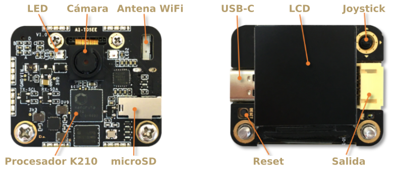
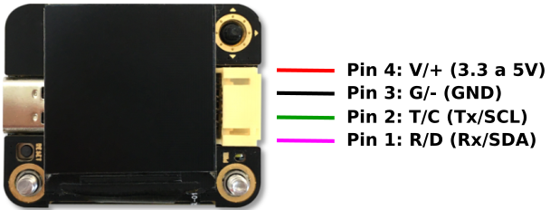
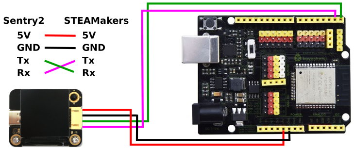
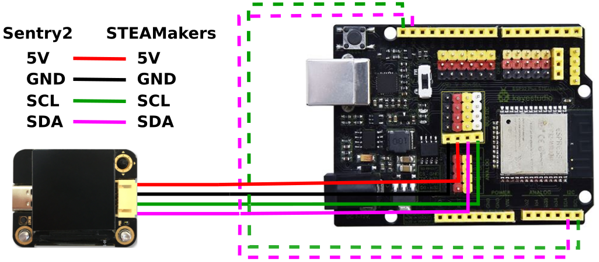
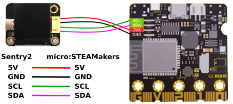

# Hardware
## **Introducción breve**
La Sentry2 es un sensor de visión diseñado por Kendryte K210 que se basa en un avanzado procesador de red neuronal RISC-V de 64 bits. El dispositivo integra varios algoritmos de visión artificial avanzados, que pueden satisfacer las necesidades básicas de procesamiento de visión. El chip ESP8285-WiFi que monta la placa se puede programar desde Arduino IDE, arduinoblocks, micropython, etc; para realizar reconocimiento en línea, transmisión de imágenes, AIoT (Artificial Intelligence of Things o unión de Inteligencia Artificial e Internet de las Cosas) y otras aplicaciones.

Hay dos versiones de Sentry2: Edición Enterprise o Empresarial (marcada con una E) y Edición Consumer o Consumidor (marcada con una C).

  
*Resumen*

* **LED:** Diferentes estados de detección.
* **Cámara:** Datos de imagen. Se pueden ajustar el zoom de la imagen, el balance de blancos, el brillo, la saturación y otros parámetros de la cámara.
* **Antena WiFi:** El chip ESP8285 WiFi puede realizar aplicaciones de reconocimiento en línea, transmisión de imágenes, AIoT.
* **Procesador K210:** Potente procesador RISC-V de 64 bits y doble núcleo con procesamiento de redes neuronales.
* **microSD:** Soporte para tarjeta microSD para almacenamiento de imágenes (solamente admite tarjetas con comunicación SPI).
* **USB-C:** El chip USB-UART permite comunicarse directamente y control con un ordenador, así como la actualización del firmware.
  
!!! Warning "<b>PRECAUCIÓN:</b>"
    Cuando conectamos el puerto USB, su fuente de alimentación está presente en los pines de alimentación del puerto de comunicación de 4 pines, **NO** se deben activar ambas alimentaciones al mismo tiempo.

* **Pantalla LCD:** Pantalla color TFT de alta definición y amplia visión.
* **Joystick:** Para la interacción con la interfaz de usuario admite el control en 5 direcciones (arriba, abajo, izquierda, derecha, enter o pulsador)
* **Reset:** Resetea el hardware.
* **Salida:** Puerto de salida de 4 pines que soporta modo UART (Universal Asynchronous Receiver-Transmitter. Los clásicos Tx-Rx) o modo I2C

## **Parámetros**

|Item|Unidades|Empresarial|Consumidor|Notas|
|---|:-:|:-:|:-:|---|
|Voltaje|V|3.3 a 5.0|3.3 a 5.0|No alimentar por USB y Salida al mismo tiempo|
|Corriente|mA|190|150|Modo Face vision alimentado a 5V|
|tamaño|mm|40x32x12|40x32x12|Sin carcasa|
|Peso|g|15|15|Sin carcasa|
|Distancia agujeros montaje|mm|32|32||
|Diámetro agujeros|mm|3|3||
|Cámara|--|CMOS|CMOS||
|Resolución|pixel|500W|200W||
|FPS|fps|50|25||
|FOV|grados|70|68||
|Tipo|--|TFT-ISP|TFT-ISP||
|tamaño|inch|1.3|1.3||
|Resolución|pixel|240x240|240x240||

## **Plataformas de programación y librerias**
Existen plataformas de programación y librerias para varios sistemas con o sin soporte para Linux que listamos y enlazamos a continuación. No obstante, nosostros vamos a centrarnos en la programación mediante [arduinoblocks](http://www.arduinoblocks.com/).

* [Libreria para programación en C/C++ con Arduino](https://github.com/AITosee/Sentry-Arduino/releases)
* [Programación gráfica con MakeCode de Micro:bit](https://github.com/AITosee/pxt-sentry/releases)
* [Programación Mind+, gráfica, C/C++, micropython con Arduino o Micro:bit](https://github.com/AITosee/ext-sentry/releases)
* [Programación Mixly, gráfica Arduino](https://github.com/AITosee/Sentry-Mixly/releases)
* [Programación BXY, Micropython Micro:bit](https://github.com/AITosee/Sentry-microPython/releases)
* [Programación C/C++ Raspberry Pi, Linux](https://tosee.readthedocs.io/en/latest/_downloads/42a3596a62925328df75eecbe9fb4f57/Sentry-Arduino-1.2.4_for_linux.zip)

## **Modo de empleo**
El sensor Sentry2 puede conectarse a una placa de control a través del puerto de salida, o conectarse al ordenador mediante un cable USB-C. El puerto de salida se puede configurar en modo UART o en modo I2C, la dirección física del dispositivo y la velocidad de transmisión también se pueden modificar.

!!! Warning "<b>PRECAUCIÓN:</b>"
    Cuando conectamos el puerto USB, su fuente de alimentación está presente en los pines de alimentación del puerto de comunicación de 4 pines, **NO** se deben activar ambas alimentaciones al mismo tiempo.

## **Conexión placa controladora**
### Definición de pines

  
*Definición de pines del puerto de salida*

|Pines|Modo UART|Modo I2C|
|:-:|:-:|:-:|
|1|Rx|SDA|
|2|Tx|SCL|
|3|GND|GND|
|$4^{(*)}$|VCC|VCC|

!!! Warning "<b>(*) PRECAUCIÓN:</b>"
    Cuando conectamos el puerto USB, es este quien suministra energía a los dispositivos externos. Este puerto no se puede conectar directamente a una bateria, por lo que cuando el USB está conectado no hay acceso al sistema de 3.3V.

### Conexión modo UART
Tomando como referencia una placa de control tipo ESP32 STEAMakers sería:

  
*Conexión modo UART*

!!! Note "NOTAS modo UART:"
    * Conexión cruzada entre Rx y Tx.
    * Los pines Rx y Tx en placas tipo ESP32 STEAMakers y Arduino UNO comparten puertos con la carga del firmware, por lo que es necesario desconectar las conexiones a Rx y Tx durante la carga del programa.

### Conexión modo I2C
Tomando como referencia una placa de control tipo ESP32 STEAMakers sería:

  
*Conexión modo I2C*

!!! Note "NOTA modo I2C:"
    Las líneas discontinuas indican puntos de conexión I2C alternativos mientras que las continuas van dirigidas al hub I2C que lleva la propia placa.

Tomando como referencia una placa de control tipo ESP32 micro:STEAMakers sería:

  
*Conexión modo I2Cen micro:STEAMakers*

