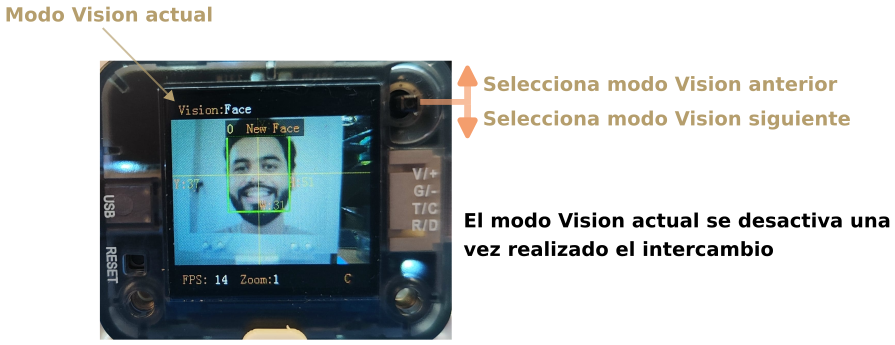

# Inicio rápido
Con el sensor de visión Sentry2 se puede iniciar de manera rápida el trabajo haciendo el proceso que citamos seguidamente:

  
*Inicio rápido*

1. Conectar la Sentry2 a un ordenador mediante un cable USB-C
2. Mover la palanca joystick arriba o abajo para cambiar el modo "Visión"
3. Situar la Sentry2 frente al objeto que desea reconocer a unos 10cm de distancia.

Así aprenderemos los fundamentos del sensor de visión Sentry2 aunque nuestro objetivo final va a ser crear programas propios para trabajar con la misma.
