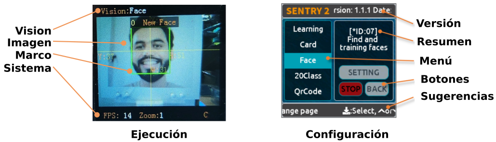
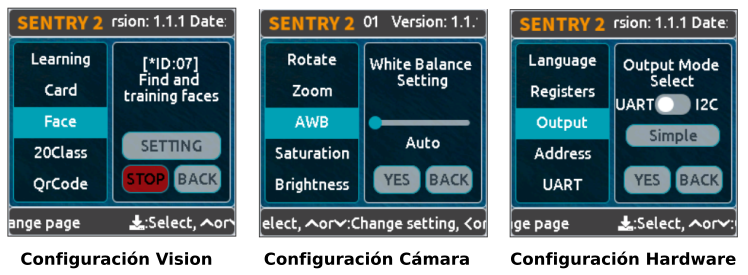
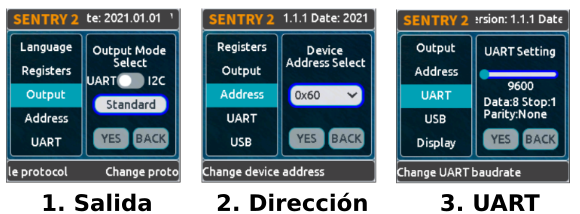
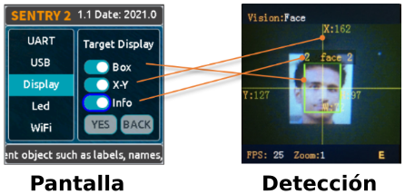
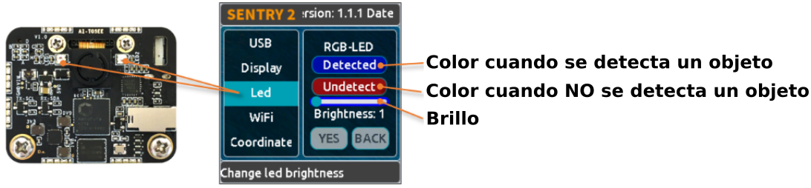
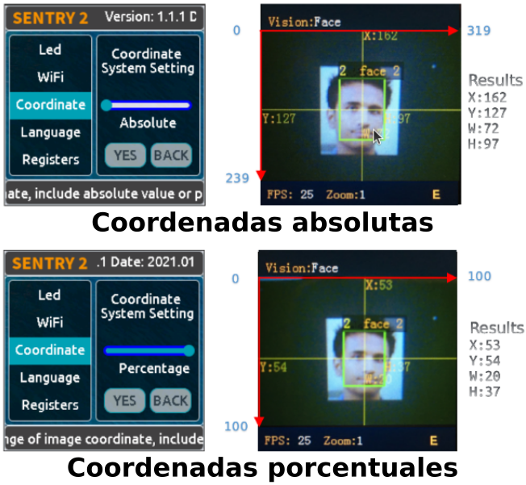
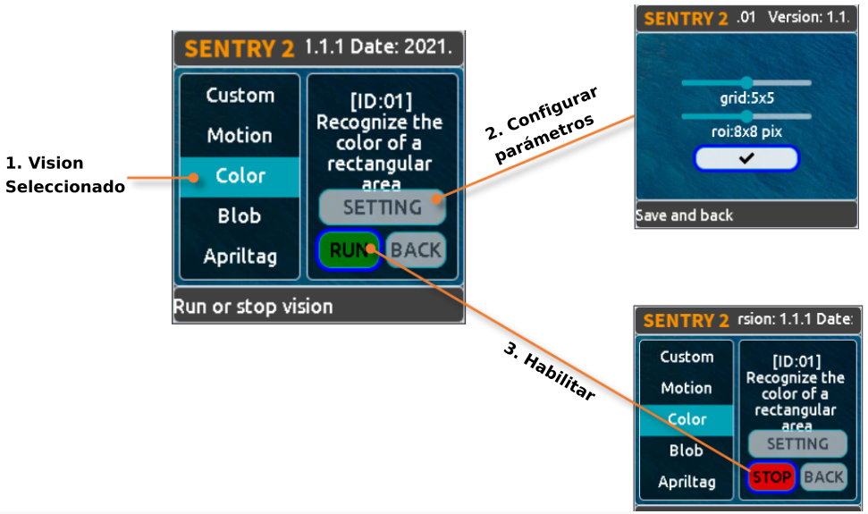
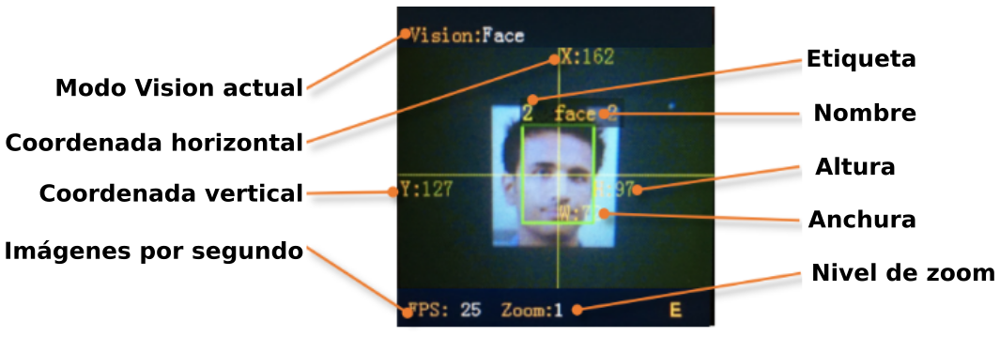

## Interface de usuario
Sentry2 tiene dos tipos de páginas de interfaz de usuario: Página de ejecución y página de configuración.

  
*Interface de usuario*

* Página de ejecución

> Estado de **Vision**: Este área muestra el nombre de Vision actual  
> **Image**: Muestra imágenes captadas por la cámara  
> **Marks**: Enmarca los objetos detectados, como cuadro de detección, coordenadas o informaciones  
> **Estado del sistema**: Frecuencia de imagen de la cámara, nivel de zoom o estado del WiFi

* Página de configuración

> **Menús**: Seleccionables con el joystick arriba o abajo, y pulsar para entrar  
> **Versión**: La versión y fecha del firmware  
> Resumen **breve**: Breve descripción del menú actual  
> **Botones**: Botones interactivos. El botón se resaltará con bordes azules si se ha seleccionado  
> **Consejos**: Muestra algunos consejos de funcionamiento

Estando en modo funcionamiento, se puede accionar el joystick hacia el lado derecho para entrar en las páginas de configuración de la interfaz de usuario. Se puede accionar hasta tres veces para mostrar las tres páginas siguientes:

> **Configuración del modo Vision:** Activar o desactivar la configuración de visualización y parámetros  
> **Configuración de la cámara:** Para ajustar el zoom, el balance de blancos, la saturación u otros ajustes de la cámara  
> **Configuración del hardware:**  Configura el modo de salida, la velocidad de transmisión UART, la dirección del dispositivo, el color de la luz, el idioma y otras configuraciones de hardware.

  
*Configuraciones*

Si se acciona el joystick hacia la izquierda, salimos de la página actual de una en una hasta volver a la página en ejecución o funcionamiento.

## **Configuración de hardware**
### Funcionamiento del joystick

!!! Info "**NOTA:**"
    Cuando se dice accionar, o hacer clic se hace referencia a una pulsación corta. Para una pulsación larga se debe mantener pulsado el botón al menos 2 segundos antes de soltarlo.

Siendo la página actual el modo ejecución:

|Operación|Descripción|
|---|---|
|Clic arriba|Cambiar a la última visión|
|Clic abajo|Cambiar a la siguiente visión|
|Clic izquierda|Instantánea (Cuando la tarjeta SD está insertada)|
|Clic derecha|Entrar en la página de configuración|
|Pulsar botón|Modelos de formación (para visiones especiales)|
|Pulsación larga hacia arriba|Acercar zoom|
|Pulsación larga hacia abajo|Alejar zoom|
|Pulsación larga hacia la izquierda|Encender/apagar la pantalla LCD|
|Pulsación larga del botón|Borrar todos los modelos (para visiones especiales)|

Siendo la página actual el modo configuración:

|Operación|Descripción|
|---|---|
|Clic arriba|Cambiar al menú o botón anterior|
|Clic abajo|Cambiar al siguiente menú o botón|
|Clic izquierda|Cambiar a la página de configuración anterior / volver a la página de funcionamiento|
|Clic derecha|Cambiar a la siguiente página de configuración|
|Pulsar botón|Seleccionar|

Hay tres acciones especiales de "Puesta en marcha":

* Mantener accionado el joystick mas de segundo hacia arriba para restaurar la configuración de hardware de fábrica.
* Pulsar el botón para entrar en modo actualización del firmware del K210.
* Mantener accionado el joystick de manera prolongada para entrar en modo actualización del firmware del ESP8285.

### Configuración de salida
Se deben establecer algunas configuraciones de salida si queremos utilizar una placa controladora para comunicarnos con Sentry2.

  
*Configuración de salida*

1. En la página de funcionamiento, haz clic derecho tres veces para acceder a la página de configuración del hardware.
2. En la opción "Output" (Salida), pulsa el botón del joystick para entrar en los ajustes.
3. Selecciona el modo UART o I2C. Generalmente, el modo I2C es más rápido, lo que permite mejorar la velocidad de fotogramas del procesamiento de imágenes si la placa controladora no es compatible con el modo UART de alta velocidad de transmisión.
4. Elige “Standard Protocol” o “Simple Protocol” (Protocolo estándar o Protocolo simple) para el modo UART. Por lo general, se selecciona Protocolo estándar si desea utilizar la biblioteca de controladores.
5. Pulsa "YES" y vuelve atrás.
6. Selecciona la opción "Address" (Dirección) del menú de la izquierda.
7. Establece la dirección de hardware de Sentry2 con un valor entre "0x60 y 0x63", haz clic en "YES" y vuelve a hacer clic. Por defecto es 0x60.
8. Entra en la página de configuración "UART" si has seleccionado el modo UART.
9. Mueve el control deslizante hacia la izquierda o hacia la derecha para ajustar la velocidad de transmisión UART: "9600, 19200, 38400, 57600, 115200, 921600, 1152000, 2000000". Cuanto mayor sea la velocidad en baudios, menor será el tiempo de transferencia de datos, lo que mejorará la velocidad de fotogramas de la imagen. Comprueba la velocidad de transmisión máxima que admite tu placa controladora. Cuando la comunicación es anormal, debes reducir la velocidad de transmisión.
10. Haz clic izquierda con la palanca del joystick tres veces para volver a la página de funcionamiento.

### Configuración USB
Sentry2 puede comunicarse con el ordenador mediante un cable USB-C. Su velocidad de transmisión se puede ajustar por separado. El modo USB también se basa en "Protocolo estándar" o "Protocolo simple".

  
*Configuración USB*

**Baudrate:** Soporta velocidades de 9600、19200、38400、57600、115200、921600、1152000、2000000 baudios. El USB se puede desactivar si el control deslizante está totalmente a la izquierda.
**a UART:** Activar o Desactivar la transmisión de datos entre USB y UART.

### Configuración pantalla
Los resultados de la detección pueden enmarcarse cuando la visión está en ejecución. Hay 3 marcos: caja de detección, coordenadas X-Y e información.

  
*Configuración USB*

**Box (Recuadro):** Una caja rectangular que muestra los objetos detectados.

**X-Y:** Dibuja las líneas de coordenadas horizontales y verticales para el objeto detectado, y muestra, X: posición horizontal, Y: posición vertical, W: anchura del objeto, H: altura del objeto

**Info:** Muestra información sobre el objeto, como su etiqueta de clasificación y su nombre.

* Consejo: Al realizar una detección multirresultado, dibujar demasiadas marcas puede reducir la velocidad de fotogramas, puedes desactivar adecuadamente algunas marcas.

* Aviso: Algunas visiones no tienen todos los elementos de dibujo, como "Detección de líneas" que no dibuja líneas de coordenadas

### Configuración LED
Hay 2 LEDs delante del hardware para indicar el estado de la detección. El color del LED cambiará en función de los resultados de detección de cada fotograma.

  
*Configuración LED*

El usuario puede configurar el color del LED para el estado "detectado" o "no detectado" respectivamente. Pulsa el joystick para cambiar el color según la secuencia siguiente:

  
*Secuencia de colores de configuración del LED*

El color negro significa que el LED está apagado.

Cuando los colores "Detectado" y "No detectado" son iguales, los LEDs se mantendrán encendidos.

El rango de "Brillo" va de 0 a 15, donde 0 significa apagar la luz y 15 es el máximo brillo. Generalmente, se ajusta el brillo a 1 ó 2.

* **Apagar el LED**

En algunos casos, el LED debe estar apagado, de lo contrario, su iluminación puede causar interferencias en el reconocimiento de la imagen. Hay dos formas de apagar el LED: poner "Detected" (Detectado) y "Undetected" (No detectado) en negro o poner "Brillo" a 0.

* **Fill light (retroiluminación)**

Cuando el entorno es oscuro o a contraluz, es necesario retroiluminar: Ajustar "Detected" (Detectado) y "Undetected" (No detectado) a blanco. Ajustar "Brillo" a 15.

### Configuración WiFi
El chip ESP8285-WiFi que monta el sensor Sentry2 se puede comunicar con el chip K210 a través de un puerto UART interno. Cuando "Custom Vision" está habilitado, el chip ESP8285 funcionará.

  
*Configuración WiFi*

**Baudrate:** Soporta “9600、74880、115200、921600、1152000、2000000、3000000、4000000” baudios. El WiFi se puede desabilitar si el deslizador está totalmente a la izquierda.

**a UART:** Activa o Desactiva la transmisión de datos entre WiFi y UART

**a USB:** Activa o Desactiva la transmisión de datos entre WiFi y USB

***Consejo: Si los datos enviados coinciden con las instrucciones del Protocolo, las instrucciones se ejecutarán en lugar de a través de la salida.***

### Configuración coordenadas
Sentry2 admite dos sistemas de coordenadas: Absoluto y Porcentual.

  
*Configuración coordenadas*

**Absolutas:** En este modo, se devuelven los resultados de las coordenadas reales. Rango horizontal de 0 a 319 y vertical de 0 a 239. El punto central es (160,120). Este modo tiene mayor precisión.

**Porcentaje:** En este modo, los resultados de las coordenadas reales se cuantifican en el rango de 0 a 100. Ambos rangos en dirección horizontal y vertical son de 0 a 100. El punto central es (50,50).

### Configuración idioma
Puedes cambiar los idiomas del sistema entre inglés o chino.

  
*Configuración idioma*

### Configuración de guardado
Operaciones de guardado de Sentry2: automático, Guardar registro, Ajustes por defecto.

  
*Configuración de guardado*

**Auto Save (automático):** Algunos valores de los registros se guardarán automáticamente si este modo está activado, de lo contrario, los registros se restablecerán al valor predeterminado después del siguiente arranque. Generalmente, este modo debería estar deshabilitado.

**Save REG:** Guarda los valores actuales de los registros.

**Default:** Restaura los registros a valores de fábrica. Haz clic primero en este botón y luego en "YES".

## **Configuraciones de Cámara**

### Zoom digital
Se puede hacer zoom con la cámara para ajustar la distancia a los objetos de 1 a 5 niveles.

Aumentar el zoom hará el objeto más grande, pero el campo de visión será más pequeño.

Reducir el zoom hará el objeto más pequeño, pero el campo de visión será más grande.

También se puede cambiar el zoom con el joystick: Acercar - pulsación larga hacia arriba o Alejar - pulsación larga hacia abajo

### AWB: Auto balance de blancos
AWB son iniciales de Auto White Balance.

Un entorno de luz diferente (luz blanca o luz amarilla) puede provocar un desequilibrio del color blanco. Es necesario ajustar el balance de blancos. Hay cuatro modos: Auto, Bloqueado (Lock), Blanco y Amarillo:

* **Auto:** Este modo es el predeterminado y se aplica a la mayoría de los entornos.
* **Bloqueado (Lock):** Cuando hay un gran área de fondo monocromático en la imagen, el blanco está desequilibrado, lo que provocará errores de reconocimiento del color. Por lo tanto, es necesario bloquear el balance de blancos antes del reconocimiento para evitar el ajuste automático del color. El método es el siguiente:

> 1. Enfrenta la cámara a un papel blanco y manten una distancia de unos 20 cm.
> 2. Entra en el menú "AWB" y seleccione el modo "Bloqueo".
> 3. Haz clic en "YES".
> 4. Vuelve a la página de funcionamiento

* **Blanco:** Utilizar en un entorno de luz blanca
* **Amarillo:** Utilizar en un entorno de luz amarilla

### Saturación, Brillo, Contraste, Nitidez
* **Saturación**

Aumentar la saturación hará que el color se vuelva brillante, el color se verá reforzado.

Disminuir la saturación apagará el color, y a niveles muy bajos parecerá blanco y negro

* **Brillo**

Puedes cambiar el brillo de la imagen si es necesario.

* **Contraste**

Aumentar el contraste hará que la diferencia entre lugares próximos con diferencia de color sea mayor.

Reducir el contraste hará que la imagen parezca apagada.

* **Nitidez**

Aumentar la nitidez (Sharpness) hará que el contorno de los bordes sea más claro y los detalles más obvios, pero demasiado alto producirá ruido.

Reducir la nitidez desenfocará la imagen

### Control de autoexposición
AEC son las iniciales de Auto Exposure Control.

La intensidad de la luz puede reducir el valor de exposición cuando se expone la imagen.

Por el contrario, si el entorno es oscuro, puede aumentar el valor de exposición.

### Rotar
Si se habilita la imagen puede rotar 180 grados.

## **Ejecución Vision**
Hay varias formas de activar/desactivar "Vision": desde la página de la interfaz de usuario, haciendo clic en el joystick o mediante comandos del controlador.

### Por interfaz de usuario

  
*Por interfaz de usuario*

1. Selecciona Vision en los menús de la izquierda de la página de configuración.
2. Se pueden configurar algunas visualizaciones, haciendo clic en "Configuración" para entrar en ellas.
3. Si aparece el botón rojo "Detener" en la parte inferior izquierda del área de control derecha, significa que el algoritmo está actualmente cerrado. Después de hacer clic en él, cambiará a un botón verde "Ejecutar", lo que significa que el algoritmo está iniciado. Volver a pulsarlo cambiará de nuevo el botón a rojo "Detener".

### Por Joystick

  
*Inicio rápido*

1. Pulsación breve del joystick arriba y abajo para activar o desactivar un modo de visión. El modo anterior de visión se cerrará si se está ejecutando la nueva.
2. La secuencia de cambio de visión se ordena por Vision-ID

### Por comandos
En este modo, la placa controladora necesita leer y escribir registros para habilitar o deshabilitar Vision. Están disponibles las librerías de controladores para diferentes plataformas de programación.

En modo UART, la lectura o escritura de registros debe seguir el Protocolo Estándar o el Protocolo Simple.

El modo I2C puede leer o escribir registros directamente.

Habilitar visión:

1. Escribir Vision ID en el registro 0x20-VISION_ID.
2. Escribir 0x01 en el registro 0x21-VISIO_CONF1 para habilitar Vision, de lo contrario, escribir 0x00 para deshabilitarlo. 

## **Resultado Vision**
### En pantalla
El objeto objetivo se marcará en la pantalla cuando se detecte. Significado de las marcas:

  
*En pantalla*

### Por comandos
La placa controladora puede leer los resultados.

Leer resultados:

1. Escribir el id del registro 0x20-VISION_ID
2. Leer el registro 0x34-RESULT_NUM para saber cuántos objetos se han detectado
3. Escribir el id del resultado que deseamos leer en el registro 0x24-RESULT_ID
4. Leer los resultados en los registros 0x80 a 0x89

|Dirección|Nombre|Descripción|
|:-:|:-:|---|
|0x80 |RESULT_DATA1_H8 |8 bits de mayor peso de Resultado 1 |
|0x81 |RESULT_DATA1_L8 |8 bits de menor peso de Resultado 1 |
|0x82 |RESULT_DATA2_H8 |8 bits de mayor peso de Resultado 2 |
|0x83 |RESULT_DATA2_L8 |8 bits de menor peso de Resultado 2 |
|0x84 |RESULT_DATA3_H8 |8 bits de mayor peso de Resultado 3 |
|0x85 |RESULT_DATA3_L8 |8 bits de menor peso de Resultado 3 |
|0x86 |RESULT_DATA4_H8 |8 bits de mayor peso de Resultado 4 |
|0x87 |RESULT_DATA4_L8 |8 bits de menor peso de Resultado 4 |
|0x88 |RESULT_DATA5_H8 |8 bits de mayor peso de Resultado 5 |
|0x89 |RESULT_DATA5_L8 |8 bits de menor peso de Resultado 5 |

