# Vision
El sensor de visión Sentry2 integra una variedad de algoritmos de visión artificial para reconocer objetos sin necesidad de estar conectado a una red WiFi, y el chip ESP8285-WiFi integrado puede realizar la función de reconocimiento de imágenes basado en la nube.

## **ID:1 Color**
El usuario puede configurar desde una hasta 25 regiones para el reconocimiento del color y devolver el valor R(rojo),G(verde),B(azul) y la etiqueta de cada región. Se pueden configurar las coordenadas y el tamaño de cada región.

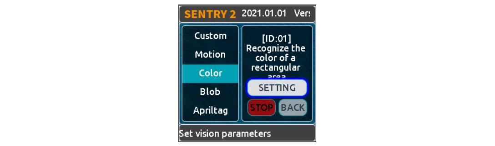  
*Color*

* **==Etiqueta Color==**  
Una etiqueta Color es un número que se utiliza para representar un color:

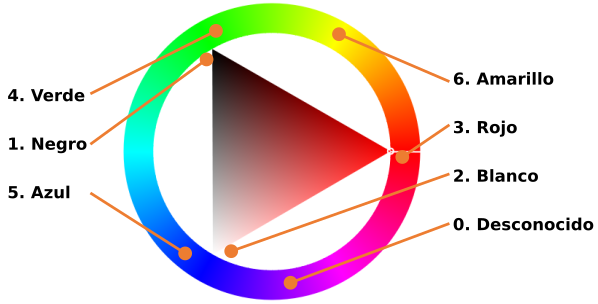  
*Etiqueta color*

* **==Parámetros==**

El usuario puede establecer regiones para el reconocimiento:

|Parámetro|Breve descripción|
|:-:|---|
|1|Coordenada X del centro de la región|
|2|Coordenada Y del centro de la región|
|3|Anchura de la región|
|4|Altura de la región|
|5|Ninguno|

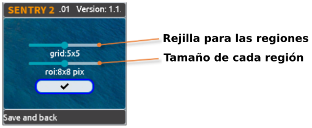  
*Parámetros*

Se ofrecen varios parámetros preestablecidos en la página de configuración de la interfaz de usuario:

* **Rejilla, Grid(X x Y):** 1x1, 2x2,3x3,4x4, 5x5, 1x10, 2x10, 6x1, 6x2
* **Tamaño. Size(W x H):** 2x2, 4x4, 8x8, 16x16, 32x32

!!! tip "**NOTA:**"
    Para representar un cuadrado en el sistema de coordenadas porcentuales, la anchura y la altura no son iguales, sino que se ajustan a la relación de aspecto 3:4. Por ejemplo, si la anchura de un cuadrado es del 12%, su altura h debe ser 12/3×4=16%. En el sistema de coordenadas absolutas, los tamaños de área de reconocimiento preestablecidos son : 1x1, 2x3, 3x4, 6x8, 9x12.

* **==Resultados==**

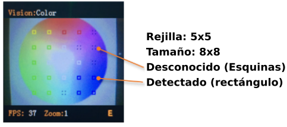  
*Resultados*

Habrá un recuadro continuo en la pantalla que identifica el color, y un recuadro de 4 esquinas que identifica un color desconocido.

|Resultado|Breve resumen|
|:-:|---|
|1|R, canal rojo, rango 0 a 255|
|2|G, canal verde, rango 0 a 255|
|3|B, canal azul, rango 0 a 255|
|4|Ninguno|
|5|Etiqueta de color|

## **ID: 2 Blob (Borrón)**
Encuentra un determinado bloque de color de una imagen y devuelve su coordenada y tamaño. Soporta detección multicolor y multiresultado.

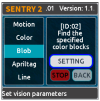  
*Blob*

* **==Parámetros==**

El usuario debe decidir en primer lugar qué color debe detectarse. La anchura y la altura de la pieza de color mínima pueden configurarse para reducir los resultados falsos:

|Parámetro|Breve resumen|
|:-:|---|
|1|Ninguno|
|2|Ninguno|
|3|Anchura mínima|
|4|Altua mínima|
|5|Etiqueta de color a detectar|

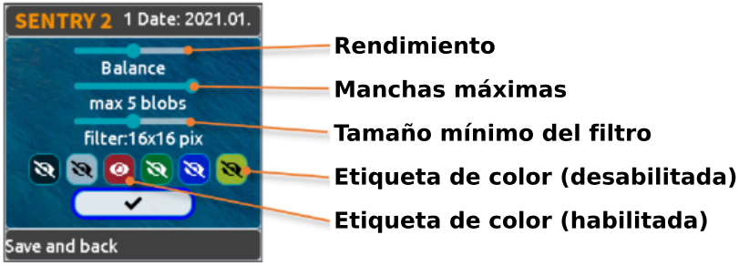  
*Parámetro*

Se proporcionan varios parámetros preestablecidos en la página de configuración de la interfaz de usuario:

* **Nivel de rendimiento del algoritmo:** Para seleccionar el rendimiento de Vision según los distintos requisitos de la aplicación: "Sensibilida", "Balance o Equilibrado" y "Precisión".
* **Número máximo de bloques:** admite de uno a cinco bloques para cada color.
* **Tamaño mínimo del bloque:**
>  * Sistema de coordenadas absoluto: 2x2, 4x4, 8x8, 16x16, 32x32, 64x64, 128x128 píxeles
>  * Sistema de coordenadas porcentual:1x1, 2x3, 3x4, 6x8, 9x12, 21x28, 42x56 %
* **Color a detectar:** Se muestra un icono de ojo abierto si la etiqueta de color está activada.

* **==Resultados==**

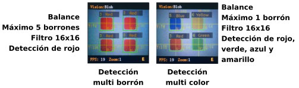  
*Resultado*

Resultados obtenidos:

|Resultado|Breve resumen|
|:-:|---|
|1| Coordenada X del centro del bloque|
|2| Coordenada Y del centro del bloque|
|3| Anchura del bloque|
|4|Altura del bloque|
|5|Etiqueta de color|

## **ID: 3 Marcador visual**
El marcador visual o también llamado Apriltag; es un patrón bidimensional que se coloca en objetos físicos y se utiliza para ayudar a los sistemas informáticos a reconocer y rastrear la posición y orientación de objetos en el espacio.

En robótica es un tipo de etiqueta formada por una cuadrícula de cuadrados blancos y negros. Utilizada en aplicaciones de visión por ordenador.

Apriltag es un conjunto de casillas blancas y negras definidas. Los distintos códigos utilizan diferentes números de cuadrados. Cada patrón tiene una etiqueta predefinida.

En este [articulo en inglés](https://ftc-docs.firstinspires.org/en/latest/apriltag/vision_portal/apriltag_intro/apriltag-intro.html) puedes encontrar mas información.

Encontrar los apriltags de una imagen, soporta las familias de codificación 16H5，25H9，36H11 y hasta 25 resultados. Es necesario decidir qué familia de codificación utilizar antes de activar esta visión, y sólo se puede procesar una familia

!!! tip "**NOTA:**"
    Esta modo de visión no se puede ejecutar al mismo tiempo que otros modos marcados con asteriscos.

**Etiqueta**

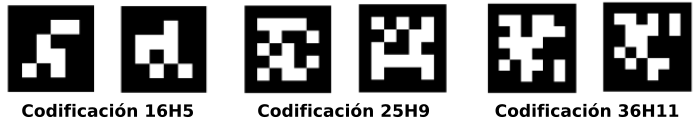  
*Familias Apriltags*

En el repositorio [aprilTag-imgs](https://github.com/AprilRobotics/apriltag-imgs/tree/master) de [AprilRobotics](https://github.com/AprilRobotics) tenemos colecciones de imágenes.

* **==Parámetros==**

Se proporcionan varios parámetros preestablecidos en la página de configuración de la interfaz de usuario:

* **Nivel de rendimiento del algoritmo:** Para seleccionar el rendimiento de Vision según los distintos requisitos de la aplicación: "Sensible", "Equilibrado" y "Preciso".
* **Familia de codificación:** admite "16H5"，"25H9"，"36H11".

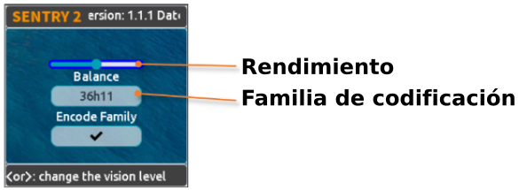  
*Parámetros*

* **==Resultados==**

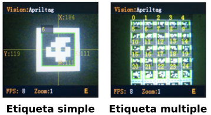  
*Resultado*

Resultados obtenidos:

|Resultado|Breve resumen|
|:-:|---|
|1| Coordenada X del centro de la etiqueta|
|2| Coordenada Y del centro de la etiqueta|
|3| Anchura de la etiqueta|
|4|Altura de la etiqueta|
|5|Etiqueta|

## **ID: 4 Línea**
Encuentra una o hasta 5 líneas de una imagen y devuelve sus 2 coordenadas de puntos finales y grados. Si se trata de una curva, se devuelve un segmento de línea aproximado.

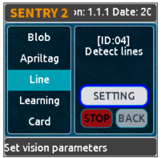  
*Línea*

* **==Parámetros==**

Se proporcionan varios parámetros preestablecidos en la página de configuración de la interfaz de usuario:

* **Nivel de rendimiento del algoritmo:** Para seleccionar el rendimiento de Vision según los distintos requisitos de la aplicación: "Sensible", "Equilibrado" y "Preciso".
* **Máximo número de líneas:** Rango entre 1 y 5.

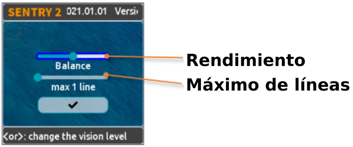  
*Parámetros*

* **==Resultados==**

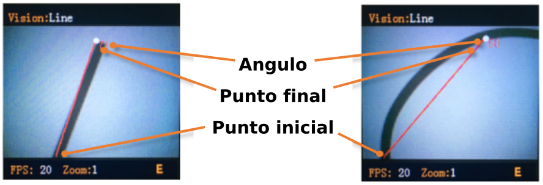  
*Resultado*

!!! tip "**NOTA:**"
    La horizontal hacia la derecha es de 0 grados, el valor se incrementa en sentido contrario a las agujas del reloj. Hacia arriba es de 90 grados, y la horizontal hacia la izquierda es de 180 grados.  

    

    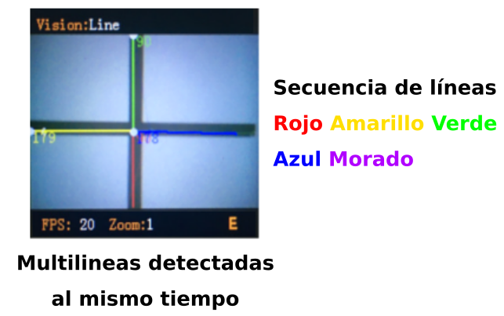  

Se utilizan 5 colores diferentes (rojo, amarillo, verde, azul y morado) para distinguir las multilíneas.

|Resultado|Breve resumen|
|:-:|---|
|1| Coordenada X del punto final de la línea (superior)|
|2| Coordenada Y del final de la línea (superior)|
|3| Coordenada X del punto inicial de la línea (inferior)|
|4|Coordenada Y del punto inicial de la línea (inferior)|
|5|Grado de la línea|

## **ID: 5 Aprendizaje**
Los objetos pueden ser entrenados y reconocidos. Hasta 25 datos de modelos se pueden guardar.

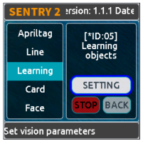  
*Aprendizaje*

* **==Parámetros==**

Se puede entrenar un nuevo objeto en la página de funcionamiento:

**1**.- Clic vertical (pulsar botón) en el joystick para iniciar el entrenamiento.

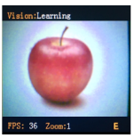  
*Iniciar entrenamiento*

**2**.- Se mostrarán en la pantalla 4 marcas de esquinas en rojo sobre unos dos segundos para que el usuario ajuste la cámara.

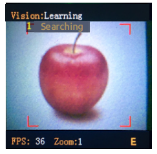  
*Marcas rojas*

**3**.- Si las 4 marcas de esquinas cambian a color verde significa que el sensor está parendiendo.

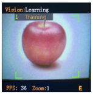  
*Marcas verdes*

**4**.- Las marcas se cambian a un rectángulo cuando el aprendizaje ha finalizado. Una etiqueta que se asigna de manera automática (El número de ID mas pequeño disponible) y un nombre se muestran en la pantalla.

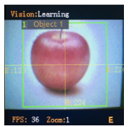  
*Rectángulo verde*

* **==Borrar todos los objetos==**

Mantener pulsado el joystick verticalmente durante más de 2 segundos en la página de funcionamiento.

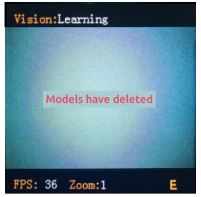  
*Borrar todos los objetos*

* **==Renombrar objetos==**

Podemos cambiar el nombre o eliminar el modelo entrenado en la página de configuración de la interfaz de usuario.

Para renombrarlo seguimos el siguiente proceso:

**1**.- Seleccionar el objeto en el menú de la izquierda.

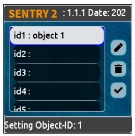  
*Seleccionar objeto*

**2**.- Clic derecho en el joystick y seleccionamos el lápiz y pulsamos el botón.

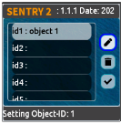  
*Seleccionar lápiz y pulsar*

**3**.- Renombramos utilizando el teclado virtual y nos situamos sobre el icono de check de la parte inferior derecha. El nombre no debe tener mas de 32 caracteres.

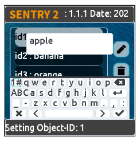  
*Teclado virtual*

**4**.- Hacemos clic sobre el icono Check para confirmar y volver.

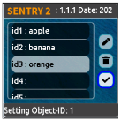  
*Confirmar*

Para borrar un objeto seguimos el siguiente proceso:

**1**.- Seleccionar el objeto en el menú de la izquierda.

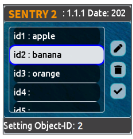  
*Seleccionar objeto a borrar*

**2**.- Clic derecho en el joystick y seleccionamos la papelera y pulsamos el botón.

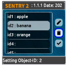  
*Seleccionar papelera y pulsar*

**3**.- Hacemos clic sobre el icono Check para confirmar y volver.

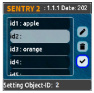  
*Confirmar borrado*

* **==Resultados==**

Vision sólo puede juzgar la existencia del objeto entrenado, pero no sus coordenadas ni su tamaño, por lo que la casilla de reconocimiento es un valor de salida fijo.

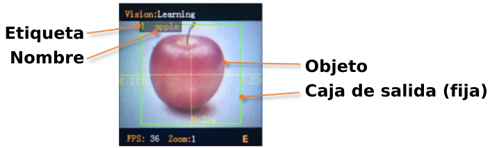  
*Resultado*

Resultados obtenidos:

|Resultado|Breve resumen|
|:-:|---|
|1| Fijado, 160|
|2| Fijado, 120|
|3| Fijado, 224|
|4|Fijado, 224|
|5|Etiqueta|

## **ID:6 Tarjeta**
Reconocer una tarjeta especificada en la imagen y devolver sus coordenadas, tamaño, etiqueta y otra información. Incluye señales de tráfico, tarjetas de formas y tarjetas de números. Las etiquetas se muestran en la siguiente tabla.

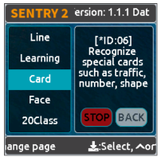  
*Tarjeta*

* **Tráfico**

|Etiqueta|Nombre|Etiqueta|Nombre|
|:-:|---|:-:|---|
|1|Adelante|2|Izquierda|
|3|Derecha|4|Cambio de sentido|
|5|Aparcar|6|Verde|
|7|Rojo|8|Velocidad 40|
|9|Velocidad 60|10|Velocidad 80|

* **Formas**

|Etiqueta|Nombre|Etiqueta|Nombre|
|:-:|---|:-:|---|
|11|Check|12|Cruz|
|13|Circulo|14|Cuadrado|
|15|Triángulo|16|Mas (+)|
|17|Menos (-)|18|División|
|19|Igual|||

* **Números**

|Etiqueta|Nombre|Etiqueta|Nombre|
|:-:|---|:-:|---|
|20|Número 0|21|Número 1|
|22|Número 2|23|Número 3|
|24|Número 4|25|Número 5|
|26|Número 6|27|Número 7|
|28|Número 8|29|Número 9|

* **==Parámetros==**

Ninguno

* **==Resultados==**

Vision puede reconocer varias tarjetas al mismo tiempo, y si la rotación de las tarjetas es de hasta 30 grados todavía se puede reconocer, pero no se deben girar demasiado.

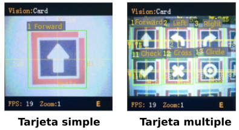  
*Resultado*

Resultados obtenidos:

|Resultado|Breve resumen|
|:-:|---|
|1| Coordenada X del centro de la tarjeta|
|2| Coordenada Y del centro de la tarjeta|
|3| Ancho de la tarjeta|
|4|Alto de la tarjeta|
|5|Etiqueta de la tarjeta|

## **ID:7 Rostro**
Reconocer caras puede ser entrenado y serán reconocidas por Vision. Se pueden guardar datos de hasta 25 modelos. Es compatible con la detección de máscaras.

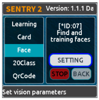  
*Rostro (Face)*

* **==Parámetros==**

**Entrenando nueva cara**

Se puede entrenar un nuevo objeto en la página de funcionamiento:

**1**.- "0 New Face" se muestra si se detecta una nueva cara. Hacemos clic en el joystick para iniciar el reconocimiento.

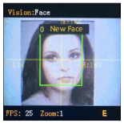  
*Comenzar reconocimiento cara*

**2**.- La etiqueta y el nombre se pueden cambiar mientras el reconocimiento de la cara está entrenandose.

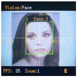  
*Etiqueta y nombre*

**Borrar todas las caras**

Una pulsación larga, de mas de dos segundos, del botón del joystick mientras estamos en la página de ejecución.

Para renombrar o borrar los modelos entrenados desde la interfaz de usuario se sigue el mismo procedimiento que en el apartado de aprendizaje.

* **==Resultados==**

Vision admite la detección de caras (cara nueva) y el reconocimiento de caras (cara entrenada) funcionando al mismo tiempo. A la cara nueva se le asignará la etiqueta 0. Especialmente, si se detecta un nuevo rostro con máscara, se mostrará "New face (mask)" ["Nuevo rostro (máscara)"] y la etiqueta se fijará en 200.

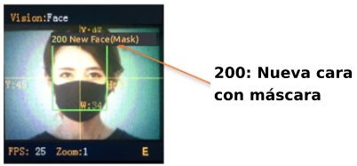  
*Resultado*

Resultados obtenidos:

|Resultado|Breve resumen|
|:-:|---|
|1| Coordenada X del centro de la cara|
|2| Coordenada Y del centro de la cara|
|3| Ancho de la cara|
|4|Alto de la cara|
|5|Etiqueta 0: nueva cara, 200: con máscara|

## **ID:8 20Class**
Identifica 20 tipos comunes de objetos y devuelve su coordenada, tamaño y etiquetas, como se muestra en la siguiente tabla.

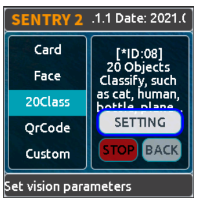  
*20Class*

|Etiqueta|Nombre|Etiqueta|Nombre|Etiqueta|Nombre|Etiqueta|Nombre|
|:-:|---|:-:|---|:-:|---|:-:|---|
|1|Avión |2|Bicicleta |3|Pájaro |4| Barco|
|5| Botella|6| Autobús|7|Coche |8|Gato |
|9|Silla |10|Vaca |11|Mesa de comedor |12|Perro |
|13|Caballo |14|Moto |15|Persona |16|Planta en maceta |
|17|Oveja |18|Sofá |19|Tren |20|Monitor de TV |

* **==Parámetros==**

Para seleccionar el nivel de rendimiento del algoritmo de Vision en función de los distintos requisitos de la aplicación: "Sensible", "Equilibrado" y "Preciso".

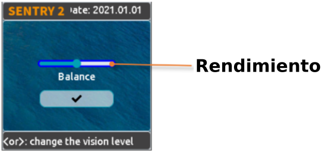  
*Parámetros*

* **==Resultados==**

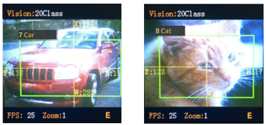  
*Resultado*

Resultados obtenidos:

|Resultado|Breve resumen|
|:-:|---|
|1| Coordenada X del centro del objeto|
|2| Coordenada Y del centro del objeto|
|3| Ancho del objeto|
|4|Alto del objeto|
|5|Etiqueta|

## **ID:9 Código QR**
Se puede reconocer un código QR estándar (menos de 25 caracteres ASCII)

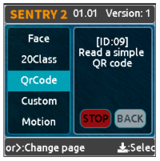  
*Código QR*

|Etiqueta|ASCII|Etiqueta|ASCII|Etiqueta|ASCII|
|:-:|:-:|:-:|:-:|:-:|:-:|
|32|Espacio en blanco |33| !|34|" |
|35| #|36|$ |37| %|
|38| &|39|‘| 40|(|
|41|) |42| *|43|+ |
|44| ,|45|- |46| .|
|47| /|48|0 |49|1 |
|50|2 |51| 3|52|4 |
|53|5 |54|6 |55| 7|
|56|8 |57| 9|58| :|
|59|; |60|< |61|= |
|62|> |63|? |64|@ |
|65| A|66|B |67|C |
|68|D |69|E |70|F |
|71| G|72|H |73| I|
|74|J |75|K |76|L |
|77|M |78|N |79| O|
|80|P |81|Q |82|R |
|83|S |84|T |85|U |
|86|V |87| W|88|X |
|89|Y |90|Z |91|[ |
|92| \ |93|] |94|^ |
|95| -|96| `|97| a|
|98|b |99|c |100|d |
|101|e |102|f |103|g |
|104|h |105|i |106|j |
|107| k|108|l |109|m |
|110|n |111|o |112|p |
|113|q |114|r |115|s |
|116|t |117|u |118|v |
|119|w |120|x |121|y |
|122|z |123|{ |124| |
|125|} |126|~ |

* **==Parámetros==**

Ninguno

* **==Resultados==**

Devuelve dos tipos de información, paquete de atributos y datos de caracteres

Resultados obtenidos:

**Paquete de atributos**

|Resultado|Breve resumen|
|:-:|---|
|1| Coordenada X del centro del código QR|
|2| Coordenada Y del centro del código QR|
|3| Ancho del código QR|
|4|Alto del código QR|
|5|Número de caracteres|

**Datos de carácter**

|Resultado|Breve resumen|
|:-:|---|
|1| Datos de carácter|
|2| Datos de carácter|
|3| Datos de carácter|
|4|Datos de carácter|
|5|Datos de carácter|

## **ID:10 Personalizar**
Si se activa este modo, el chip WiFi estará funcionando. En el documento [WiFi Firmware Developing User Guide v1.1](../pdf/Sentry2%20WiFi%20Firmware%20Developing%20User%20Guide_V1.1.pdf) se dan detalles de configuración del chip.

!!! danger "**CUIDADO**"
    Si no sabes bien lo que estás haciendo se desaconseja realizar los pasos descritos en el manual del enlace anterior.

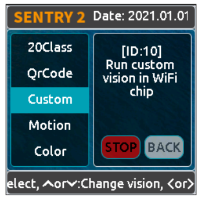  
*Código QR*

## **ID:11 Movimiento**
Compara la diferencia de píxeles de fotogramas adyacentes para determinar si hay una movida en la imagen, devuelve su coordenada y tamaño.

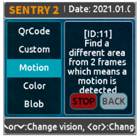  
*Movimiento*

* **==Parámetros==**

Ninguno

* **==Resultados==**

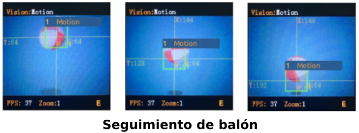  
*Resultado*

|Resultado|Breve resumen|
|:-:|---|
|1| Coordenada X del centro de la región|
|2| Coordenada Y del centro de la región|
|3| Ancho de la región|
|4|Alto de la región|
|5|Ninguno|

