# WiFi
Sentry2 tiene un chip ESP8285-WiFi que puede ser programado desde el IDE de Arduino directamente para realizar el reconocimiento en línea, transmisión de imágenes, AIoT (Artificial Intelligence of Things) y otras aplicaciones. ESP8285 se puede utilizar como un controlador para K210 que sirve de ayuda para la programación de AI (Artificial Intelligence) sin dispositivos externos.

## **Entorno de desarrollo**
### Añadir la placa ESP8266
Antes de nada debemos disponer de una [versión del IDE de Arduino](https://www.arduino.cc/en/software). En mi caso voy a utilizar **Arduino IDE 2.3.2**

En el apartado **IDE 2.0 de Arduino** tenemos la descripción del manejo de esta versión del IDE de Arduino.

En primer lugar abrimos "Preferencias" desde el menú "Archivo":

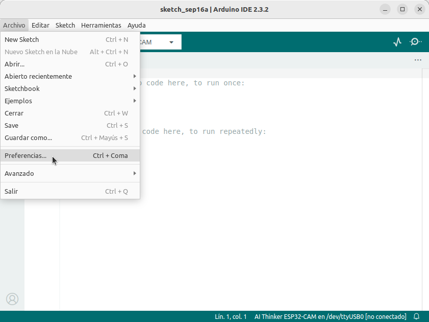  
*Abrir preferencias*

En la ventana que se abre hacemos clic en la zona marcada de "URLs adicionales de gestor de placas" para introducir la siguiente dirección [http://arduino.esp8266.com/stable/package_esp8266com_index.json](http://arduino.esp8266.com/stable/package_esp8266com_index.json).

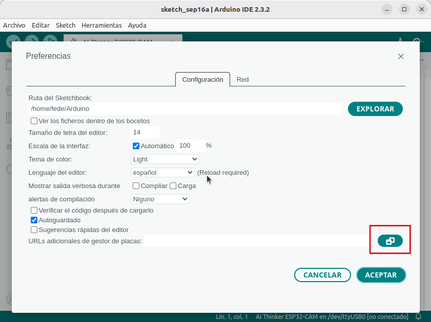  
*URLs adicionales de gestor de placas*

Debemos poner la URL dada en la lista y hacer clic en aceptar.

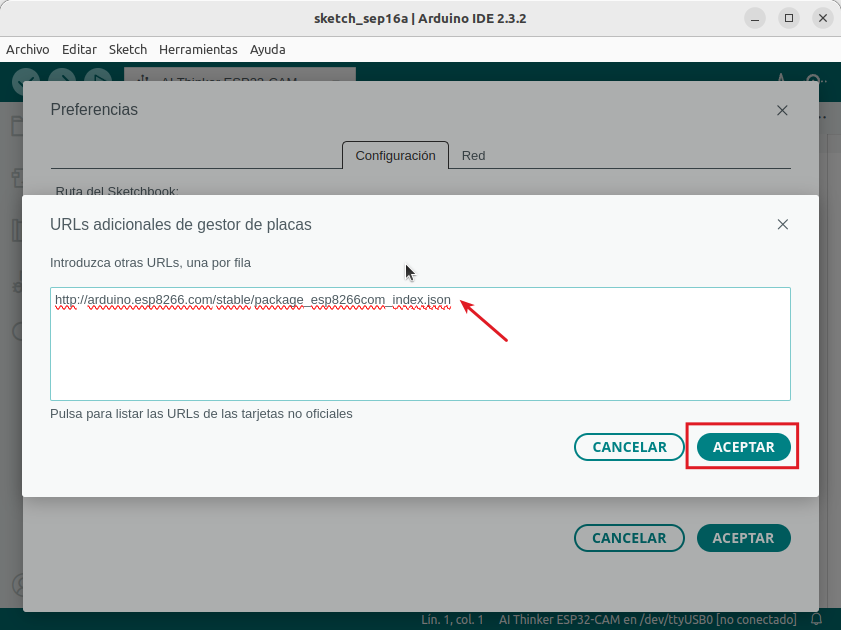  
*URLs adicionales de gestor de placas*

Quedando la situación de la imagen siguiente, donde de nuevo debemos hacer clic en aceptar.

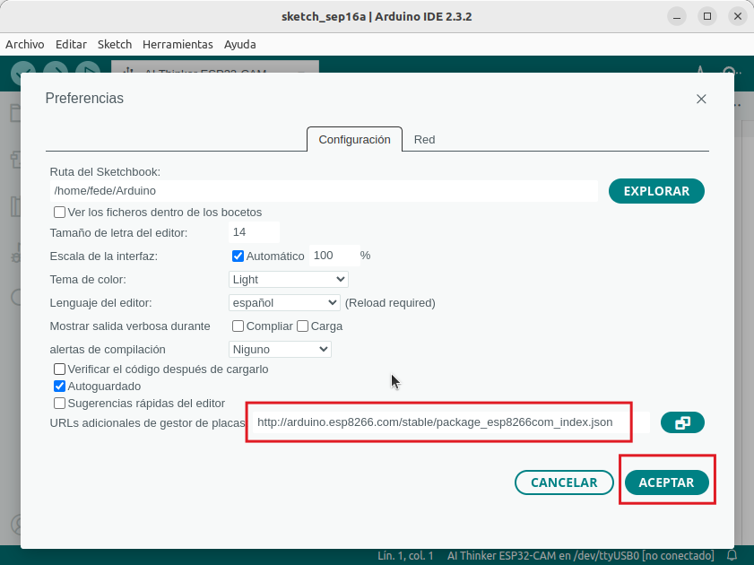  
*URLs adicionales de gestor de placas*

Abrimos el gestor de placas, por ejemplo desde el menú "Herramientas":

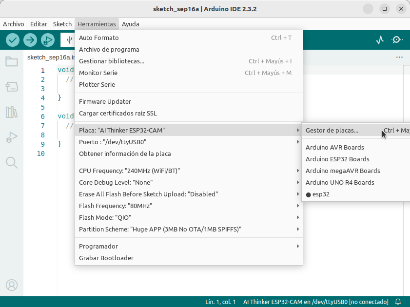  
*Gestor de placas*

Se activará el menú "Gestor de placas" de la izquierda, donde vamos a buscar ESP8266:

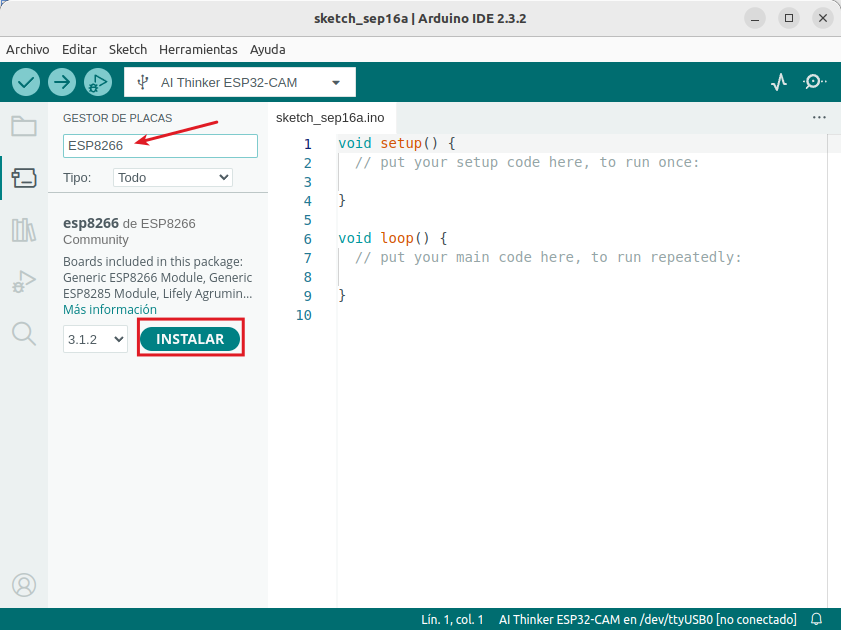  
*Gestor de placas. ESP8266*

Hacemos clic en instalar y esperamos hasta que la Plataforma ESP8266 en la versión indicada esté instalada.

  
*Gestor de placas. ESP8266 instalada*

### Prueba sencilla
Vamos ahora a conectar la Sentry2 a un puerto USB del ordenador y procedemos a seleccionar placa y puerto.

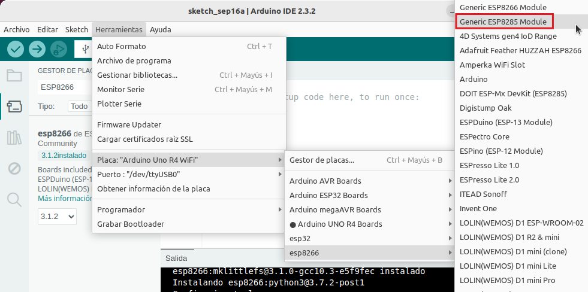  
*Selección de placa*

Desde el menú "Herramientas" hacemos los ajustes que se muestran a continuación:

* Buildin Led："4"
* CPU Frequency："80MHz" o "160MHz"
* Upload Speed："57600"
* Reset Method："no dtr (aka ck)"
* Puerto："/dev/ttyUSBxx"(El puerto USB /dev/ttyUSB0 en mi caso)

  
*Configuraciones*

Abrimos el ejemplo Blink para ESP8266:

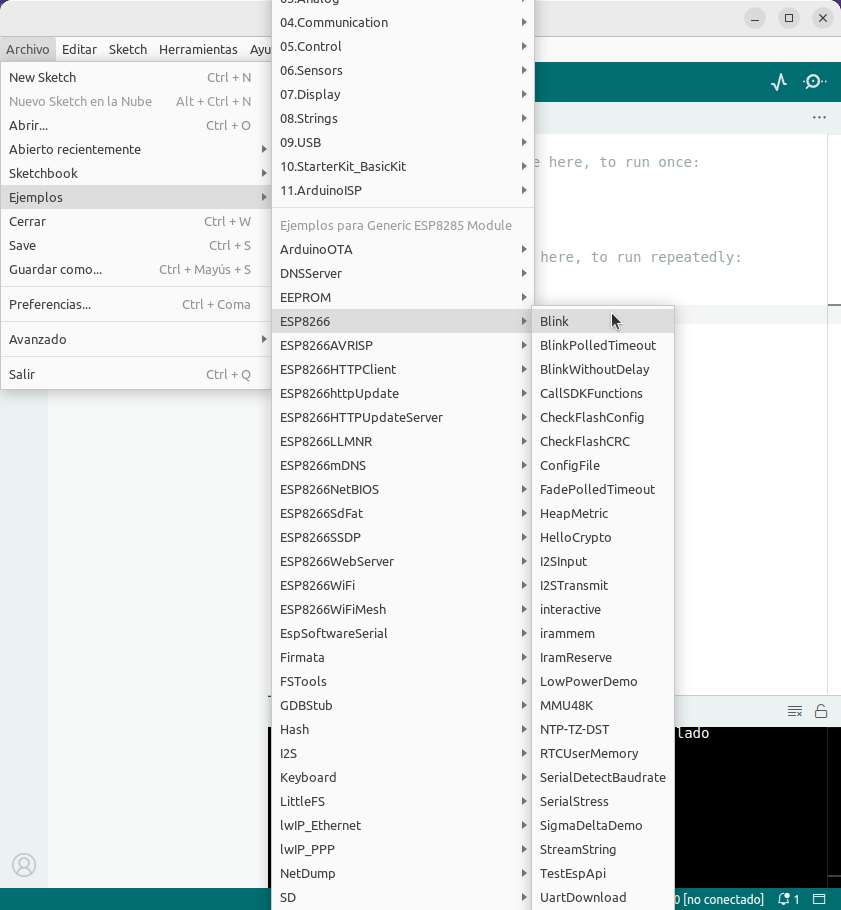  
*Abrir ejemplo Blink*

A continuación vemos el ejemplo abierto:

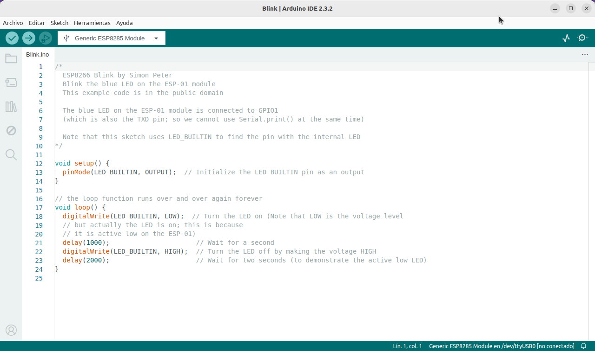  
*Ejemplo Blink*

Accionamos el mando del joystick hacia abajo y lo mantenemos pulsado (NO pulsar en vertical -accionar el botón-), hacemos clic en "cargar" para iniciar la compilación y la carga. Hay que mantener accionado el mando del joystick hacia abajo hasta que la pantalla muestre el xx% de progreso.

En la animación siguiente realizamos las acciones indicadas y al final podemos observar que hay un error fatal indicando que no puede abrir el puerto /dev/ttyUSB0.

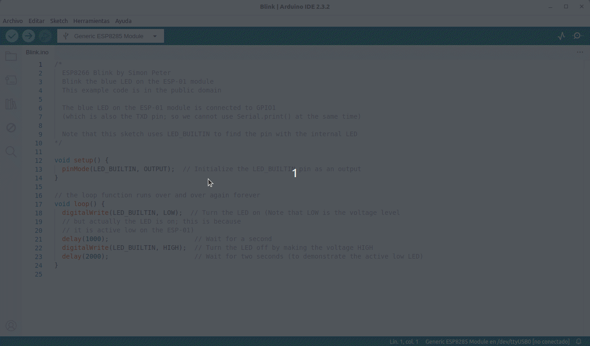  
*Primer intento de carga del ejemplo Blink*

Debemos abrir el menú USB y seleccionar adecuadamente el puerto. Ademas vamos a comprobar que todas las configuraciones son correctas.

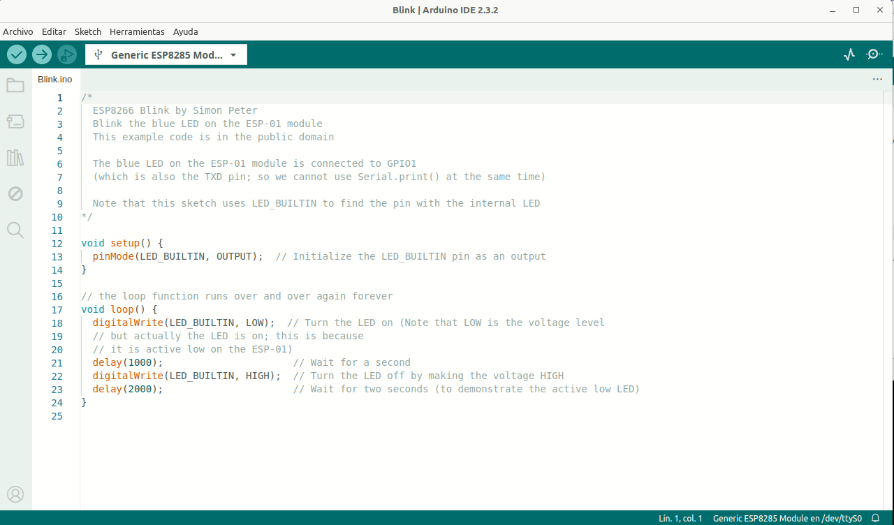  
*Selección de puerto y comprobaciones para carga del ejemplo Blink*

Ahora ya podemos proceder a cargar el programa tal y como vemos en la animación siguiente. La palanca del joystick se suelta cuando apare el 8% de carga.

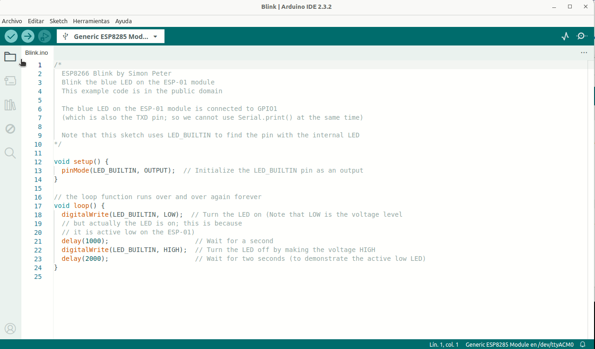  
*Carga del ejemplo Blink*  
[Aquí puedes descargar el programa Blink modificado](../IDE/Blink_modificado.zip)

Se han incluidos algunos comentarios en español y se han modificado los tiempos de encendido y apagado del LED. A continuación vemos el encendido y apagado del LED. Si nos fijamos bien es el LED que se enciende y se apaga a la derecha dek LED verde que parpadea rapidamente.

<iframe width="560" height="315" src="https://www.youtube.com/embed/WUJCwdevjFo?si=MuAeiFVKaoI4u2MY" title="YouTube video player" frameborder="0" allow="accelerometer; autoplay; clipboard-write; encrypted-media; gyroscope; picture-in-picture; web-share" referrerpolicy="strict-origin-when-cross-origin" allowfullscreen></iframe>

Para volver al modo de funcionamiento normal debemos mantener accionado el joystick mas de segundo hacia arriba y así restaurar la configuración de hardware de fábrica. Es posible que sea necesario un reset físico de Sentry2,
