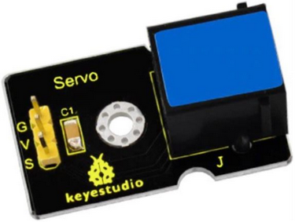

## **El servomotor**
Un servomotor o abreviado servo es un motor especial que puede posicionar su eje en un ángulo determinado y lo puede mantener en esta posición. Los servos estándar suelen girar 180º, pero es habitual encontrar servos que giran 90º y otros 360º, que son los conocidos como servos de rotación continua. En el interior del mismo están ubicados tanto la electrónica de control como los engranajes reductores que a su vez pueden llevar o no topes físicos que marquen el ángulo de giro. Para su funcionamiento sólo necesitan ser alimentados (conexiones GND y VCC o 5V) y una señal de control.

Los servomotores son en realidad motores de corriente continua a los que se les ha añadido una reductora, para que giren más despacio y con más fuerza, y un controlador electrónico que permite hacer que gire un determinado ángulo. Además, el servo en todo momento sabe en qué posición está, aunque se apague o reinicie. Esto significa que si a un servo que hemos movido a un determinado punto, lo hemos dejado sin alimentación y al alimentarlo de nuevo le indicamos que gire 90º, no va a girar 90º sino que se va a dirigir a su posición de 90º que tiene memorizada internamente.

En la figura siguiente vemos el interior de un servo esquematizado.

  
*Interior de un servo 9g*

Su aspecto real lo vemos en esta otra figura, donde también se aprecian las palas y tornillería que lo acompañan.

  
*Aspecto servo 180 grados*

Vemos claramente que el conector no es EASY Plug sino con un conector hembra de tres pines para tres cables de conexión, que se distinguen por los colores marrón, rojo y naranja (diferentes marcas pueden tener diferentes colores).

### Principio básico de funcionamiento
La electrónica de control del servomotor tiene un circuito de referencia incorporado que emite la señal de referencia, que es un ciclo de 20 ms con un ancho de pulso de 1,5 ms. Se compara la tensión de control recibida con la de referencia y se genera una diferencia de tensión. El circuito de control en la placa decidirá la dirección de rotación en consecuencia y accionará el motor. El sistema de engranajes o reductora convierten el giro del motor en un par de fuerza a través del eje. El sensor detecta que se ha alcanzado la posición enviada de acuerdo con la señal de retroalimentación. Cuando la diferencia de tensión existe el motor gira y cuando la diferencia se reduce a cero, el motor se detiene. Normalmente, el ángulo de rotación es de 0 a 180 grados.

El ángulo de rotación del servomotor se controla regulando el ciclo de trabajo de la señal PWM cuyo estándar es de 20 ms (50 Hz).

Hay que tener mucho cuidado de posicionar el conector de los servos en los tres pines macho de la shield en el orden correcto (el conector es reversible) o seguramente romperemos algo de manera irremediable.

### Conexión servo EASY Plug
Para poder conectar un servomotor a la placa EASY Plug debemos utilizar el adaptador que vemos en la imagen siguiente:

  
*Adaptador servo de modular a EASY Plug*

<b>Hay que tener mucho cuidado de posicionar el conector del servo (porque es reversible) en los tres pines macho del adaptador para hacerlo en el orden correcto o seguramente romperemos algo de manera irreversible.</b>

### Bloques de programación
En el apartado de bloques de programación, se encuentra en "Motor -->> Servo":

  
*Bloques Servo*

Para controlar el servomotor, indicamos los grados de rotación (Ángulo de giro) que queremos y el tiempo de retardo, o tiempo que tarda en ir de una posición a otra.

El control de un servomotor de rotación continua se realiza de igual manera, pero su reacción es diferente.

Los bloques Servo-Oscilador nos permiten de una forma sencilla hacer que el servo repita una secuencia de movimientos u oscilaciones de forma indefinida. Un ejemplo típico puede ser el que vemos en la figura siguiente, donde el servo oscila entre 0 y 90º en periodos de dos segundos.

  
*Oscilación con servo*

### Posición 0º u origen
Previo a cualquier actividad con un servo es averiguar cual es su posición 0º u origen. Un sencillo programa nos permite programar por primera vez el ángulo a 0º para descubrir el punto de origen y a partir de aquí montar alguna pala de las que vienen con el servo para poder visualizar la rotación del eje. El programa es el de la imagen siguiente:

  
*Encontrar el origen del servo*

