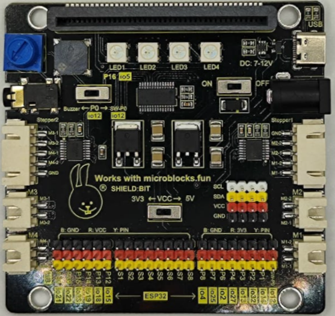
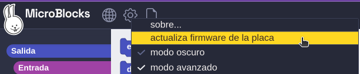
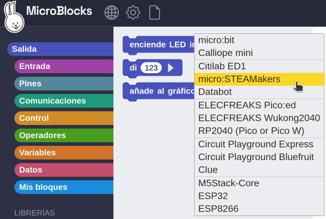
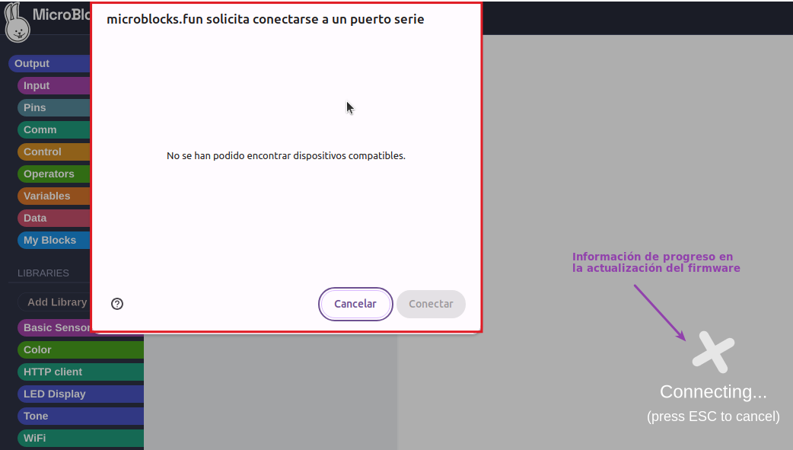
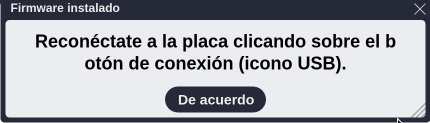
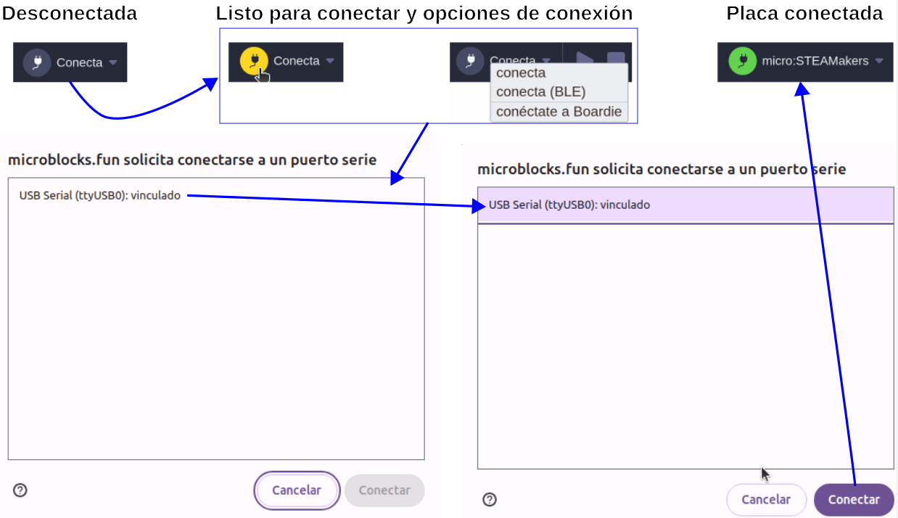
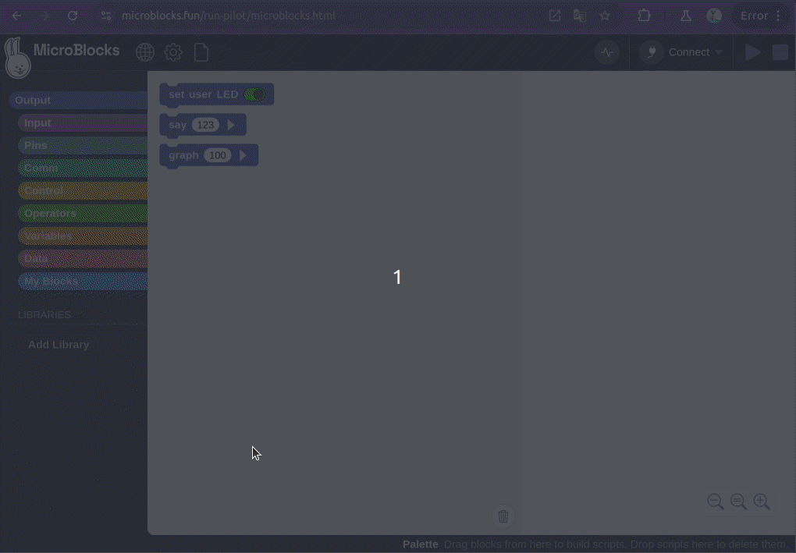
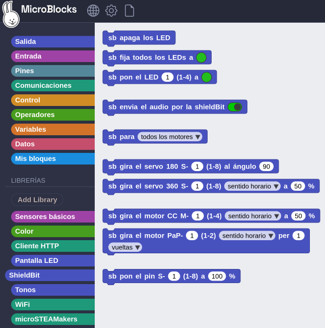
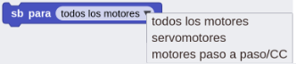

La shield:bit tiene capacidad para manejar 4 motores DC, 2 motores paso a paso, dispone de altavoz y conector de auriculares con control de volumen además de 4 LED NeoPixel.

<center>

  
*Shield:bit*

</center>

La placa incluye un PCA9685 que es un controlador de 16 canales inicialmente diseñado para controlar diodos LEDs por PWM que también permite controlar por PWM motores o servos. La comunicación con placas de control se realiza por I2C. Cada salida LED tiene su propio controlador PWM de frecuencia fija y resolución de 12 bits (4096 pasos). Este controlador se utiliza para controlar las entradas de los dobles drivers puente H de motores HR8833. La placa dispone de dos drivers HR8833 conectados para controlar dos motores DC o un motor paso a paso cada uno, disponibles en los conectores correspondientes. El controlador PCA9685 se gestiona desde los pines I2C de la micro:STEAMakers, SDA (P20) y SCL (P19). La shiel:bit incluye también 8 salidas directas para control de servos mediante pines de conexión GVS nombradas codemo S1 a S8.

La placa además dispone de dos reguladores de tensión AMS1084 para gestionar las tensiones de alimentación de 3,3 y 5V que se pueden suministrar bien desde el conector USB o bien desde el conector DC, donde podemos introducir una tensión externa entre 7 y 12V. Estos son capaces de entregar hasta 5A de coriente.

La alimentación externa se utiliza como tensión de entrada del regulador configurado para entregar 5V en su salida y ponerlos como tensión de entrada de alimentación del otro regulador, estando este regulador configurado para entregar 3.3V a su salida. Los 5V de tensión de entrada se pueden obtener tanto de la entrada externa como de la tensión del puerto USB. Para impedir que los 5V de salida del regulador lleguen al puerto USB se utiliza el transistor de efecto de campo de canal P AO3407 que incorpora un diodo en antiparalelo entre drenador y surtidor con el cátodo conectado al surtidor que impide que la tensión de salida del regulador llegue al puerto USB. Independientemente de como se suministren los 5V de tensión de entrada del regulador de 3.3V, estos se gestionan mediante el interruptor de encendido y apagado de la placa.

La posición del interruptor de nivel de tensión determina el valor de tensión en los pines VCC de los bloques de pines extendidos y del hub I2C independientemente de como se alimente la placa:

* Posicion 3V3: todos los pines a 3.3V.
* Posiciín 5V: pines P1 a P6 a 3.3V y el resto a 5V.

## <FONT COLOR=#007575>**La placa Shiel:bit**</font>

<center>

  
*Partes de la Shield:bit*

</center>

<font size="6"><b>==1==</b></font> Conector tipo jardinera para la micro:STEAMakers.

<font size="6"><b>==2==</b></font> El conjunto está formado por el potenciómetro, el conector de audio tipo jack, el zumbador y un interruptor conectado a P0 (io12), que es una entrada analógica. Cuando creamos un programa que reproduce sonido y sin nada conectado al jack, este sonido se reproducirá en el zumbador. Si conectamos unos auriculares o un altavoz al jack deja de sonar el zumbador y el sonido pasa a reproducirse en el dispositivo externo conectado. El potenciómetro es el control de volumen y para que el sonido se reproduzca el interruptor P0 debe estar en posición Buzzer.

<font size="6"><b>==3==</b></font> Conector "steepper 2" para motor paso a paso. Podremos controlar el movimiento de un motor paso tanto en el sentido de giro como los pasos que debe dar. El control se realiza por PWM con una resolución de 12 bits (4096 pasos) a través del controlador PCA9685 y su correspondiente driver puente en H HR8833.

<font size="6"><b>==4==</b></font> Conector para motor DC etiquetado como M3. Podremos controlar el sentido de giro y la velocidad del motor.

<font size="6"><b>==5==</b></font> Conector para motor DC etiquetado como M4. Podremos controlar el sentido de giro y la velocidad del motor.

<font size="6"><b>==6==</b></font> Pines extendidos tipo GVS en los que VCC puede ser de 3,3 o de 5 V dependiendo de la posición del interruptor 14. Los pines de este tipo son:

* P12 - io15. E/S de propósito general.
* P13 - io18. Pin SCK de SPI.
* P14 - io19. Pin MISO de SPI.
* P15 - io23. Pin MOSI de SPI.
* P19 - io22. Pin SCL del puerto I2C
* P20 - io21. Pin SDA del puerto I2C

<font size="6"><b>==7==</b></font> Pines para servomotores. La shiel:bit dispone de ocho grupos de pines (S1 a S8) para conectar servomotores.

Los pines S- son propios de la Shield:bit y están conectados al driver que permite gestionar motores, el PCA9685 que realmente es un driver para crear señales PWM. Cuando mas adelante se realiza la descripción de los bloques de la placa se dan mas detalles referentes a este grupo de pines.

<font size="6"><b>==8==</b></font> Pines extendidos tipo GVS en los que VCC es 3,3 V independientemente de la posición del interruptor 14. Los pines de este tipo son:

* P0 - io12. Entrada analógica asociada al conector circular o para pinza de cocodrilo "0". Para utilizarlo como P0 el interruptor de sonido P0 debe estar en la posición SW-P0 y por lo tanto los componentes de audio no estarán disponibles.
* P1 - io14. Entrada analógica asociada al conector circular o para pinza de cocodrilo "1".
* P2 - io32. Entrada analógica asociada al conector circular o para pinza de cocodrilo "2".
* P3 - io13. Entrada analógica asociada a la entrada de control de la matriz RGB de 5x5.
* P4 - io27. Entrada analógica asociada al sensor táctil.
* P6 - io2. E/S de propósito general.
* P7 - io25. E/S de propósito general.
* P8 - io4. E/S de propósito general.

!!! note "Doble nomenclatura de los grupos de pines 6 y 8"
    Son los pines normales de la ESP32 que tienen doble nomenclatura porque:

    * En ArduinoBlocks debe hacer usarse la numeración "io", que es la real de la ESP32.

    * En Microblocks, utilizando la máquina virtual propia de la microSTEAMakers, es necesario utilizar la notación "P", ya que está implementada para ser compatible con todos los dispositivos que funcionan con la micro:bit.

<font size="6"><b>==9==</b></font> Conector para motor DC etiquetado como M1. Podremos controlar el sentido de giro y la velocidad del motor.

<font size="6"><b>==10==</b></font> Conector para motor DC etiquetado como M2. Podremos controlar el sentido de giro y la velocidad del motor.

<font size="6"><b>==11==</b></font> Conector "steepper 1" para motor paso a paso. Podremos controlar el movimiento de un motor paso tanto en el sentido de giro como los pasos que debe dar. El control se realiza por PWM con una resolución de 12 bits (4096 pasos) a través del controlador PCA9685 y su correspondiente driver puente en H HR8833.

<font size="6"><b>==12==</b></font> Entradas de alimentación externa. Se puede realzar por el puerto USB (sólo alimentación) o por el conector tipo jack al que se puede introducir una tensión continua de entre 7 y 12V. La alimentación está controlada por el interruptor de encendido y apagado (ON-OFF).

<font size="6"><b>==13==</b></font> LEDs RGB direccionables. 4 ledes RGB que están conectados internamente a la placa a través del pin P16 (io5).
v
<font size="6"><b>==14==</b></font> Interruptor 3,3 - 5V.

<font size="6"><b>==15==</b></font> — Hub o puertos I2C. La placa está equipada con cuatro puertos de comunicación I2C.

### <FONT COLOR=#AA0000>Compatibilidad de pines</font>

!!! warning "<FONT COLOR=#FF0000>**AVISO IMPORTANTE**</font>"
    Cuando vamos a trabajar con señales analógicas debemos tener muy presente que, aunque todos los pines IOxx son entradas y salidas digitales, algunas incluso con más funciones. **Cuando tenemos que utilizar la comunicación WiFi el convertidor ADC2 NO funciona.**

Las placas ESP32 tienen disponibles dos ADC (Analog to Digital Converter) de 12 bits que se denominan ADC1 y ADC2. Esos 12 bits dan una precisión de $2^{12} = 4096$. Por lo tanto, si tenemos 12 bits para 3.3V podemos asegurar que $3.3V/4096 = 0,8 mV$ es la tensión correspondiente a cada paso.

!!! danger "<FONT COLOR=#FF0000>**Máxima tensión admisible en el ADC**</font>"
    Aunque los pines GPIO de la ESP32 pueden funcionar a 5V, los conversores ADC no pueden. Debemos tener cuidado de no sobrepasar esos 3.3V si el pin es uno de los que están conectados a uno de los conversores.

La placa ESP32 micro:STEAMakers es al fin y al cabo una ESP32 y la lectura de una entrada analógica se realiza de la forma habitual en entornos basados en Arduino, es decir con ```analogRead(pin_GPIO)```. Internamente la ESP32, de manera genérica, compara la tensión que pretendemos medir con un valor de referencia Vref mediante un circuito atenuador de ganancia variable, tipicamente de -11dB para poder medir hasta 3.3V.

En la ESP32 micro:STEAMakers los pines que tienen conxión con los conversores ADC y que pueden ser utilizados como entradas analógicas están distribuidos de la siguiente forma:

 * **ADC1** se conecta a 8 pines GPIO:

<center>**32** , 33, 34, 35, 36, 37, 38, 39</center>

 * **ADC2** se conecta a 10 pines GPIO:

<center>0, **2**, **4**, **12**, 13, **14**, **15**, **25**, 26, **27**<br>
<FONT COLOR=#FF00FF><b>WiFi ON → INHABILITA ADC2</b></font></center></br>

A efectos prácticos, revisando el pinout de la placa podemos asegurar que todos los pines catalogados como entradas analógicas, con la única excepción de P2 que se conecta a io32 y que pertenece a ADC1, funcionarán correctamente siempre y cuando no realicemos configuración WiFi alguna, dado que están conectados a ADC2.

## <FONT COLOR=#007575>**Shiel:bit en MicroBlocks**</font>
### <FONT COLOR=#AA0000>Actualización del firmware</font>
Ya es posible actualiar el firmware de la micro:STEAMakers en si misma, aunque sigue siendo aplicable actualizar como ESP32. Si entramos en el menú de configuración (engranaje) podemos acceder a la entrada de actualizar firmware:

<center>

  
*Actualizar firmware de la placa*

</center>

En el menú de la ventana emergente ya podemos seleccionar la ESP32 **micro:STEAMakers**:

<center>

  
*Seleccionar placa*

</center>

Si no no hay una placa conectada aparecerá el siguiente aviso:

<center>

  
*Solicitud para conectarse a un puerto serie*

</center>

Una vez finalizada la actualización se muestra el mensaje siguiente:

<center>

  
*Mensaje de firmware actualizado*

</center>

El proceso es totalmente similar para las distintas opciones de actualización disponibles.

Si todo está correcto ya se puede realizar el proceso de conexión tras el cual el icono del puerto USB pasa a estar acompañado de un círculo verde que indica la conexión.

<center>

  
*Proceso de conexión*

</center>

Al finalizar la actualización del firmware, y si hemos escogido micro:STEAMakers como opción, una vez que se establezca la conexión se añadirá la libreria microSTEAMakers, las dependientes y las comunmente utilizadas con la placa.

<center>

  
*Conexión con micro:STEAMakers realizada*

</center>

### <FONT COLOR=#AA0000>Agregar libreria Shielbit</font>
El equipo de desarrollo de MicroBlocks ha creado una librería para que la Shield:bit tenga sus propios bloques de programación.

Añadir la librería es tan sencillo como seguir el proceso que vemos a continuación:

<center>

  
*Agregar libreria Shield:bit*

</center>

El proceso se ha realizado en la versión [2.0.16-pilot](https://microblocks.fun/run-pilot/microblocks.html). Las versiones de prueba se pueden encontrar en la sección [Download](https://microblocks.fun/download) de la web de MicroBlocks.

Una vez agregada la libreria ya tenemos todo lo necesario para trabajar con este conjunto de placas.

<center>

  
*Libreria Shield:bit agregada*

</center>

### <FONT COLOR=#AA0000>Bloques de libreria Shielbit</font>
Vamos a realizar una descripción de los bloques de la librería que se utilizarán en el apartado de actividades de MicroBlocks.

* **sb apaga los LED**. Pone en negro todos los diodos LED RGB de la Shiel:bit.

<center>

  
*Bloque sb apaga los LED*

</center>

* **sb fija todos ...**. Fija el color de todos los LED de la Shiel:bit al color elegido de la paleta o establecido por su valor RGB expresado en decimal. El color por defecto es el verde con R=35, G=190 y B=30.

<center>

  
*Bloque sb fija todos ...*

</center>

La paleta se despliega haciendo clic sobre el círculo de color.

<center>

  
*Paleta de colores*

</center>

* **sb pon el LED ...**. Pone del color establecido en la paleta el LED seleccionado.

<center>

  
*Bloque sb pon el LED ...*

</center>

* **sb envia el audio ...**. La posición del interruptor determina si el audio está disponible para el buzzer o el jack de la Shiel:bit.

<center>

  
*Bloque sb envia el audio ...*

</center>

* **sb para ...**. Detiene el movimiento de los motores escogidos en el desplegable.

<center>

  
*Bloque sb para ...*

</center>

* **sb gira el servo 180 ...**. Permite girar el servo de 180 grados que se especifique (pines S1 a S8) el ángulo que indiquemos.

<center>

  
*Bloque sb gira el servo 180 ...*

</center>

!!! Abstract " "
    Bloque para pines S- propios de la Shield:bit para control de servos mediante señales PWM.

* **sb gira el servo 360 ...**. Permite girar el servo de 360 grados que se especifique (pines S1 a S8) en el sentido de giro escogido y a la velocidad establecida en porcentaje.

<center>

  
*Bloque sb gira el servo 360 ...*

</center>

!!! Abstract " "
    Bloque para pines S- propios de la Shield:bit para control de servos mediante señales PWM.

* **sb gira el motor CC ...**. Permite girar el motor DC que se especifique (conectores M1 a M4) en el sentido de giro escogido y a la velocidad establecida en porcentaje.

<center>

  
*Bloque sb gira el motor CC ...*

</center>

* **sb gira el motor PaP ...**. Permite girar el motor paso a paso que se especifique (conectores Stepper1 y stepper2) en el sentido de giro escogido el número de vueltas o los grados que indiquemos.

<center>

  
*Bloque sb gira el motor PaP ...*

</center>

* **sb pon el pin ...**. Este bloque nos sirve para establecer el valor PWM en porcentaje para los dispositivos conectados en los pines pines S1 a S8.

<center>

  
*Bloque sb pon el pin ...*

</center>

!!! Abstract " "
    Bloque para pines S- propios de la Shield:bit con capacidad de control por PWM (pone el pin a un valor en %). Este bloque permite aprovechar los 8 pines S como pines normales con capacidad PWM.
