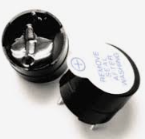

# Zumbador o buzzer
Antes de entrar en descripciones técnicas de componentes vamos a hablar un poco del sonido, sin entrar en profundidad, y como reproducirlo con una micro:STEAMakers.

Uno de los parámetros que caracterizan a un sonido es su frecuencia de emisión, siendo la frecuencia el número de veces que se repite por unidad de tiempo (segundo). La transmisión del sonido se realiza por ondas a través en cualquier medio (sólido, líquido o gaseoso) excepto en el vacío. La frecuencia de un sonido nos indica cuantos ciclos por segundo tiene una onda.

En la imagen y la tabla siguientes vemos un dibujo con un fragmento de las teclas de un piano estando todo referido a una nota estándar, la nota "La" central que tiene una frecuencia de 440 Hz. Podemos ver la nota musical que reproduce, en las dos notaciones más comunes de los sonidos (Inglés: C D E F G A B, Alemán: C D E F G A H, Español, italiano y francés: Do Re Mi Fa Sol La Si) y además se encuentra la frecuencia que produce esa nota musical.

  
*Sección de piano y notas*

Otro de los parámetros que caracterizan al sonido es su nivel y en sonido se caracteriza con los decibelios (dB) que es la forma de medir la intensidad del sonido. La percepción del sonido depende de factores como la intensidad, el tiempo que dura, las frecuencias o tonos y el entorno donde estamos. Vamos a introducir brevemente como medir la intensidad del sonido.

Los decibelios (dB) son la unidad de medida de presión acústica. Medimos presión, luego estamos midiendo una fuerza y mas concretamente una fuerza por unidad de superficie. Un sonido pierde intensidad según nos alejamos de la fuente y lo hace a un ritmo de unos 6 dB cada que vez que se duplica la distancia. Vemos un ejemplo: supongamos que escuchamos un sonido de 45 dB a una distancia de un metro, cuando nos pongamos a dos metros escucharemos 39 dB, cuando estemos a 4 metros, será de 33 dB y cuando estemos a 8 metros, de 27 dB.

La escala de medida en dB no es lineal, es logaritmica porque representa mejor la forma en que sentimos los cambios de la intensidad del sonido con nuestro oido. Algunos datos para reflexionar sobre el ruido:

* El sonido se vuelve dañino para el ser humano a partir de los 75 dB.
* Alrededor de los 120 dB causa dolor. Una exposición de dos horas a 100 dB necesita un día completo para que el oido compense la exposición.
* Sonido en torno a 180 dB pueden ocasionar la muerte.

En la tabla vemos algunos ejemplos del día a día:

|nivel de sonido|Percepción|Situación|
|---|---|---|
|0 dB|Muy bajo|Nivel de audición humano|
|10 a 30 dB|Nivel bajo|Conversación tranquila. Biblioteca|
|30 a 50 dB|Nivel bajo|Conversación normal. Motor frigorifico. Agua saliendo del grifo|
|55 a 75 dB|Nivel considerable|Aspirador. Calle con trafico denso. Despertador. Batidora|
|75 a 100 dB|Nivel alto|Sensación molesta. Atasco de tráfico. Sirena de policia|
|100 a 120 dB|Muy alto|Taladro/claxon/concierto R&R = 120 dB. Interior discoteca = 110 dB|
|mas de 120 dB|Dolor|Avión despegando a 25 metros. Petardo a un metro|

Una equivalencia que nos puede ayudar a familiarizarnos con esta unidad es la tabla de equivalencias entre potencias y dBm (decibelios milivatio):

| P (mW) | dBm | P (mW) | dBm | P (mW) | dBm | P (mW) | dBm |
|:-:|:-:|:-:|:-:|:-:|:-:|:-:|:-:|
| 1 | 0 | 16 | 12 | 250 | 24 | 4 W | 36 |
| 1.3 | 1 | 20 | 13 | 315 | 25 | 5 W | 37 |
| 1.6 | 2 | 25 | 14 | 400 | 26 | 6 W | 38 |
| 2 | 3 | 32 | 15 | 500 | 27 | 8 W | 39 |
| 2.5 | 4 | 40 | 16 | 630 | 28 | 10 W | 40 |
| 3.2 | 5 | 50 | 17 | 800 | 29 | 13 W | 41 |
| 4 | 6 | 64 | 18 |  1 W | 30 | 16 W | 42 |
| 5 | 7 | 80 | 19 | 1.3 W | 31 | 20 W | 43 |
| 6 | 8 | 100 | 20 | 1.6 W | 32 | 25 W | 44 |
| 8 | 9 | 125 | 21 | 2 W | 33 | 32 W | 45 |
| 10 | 10 | 158 | 22 | 2.5 W | 34 | 40 W | 46 |
| 13 | 11 | 200 | 23 | 3 W | 35 | 50 W | 47 |

Si observamos cuidadosamente la tabla veremos que la potencia se duplica o divide por dos, según recorramos la tabla, cada 3 dB.

## **Zumbador pasivo**
Un zumbador o buzzer pasivo no es mas que un pequeño altavoz que nos sirve para convertir una señal eléctrica en una onda de sonido. Son dispositivos que no disponen de ningún tipo de electrónica interna, por lo que tenemos que proporcionar una señal eléctrica para conseguir el sonido deseado.

Normalmente (como componente) estos dispositivos se incluyen en un módulo que incorpora un transistor y una resistencia de polarización del mismo para hacer funcionar al altavoz que actúa como carga.

Un buzzer se basa en un transductor piezoeléctrico que es capaz de variar su volumen con el paso de la corriente eléctrica, fenómeno que se aprovecha para hacer vibrar la membrana del altavoz. Esquemáticamente vemos esto en la figura siguiente:

  
*Funcionamiento y aspecto de un buzzer pasivo*

Un zumbador pasivo requiere para su funcionamiento una señal de tipo PWM para poder indicarle la frecuencia y la duración de la señal.

El aspecto de un buzzer clásico visto por ambos lados nos ayudará a distinguirlo del activo.

  
*Aspecto de un buzzer pasivo típico*

El que incorpora la ESP32 micro:STEAMakers es de tipo 'montaje superficial' y tiene el aspecto de la imagen siguiente:

  
*Aspecto del buzzer pasivo en la micro:STEAMakers*

## **Zumbador activo**
Este tipo de zumbador incluye un oscilador que genera una frecuencia audible fija y que se conoce como zumbador pasivo y,  en realidad, es el que de forma correcta **se puede denominar como zumbador**. Este es mucho mas sencillo de usar ya que basta con conectarlo a un pin digital y cuando pongamos a nivel alto este pin el zumbador generará su zumbido característico durante el tiempo que establezcamos. Con este tipo de zumbador no se pueden generar melodías.

Cuando está nuevo se distingue del zumbador pasivo o altavoz por la pegatina de protección que lo acompaña, pero esta hay que quitarla para oir el zumbido y sin ella es difícil distinguir un tipo del otro, salvo por su reverso. Es aconsejable marcar alguno de los dos cuando podemos distinguirlos, sobre todo si van a ir montados sobre una PCB. Una buena idea puede ser utilizar la propia pegatina en el lateral del mismo para distinguirlo a primera vista.

Un zumbador activo produce un tono audible fijo con tan solo aplicarle tensión.

El aspecto por ambos lados de uno típico nos ayudará a distinguirlo del pasivo.

  
*Aspecto de un buzzer activo típico*
